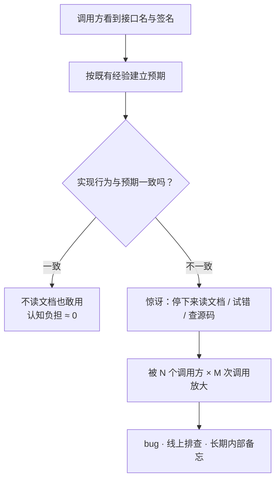
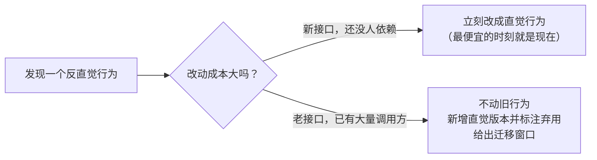

来几个不用查文档就能"猜错"的问题：

- `[1, 10, 2].sort()` 的结果是什么？（不是 `[1, 2, 10]`）
- Python 里 `data.sort()` 返回什么？（不是排好序的列表，是 `None`）
- `git checkout` 到底干什么？（切分支、丢改动、取文件、建分支——四件事）
- 一个接口返回 `HTTP/1.1 200 OK`，body 里写着 `{"code": 500}`，算什么？（算事故）

这些行为**都不是 bug**，每一个都能找到理由。但它们都要让使用者停下手里的事，去记住一条"反直觉的规则"。这就是**最少惊讶原则（Principle of Least Astonishment, POLA）**要说的事——它管的不是功能对不对，而是**接口是否可信**。

## 一、它从哪来

POLA 没有唯一的提出者，它是从人机交互（HCI）到编程语言、API 设计里慢慢固化成共识的一条准则。它的措辞很朴素：**系统的行为，应该与使用者基于既有经验所形成的预期一致。**

在工程界留下脚印的几个节点：

- **人机交互传统的系统论述**：界面设计里早就把"用户的心智模型（mental model）"当成一等公民——操作结果不符合预期，责任在设计方，不在用户。
- **Kernighan & Pike《The Practice of Programming》（1999）**：把"surprise"直接当设计缺陷来讨论——让人意外的接口，等于没设计。
- **Tim Peters 的《Zen of Python》（1999，收录于 PEP 20）**：`Errors should never pass silently.`、`Explicit is better than implicit.`、`There should be one—and preferably only one—obvious way to do it.` 三句话都在说同一件事：**别让使用者猜。**
- **Eric S. Raymond《The Art of Unix Programming》（2003）**：把 "Rule of Least Surprise" 列为 Unix 设计哲学的正式条目之一。
- **现代 API 规范**：Rust API Guidelines 的命名与错误条目、Google API 设计指南、以及各语言社区里"与标准库保持一致"的硬性要求——都是这条原则的当代形态。

注意最后一条：**它已经被写进官方规范了**。也就是说，惊讶不再只是"品味问题"，而是评审能打回的缺陷。

## 二、为什么需要它

因为人在用接口时，靠的是**模式匹配**，不是文档。

看到 `sort()`，脑子里自动补全"返回排序后的结果"；看到 `get()`，自动补全"没有就返回空"；看到 `delete`，自动补全"删了就是删了，再删一次也没事"。这套预测一旦落空，使用者就必须停下来：查文档、翻源码、写小脚本试。**每一次惊讶，都是一次强制性中断。**

更要命的是它会**被乘数放大**：一个被 N 个调用方、M 次调用复用的接口，一次惊讶会变成 N 次 bug、N 次线上排查、以及一条永久存在的"内部备忘"。反过来，一个"猜得对"的接口，一次设计换来无数次"不读文档也敢用"。

惊讶的来源其实很有限，就这四类：

1. **名不副实**：`checkXxx()` 顺带改了状态；`get` 做了网络请求；`200 OK` 里装错误码。
2. **隐藏状态**：原地排序、可变默认参数、全局单例、隐式缓存。
3. **返回值双关**：`None` 既表示"没有"又表示"出错"，调用方只能瞎猜。
4. **一致性破坏**：同名方法在 A 类返回新对象、在 B 类原地改；同一套 API 里有的下标从 0 开始、有的从 1 开始。

**本质一句话：最少惊讶 = 让接口的行为符合使用者已经形成的直觉；惊讶不是用户的问题，是设计者的账单。**

## 三、两张图看懂

先看"惊讶"是怎么从一次中断变成长期成本的：



再看"发现惊讶行为之后怎么办"——这是这条原则最现实的部分：



**"改不了"往往不是技术问题，而是兼容性问题**——这一点决定了这条原则的边界（第五节还会回到这里）。

## 四、它有什么用

下面两组输出都是本机实跑（脚本 `.workbuddy/surprise_demo.py` / `.workbuddy/surprise_demo.js`），不是抄的段子。

**1. Python 侧：一堆"有理由但需要记住"的默认行为**

```text
data.sort() 的返回值 = None   ← 不是排好序的列表
data 本身 = [1, 2, 3]    sorted(...) = [1, 2, 3]
d.get("b") = None    d['b'] → KeyError('b')
push(1) = [1]
push(2) = [1, 2]   ← 两次调用共享同一个默认列表
0.1 + 0.2 = 0.30000000000000004
float('nan') == float('nan') → False
bool([]) = False  bool('') = False  bool(0) = False  bool('0') = True
s.strip() = 'wal'   但 s 还是 '  wal  '
datetime.now() 带时区吗？ None ← naive，无时区信息
```

怎么读这组：

- `sort()` 返回 `None` 是**故意**的——明确告诉你"我是原地排序，别指望链式调用"，顺手省掉一次列表复制。代价是每个新人都要惊讶一次。于是官方给了另外一条符合直觉的路：`sorted()`。
- `get` 与 `[]` 提供了**两种语义**："宽容"（没有就 `None`）和"严格"（没有就抛异常）。这是好设计，但前提是调用方知道自己在选哪一种。
- 可变默认参数 `acc=[]` 是隐藏状态的教科书——**默认值在函数定义时创建一次，之后被所有调用共享**。（顺带一个二阶惊讶：写成 `print(push(1), push(2))` 会两处都显示 `[1, 2]`，因为打印的是同一个对象，只是取值时机晚了一步。）
- `bool('0') == True` 是"非空字符串都真"的直接后果——它和"0 是假"这条直觉在字符串上打了一架。

**2. JavaScript 侧：经典中的经典**

```text
[1, 10, 2].sort()                  → [1, 10, 2]
typeof null                        → "object"
[] == false                        → true
null >= 0 / null == 0              → [true, false]
Number('') / Number(null) / Number(undefined) → [0, 0, NaN]
typeof NaN                         → "number"
[1,2,3] + [4,5,6]                  → "1,2,34,5,6"
[1, 2, 3].map(parseInt)            → [1, NaN, NaN]
'b' + 'a' + + 'a' + 'a'            → "baNaNa"
```

- `[1, 10, 2].sort()` 默认按**字符串字典序**比较，所以数字排序必须显式传比较函数。为什么不改？因为 1995 年定下的行为一旦变更，全世界旧代码会**静默**出错。这就是最少惊讶原则最大的敌人：**兼容性**。
- `[1, 2, 3].map(parseInt)` 更阴：`map` 传给回调的是 `(元素, 下标, 数组)`，而 `parseInt` 的第二个参数是**进制**——于是 `parseInt('2', 1)` 直接 NaN。这是"回调约定与函数签名不匹配"造成的惊讶，纯属接口设计事故。

**3. 命令行：`git checkout` 被"拆家"**

```bash
# 2.23 之前：同一个命令干四件事，语义模式靠参数猜
git checkout <branch>              # 切分支
git checkout -- <file>             # 丢弃改动（危险）
git checkout <commit> -- <file>    # 从某次提交取文件
git checkout -b <new>              # 建分支并切换

# 2.23 起拆成两个名字：把"猜"变成"读"
git switch <branch>
git restore <file>                 # 名字就写着：你要丢弃改动
```

**名字应该表达意图，而不是复用历史的巧合。** 这是把"惊讶"当 bug 修的正面案例——代价是要同时维护两套命令并长期做迁移提示，收益是新人不再用错。

**4. 协议层：`200` 里装错误码是工具链的毒药**

```http
HTTP/1.1 200 OK
{"code": 500, "message": "internal error"}
```

业务上想"永远返 200 好处理"，代价是所有依赖状态码的基础设施全部失效：监控看不到错误率、告警不响、网关不熔断、重试策略失效、CDN 还可能把错误页缓存下来。**接口的"名不副实"会一路污染整个工具链**——这就是为什么 REST 宁可让 `DELETE` 幂等、让状态码有语义：**让框架和人能预测。**

## 五、反例与边界

- **惊讶是相对的**。同一个行为对专家是直觉，对新手是惊吓（NumPy 的广播、pandas 的链式赋值警告）。所以目标不是"谁都不惊讶"——那不存在——而是**锚定目标用户的心智模型**。
- **一致性 > 局部最优**。C 的 `struct tm` 月份从 0 开始，Python 的 `datetime` 从 1 开始；Python 2 的 `/` 做整除坑了整整一代人，Python 3 改成真除法，代价是**十几年的迁移**。**能改的惊讶行为，往往是在付兼容性学费。**
- **别把它当成"不要创新"**。真正的新范式必须先教：Rust 的所有权、Git 的 DAG、Go 的显式 `error`。使用者觉得惊讶，常常是因为**缺一个概念模型**，而不是接口难用——这时要做的是讲清模型 + 一致贯彻，而不是加糖语法掩盖它。
- **过度迎合直觉会养出坏 API**。隐式类型转换、自动重试、隐式网络请求、"猜你想要"的默认值，都是把惊讶推给了未来和运维。
- **警惕"我的直觉 ≠ 用户的直觉"**。设计者最熟悉自己的抽象，也最容易低估别人的惊讶——这是所有 API 设计者的默认盲区。所以要用数据说话：文档搜索量、issue 里 `question`/`confusing` 标签的分布、新手 onboarding 时长，都能把"惊讶"变成可度量的指标。
- **它管的是"符合预期"，不是"符合审美"**。一个"丑但一致"的接口胜过一堆"漂亮但各说各话"的接口。

## 六、对比表与小结

| 维度 | 行为符合直觉 | 行为违反直觉 |
|------|-------------|-------------|
| 使用方式 | 不读文档也敢用 | 必须查文档 / 翻源码 / 写小脚本试 |
| 出错形态 | 早失败，错误信息能指导修复 | 静默返回 `None`，或顺手改了状态 |
| 长期成本 | 一次设计，N 次省心 | 一次省事，N 次支持与排查 |
| 典型修法 | 名字表达意图、约定统一 | 新增直觉版本 + 标注弃用 + 迁移窗口 |

| 惊讶的形态 | 典型例子 | 修法 |
|-----------|---------|------|
| 名不副实 | `checkXxx()` 顺带改状态；`200` 里装错误码 | 名字就是行为；用协议层语义表达结果 |
| 隐藏状态 | 原地排序、可变默认参数、全局单例 | 返回新值，或在命名上标出 `in_place` |
| 返回值双关 | `None` 既表示"没有"又表示"出错" | 用异常 / `Result` / `Option` 明确区分 |
| 一致性破坏 | 同名方法在 A 类返回新对象、B 类原地改 | 统一约定，即使局部更"省" |

🐾 **小结**：最少惊讶不是"讨好用户"，而是**把你的知识成本转成使用者的一次性学习**。它最实用的一条推论是：**当你想在接口里"聪明一下"的时候，先假设使用者只有三秒耐心**——三秒内猜不出来的行为，迟早会以 issue、事故、内部备忘的形式回到你手上。惊讶的账单从来不会消失，只会改寄件地址。

**相关阅读**

- 康威定律：架构复制沟通结构（接口为什么长得那么"厚"，有时是组织沟通的投影）：[/posts/princ-conway/](/posts/princ-conway/)
- 幂等性：让重试变得安全（`DELETE` 为什么应当幂等，本质是给使用者一个可预测的承诺）：[/posts/princ-idempotency/](/posts/princ-idempotency/)
- 写前日志 WAL：先记账、后落库（"写成功"到底承诺了什么，是接口语义最难的一条）：[/posts/princ-wal/](/posts/princ-wal/)
