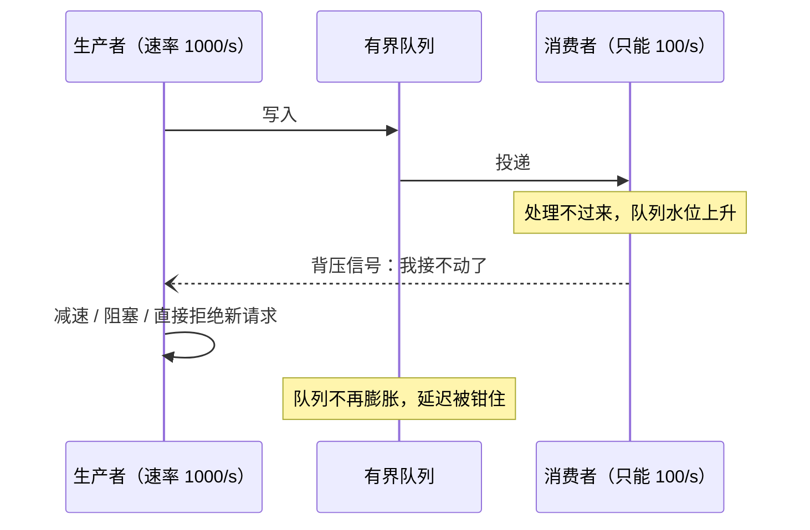
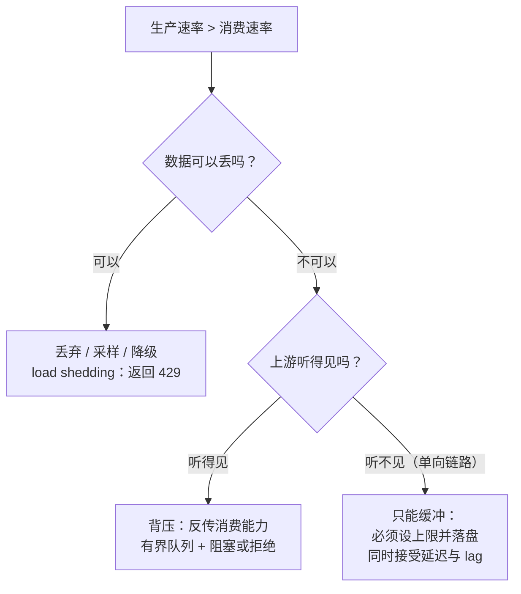

线上有个很常见的死法：**上游一慢，下游先崩。**

下游没做错什么，它只是老老实实收下所有请求，放进队列，然后慢慢处理。结果队列越来越长，内存越来越满，延迟越来越高，最后 `OutOfMemoryError` 或者一次超时雪崩——监控图上，崩溃前那段"吞吐还挺好看"的时间，往往就是队列在替它挨打。

再对比两个现象：Kafka 的消费者处理不过来时，Broker 一点事没有，只是 lag 在涨；而写一个死循环 `send()` 的客户端，对着一个不读的服务端狂发数据，**它自己会被卡住，对端安然无恙**。

它们背后是同一件事：**背压（back pressure）**——把下游的"我接不动了"传回上游。

## 一、它从哪来

"背压"这个词是从流体力学借来的：管道下游堵住，压力会反推到上游。计算机里最早的工业级实现不是某个框架，而是**网络协议本身**：

- **1981 年，RFC 793（TCP）** 就用**滑动窗口**做了流量控制：接收方通过 `rwnd`（receive window）告诉发送方"我还能收多少"，窗口归零时发送方必须停下等。这是背压最朴素也最可靠的形态——**数据的送达速率由接收方决定**。
- **1965 年，Dijkstra 的信号量**与生产者-消费者问题，第一次在程序里把"缓冲"和"同步"作为一对矛盾摆上台面：缓冲容量有限，生产快于消费就必须有人等。
- **2015 年 5 月，Reactive Streams 规范 1.0.0 发布**（RxJava、Typesafe/Akka、Pivotal 等共同推动）。它把背压写成了接口约定：发布者不能"想推就推"，订阅者通过 `request(n)` **主动索取**，`onNext` 的节奏由下游决定。
- **2017 年，Java 9 把它收编进标准库**：`java.util.concurrent.Flow` 的四个接口（`Publisher`/`Subscriber`/`Subscription`/`Processor`）就是 Reactive Streams 的翻版。
- 同一时期，**Kafka 用 pull 模型**给出了另一种答案：消费者自己拉数据，拉多少由自己决定——背压不需要额外机制，**模型本身就带背压**。

## 二、为什么需要它

因为**速率的错配是常态**。生产速率由外部流量决定（用户、上游服务、传感器），消费速率由处理能力决定（CPU、下游依赖、磁盘）。这两个数字从不相等，也不该指望它们相等。

面对"生产快、消费慢"，只有三种应对：

1. **丢**（load shedding）：拒绝、降级、采样，返回 `429`。系统活着，业务受损。
2. **缓冲**：排队、落盘。看起来最友好，但它只把问题**延后**。
3. **背压**：把消费能力反传给生产者，让它减速。**这是唯一能"不丢数据也不爆内存"的答案——前提是上游听得见。**

缓冲为什么危险？排队论里有个 Little's Law：`L = λW`（队列中平均元素数 = 到达率 × 平均停留时间）。缓冲变大 → 同上吞吐下等待变长 → 延迟上升 → 上游超时 → **重试把到达率又抬高** → 队列更长。这就是雪崩的标准路径。缓冲从来不是解决方案，它只是**把"丢数据"换成了"延迟债"，并且常常在你最需要它的时候一起爆掉**。

所以背压的本质是一次**控制权移交**：不是"我尽量接住"，而是"**我接不动的时候，你必须停**"。

**本质一句话：背压 = 让下游的"我接不动了"能被上游听见；没有背压的系统，只能拿内存和延迟去替下游挨打。**

## 三、两张图看懂

先看一次有背压的交互——注意最后那条反向消息才是关键：



再看"三种应对"的选择树——**能不能丢、上游能不能听见**，决定你只有哪条路可走：



## 四、它有什么用

**1. TCP：背压是协议自带的，写不对都难**

一个"完全不管下游死活"的实验（本机实测，脚本 `.workbuddy/backpressure_demo.py`）：服务端 `accept()` 之后**一个字节都不读**，客户端用非阻塞 `send` 拼命灌。

```text
发送端 SO_SNDBUF = 64 KB   接收端 SO_RCVBUF = 64 KB
[阶段一] 对端完全不读：send 到第 192 KB 时抛出 BlockingIOError
         → 生产者被内核按住了（这就是 TCP 的背压），数据没有凭空消失
[阶段二] 对端开始慢速读（200ms / 32KB）：发送端可继续发送，对端已读出 192 KB
```

读法：192 KB ≈ 发送缓冲 + 接收缓冲 + 在途数据，这几块一满，**内核就不再让应用往下塞**。对端一旦开始读，`rwnd` 恢复，发送端自动复活。这就是滑动窗口的价值：**接收方从不被迫丢数据，发送方也从不会以为自己可以无限发。**

Linux 上想看现场：`ss -ti` 输出里的 `rwnd`（接收窗口）、`cwnd`（拥塞窗口）就是这两个旋钮。

**2. Node 流：`write()` 返回 false 就是背压信号**

同一个生产者，只改一个参数 `highWaterMark`（高水位线），结果完全不同（本机实测，`.workbuddy/node_backpressure.js`）：

```text
生产者固定写入 100 块 × 4 KB，消费者每块耗时 20ms：
highWaterMark = 16 KB      write() 返回 false:  25 次   缓冲峰值(内存):   16 KB
highWaterMark = 1024 KB    write() 返回 false:   0 次   缓冲峰值(内存):  400 KB
```

第二行是陷阱：`false` 一次都没出现，不是性能变好了，而是**背压被关掉了**——400 KB 全压在内存里，而且这还只是 100 块。正确的写法只有一句话：

```javascript
if (!sink.write(chunk)) {
  await once(sink, 'drain');   // 等到下游排空再继续生产
}
```

**3. Reactive Streams / Java Flow：把背压写进类型系统**

订阅者不主动索取，就一条数据都不会来：

```java
// 下游用 request(n) 控制"我要多少"，上游只能按需给
public final class SlowSubscriber implements Flow.Subscriber<Integer> {
    private Flow.Subscription subscription;
    private int processed = 0;

    @Override public void onSubscribe(Flow.Subscription s) {
        this.subscription = s;
        s.request(1);                       // 一次只要 1 条
    }
    @Override public void onNext(Integer item) {
        handle(item);                        // 慢慢处理
        if (++processed % 100 == 0) System.out.println("已处理 " + processed);
        subscription.request(1);             // 处理完再要下一条
    }
    @Override public void onError(Throwable t) { /* ... */ }
    @Override public void onComplete() { /* ... */ }
}
```

配 `SubmissionPublisher` 时还能给缓冲设上限，超了就让 `submit()` 阻塞或直接拒绝——**背压从"自觉"变成了"协议"**。（这段代码本机没有 JDK 可编译，属示例。）

**4. Kafka：用 pull 模型天然免疫**

消费者自己拉，拉多少由 `max.poll.records` / `fetch.max.bytes` 决定。所以 Broker 永远不会被"慢消费者"打爆——慢的后果是 **lag 上涨**，一个可观测、可扩缩容的信号。应用层更精细的手段是 `consumer.pause()/resume()`：处理得慢就先暂停分区，处理完再恢复。

**5. Redis：最暴力的背压——直接断你**

发布订阅和普通客户端都有输出缓冲上限：

```properties
client-output-buffer-limit pubsub 32mb 8mb 60
```

意思是：输出缓冲超过 32 MB（或持续 60 秒超过 8 MB），**直接断开这个客户端**。宁可断你，也不让自己吃光内存——这是"丢"分支的硬实现，也是背压的一种极端形态（把拒绝的成本推给消费者）。

**6. 线程池：最省事的背压是有界队列**

```java
// 队列满 → 由提交线程自己执行 → 提交方自然减速（背压）
new ThreadPoolExecutor(8, 8, 0L, TimeUnit.SECONDS,
        new ArrayBlockingQueue<>(200),
        new ThreadPoolExecutor.CallerRunsPolicy());
```

反例就在 JDK 自带工厂里：`Executors.newFixedThreadPool` 用的是**无界队列**（`LinkedBlockingQueue` 不设容量），流量一涨，队列无限增长——**等于把背压关掉了**。

## 五、反例与边界

- **单向链路做不了背压**。短信下发、日志外发、传感器采样——上游根本不会听你的。这时只能"丢 + 上限"：降采样、丢弃策略、落盘并设死上限，并且把丢弃率当指标看，别假装它不存在。
- **背压会把延迟传染给上游**。如果这条链在关键路径上，全体阻塞会拖垮 SLA。此时正确的选择是**在边界上丢**（`429` / 降级），而不是让整条链一起慢下来。**背压保护系统，load shedding 保护 SLA**，两者要配合。
- **无界队列 = 关闭背压**。`new LinkedBlockingQueue<>()`、无限创建线程的 `newCachedThreadPool`、把 `ConcurrentLinkedQueue` 当缓冲池——全都是把背压换成 OOM 或线程风暴的经典写法。
- **多生产者有队头阻塞**。一个慢消费者会拖住所有生产者。解法是按生产方隔离（独立队列、独立连接、优先级队列），而不是把队列开得更大。
- **背压 ≠ 限流**。限流按**外部配额**切（QPS、租户额度、接口配额），背压按**内部容量**切（队列水位、处理速率）。限流挡外部洪水，背压保内部节奏，两者通常同时存在。
- **缓冲不是原罪，无上限才是**。Kafka 的 log、MQ 的持久化队列可以很大，因为它们把"不可控的内存增长"换成了"可观测的 lag"——**有界 + 可观测 + 可落后**，这三点齐了，缓冲才是安全的。

## 六、对比表与小结

| 策略 | 做什么 | 代价 | 什么时候用 |
|------|--------|------|-----------|
| 丢弃（load shedding） | 拒绝 / 降级 / 采样，返回 `429` | 业务受损，但系统活着 | 上游不可控、数据可丢或可重试 |
| 缓冲 | 排队、落盘、加大水位 | 延迟上升（Little's Law），仍需上限 | 数据不能丢，且能承受延迟 |
| 背压 | 反传消费能力，让上游减速 | 上游被拖慢，延迟沿链路传染 | 上下游可通信、链条长度可控 |

| 层次 | 背压机制 | 信号 |
|------|----------|------|
| TCP | 接收窗口 `rwnd` + 滑动窗口 | 窗口归零 → 发送端停 |
| Node 流 | `highWaterMark` + `write()` 返 false | `false` / `drain` 事件 |
| Reactive Streams / Flow | `request(n)` 需求驱动 | 下游不 `request` 就没有数据 |
| Kafka | pull 模型 + `pause()`/`resume()` | lag |
| Redis | `client-output-buffer-limit` | 超限直接断开客户端 |
| 线程池 | 有界队列 + `CallerRunsPolicy` | 队列满 → 提交线程自己执行 |
| HTTP/2、gRPC | 流控窗口 `WINDOW_UPDATE` | 窗口耗尽 |
| 网关 / 边缘 | `429`、限流、熔断 | 拒绝 |

🐾 **小结**：凡是"生产速率由外力决定、消费速率由处理能力决定"的系统，都必须回答同一个问题——**下游接不动的时候，会发生什么？** 答案只有三个：丢、堆、慢。选"堆"的系统，迟早会把内存当缓冲用，然后用一次 OOM 学会 Little's Law。而背压的珍贵之处在于：它让"慢"变成一个**被传递的信号**，而不是一场**只在下游爆发的雪崩**。

**相关阅读**

- 空间换时间：哈希、缓存与索引的共同母题（缓冲就是空间换时间，只是它换来的时间迟早要连本带利还）：[/posts/princ-space-time/](/posts/princ-space-time/)
- 幂等性：让重试变得安全（背压场景下"拒绝 + 重试"必须安全，否则背压会放大成重复写入）：[/posts/princ-idempotency/](/posts/princ-idempotency/)
- CAP 定理：分布式的取舍三角（可用性与一致性的取舍，就是"丢还是等"的分布式版本）：[/posts/princ-cap/](/posts/princ-cap/)
