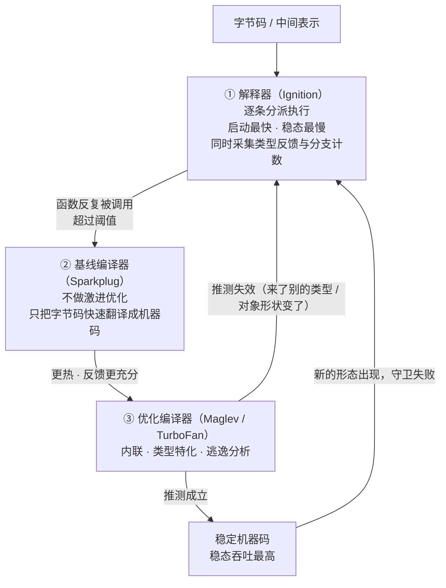
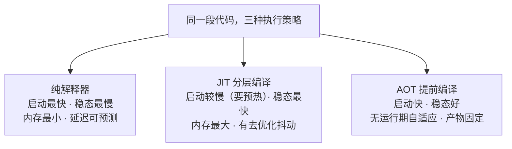

同一个函数，同一台机器，同一份代码，只改了启动参数——吞吐差了 **13 倍**：

```text
运行模式                    数值热循环 次/秒
------------------------------------------------
默认（JIT 全开）               198,656
--no-opt（禁用优化编译器）        28,936      0.14x
--jitless（纯解释器）           15,281      0.08x
```

更耐人寻味的是逐次调用的耗时——**第 21 次还是 82.8 µs，第 22 次就掉到 5.0 µs**，中间没有任何代码变化，只是编译器在程序运行的过程中"决定"给它生成一份更快的机器码。

这就是 JIT（Just-In-Time compilation，即时编译）最反直觉的地方：**它把编译从"运行之前"挪到了"运行之中"，用运行时的真实信息换更激进的优化。**

## 一、它从哪来

JIT 的直系祖先是**动态语言的实现者**——因为只有他们非这么做不可。

- **1960 年代**：Lisp 社区已有"运行时编译"的实践（MacLisp、后续的各类 Lisp 实现），但更多是显式调用编译器的形式。
- **1984 年，Xerox PARC**：Deutsch 与 Schiffman 的《Efficient Implementation of the Smalltalk-80 System》提出了 **dynamic translation**——把字节码在运行时翻译成机器码。这是 JIT 作为"透明优化手段"的起点。
- **1987–1994 年，Self 语言**：Ungar、Smith、**Urs Hölzle**、Chambers 等人做出了完整形态的**自适应优化**（adaptive optimization）。关键的 1994 年 PLDI 论文《Optimizing Dynamically-Dispatched Calls with Run-Time Type Feedback》确立了今天所有 JIT 的核心机制：**靠运行时反馈（type feedback）来做优化决策**，并允许优化失效后**去优化**（deoptimization）回到安全状态。
- **1999 年，Java HotSpot VM**：Sun 收购了 Self/Strongtalk 团队创办的 Animorphic，把他们请去写了 HotSpot。**C1（client，快速编译）+ C2（server，激进优化）** 的分层编译由此进入工业主流。
- **2008 年，V8**：为 JavaScript 而生。早期版本干脆**不做解释器**，直接全量编译成机器码；2015 年引入 **Ignition（字节码解释器）+ TurboFan** 组成分层 + 去优化的骨架；2021 年 V8 9.0 又补上 **Sparkplug（基线编译器）** 与 **Maglev（中层）**，形成四级阶梯。
- **同一条技术路线的其他成员**：PyPy（2007，用 trace 化的 JIT 让 Python 快起来）、**LuaJIT**（2005，Mike Pall，至今仍是"小语言 + 顶级 JIT"的样板）、PHP 8.0（2020）、.NET RyuJIT、以及 WebAssembly 规范里的分层编译。

所以 JIT 不是"编译器的某个优化"，而是**一整套运行期架构**：解释器负责启动与采集反馈，编译器负责把反馈变成机器码，去优化机制负责在猜测失效时安全撤退。

## 二、为什么需要它

因为**提前编译（AOT）拿不到运行时才存在的信息**。

一个静态编译的编译器面对这样的代码：

```java
interface Shape { double area(); }
```

它只看到"这里可能是一百种实现"。于是它必须生成**保守**的代码：查虚表、做间接跳转、准备处理所有分支。哪怕实际运行中这里 100% 都是同一种实现，编译器也无从得知——**这个信息直到程序跑起来才产生**。

JIT 的做法是：

1. **先跑，边跑边看**：解释器执行时记录类型反馈、分支计数、对象形状；
2. **发现热点**，用真实观察到的信息生成**推测性优化**的机器码（"这里总是 `Circle`，那就把 `area()` 内联进来"）；
3. **加守卫（guard）**：如果输入不符合假设，立刻**去优化**回退到解释器。

翻译成本不消失，只是**被推迟，并被分摊**：只对真正热的代码付这份钱。

这解释了为什么**分层**是必然的：不同代码"值得"的优化强度不同。用最激进的编译器去编译只跑一次的函数，是纯亏；让跑了一亿次的循环继续走解释器，也是纯亏。**分层编译就是"用最小的编译成本，把每一段代码放到它值的那一级"。**

**本质一句话：JIT 用运行期的真实信息换更激进的优化——代价是预热成本、内存占用与去优化抖动，收益是稳态吞吐；它把"编译"从一次性开销变成了一个持续的投资决策。**

## 三、两张图看懂

先看分层编译的阶梯。注意那条**从优化代码指回解释器的箭头**——它是 JIT 能成立的前提：



去优化这条回边是整个设计的**安全阀**：因为随时能退回解释器，优化器才可以放心大胆地**猜**。没有它，JIT 只能做绝对安全的优化，收益会大幅缩水——这也解释了为什么"JIT 的性能上限"和"去优化的成本"是一对必须一起看的东西。

再看执行策略的三角，它们各自擅长的事几乎不重叠：



## 四、它有什么用

**1. 热循环吞吐：默认 / 禁用优化 / 纯解释器（Node 22.22.2 / V8 12.4 实跑）**

被测负载是一个纯数值热循环 `work(4000)`，另有两组对象形状测试。脚本 `.workbuddy/jit_demo.js`：

```text
Node v22.22.2 / V8 12.4.254.21-node.39
==============================================================================
运行模式                    数值热循环 次/秒      单态调用 次/秒        多态调用 次/秒
------------------------------------------------------------------------------
默认（JIT 全开）               198656          2491096815       163037911
--no-opt（禁用优化编译器）        27968            73888405        36827707
--jitless（纯解释器）          15281            36918440        24029810
==============================================================================
相对默认模式的数值循环吞吐：
  默认（JIT 全开）                1.00x
  --no-opt（禁用优化编译器）          0.14x
  --jitless（纯解释器）            0.08x
```

三点解读：

- **优化编译器贡献了约 7 倍**（默认 vs `--no-opt`）。这一档来自内联、循环优化、类型特化、去虚拟化。
- **字节码解释器又慢了一半**（`--no-opt` vs `--jitless`）：基线编译器把"逐条分派字节码"变成"逐条执行机器码"，本身就很值钱。
- **`--jitless` 不是"更安全的默认"，而是另一种取舍**：它没有可写可执行内存（安全收益），也彻底没有预热期（延迟收益），代价就是这 13 倍。

**2. "跑着跑着变快"的实际形状（同一脚本，逐次调用计时）**

```text
默认模式：同一个 work(4000) 连续调用 400 次，逐次单次耗时（µs，越小越快）
  第  1- 6 次:    76.8   225.7    91.1    61.2    64.3    63.7
  第  7-12 次:    75.3    37.7    37.6    39.1    38.8    39.2
  第 13-18 次:    38.1    51.2    36.7    36.2    37.4    44.2
  第 19-24 次:    39.0    82.8     5.0     4.8     4.7     4.6
  第 25-30 次:     4.7     4.7     4.7     4.7     4.6     4.7
  第 31-36 次:     4.7    14.0     4.7     4.7     4.7     4.7
  第 37-42 次:     4.7     4.7     4.7     4.7     4.7     4.7
  第 43-48 次:     4.7     4.7     4.8     4.7     4.7     4.6
  第 49-54 次:     4.7     4.7     4.7     4.6     4.7     4.7
  第 55-60 次:     4.6     4.7     4.7     4.7     4.7     4.7

  前 40 次平均 32.99 µs  /  第 200 次之后平均 4.52 µs  →  冷热差 7.30x
```

**第 21 次是 82.8 µs，第 22 次就是 5.0 µs**——一个台阶，不是渐变。这就是优化编译器上线的那一刻：第 21 次的尖峰正是编译开销记在了那次调用上。前六次的抖动（76.8 / 225.7 / 91.1 / 61.2 …）则是解释器阶段的常态：**还没优化，本来就快不到哪去。**

冷热差在各模式下对比得非常干净：

```text
各模式的冷启动差距（前 40 次均值 ÷ 第 200 次之后均值）：
  默认（JIT 全开）              7.30x   （前 40 次均 32.99 µs / 稳态 4.52 µs）
  --no-opt（禁用优化编译器）       1.14x   （前 40 次均 41.81 µs / 稳态 36.74 µs）
  --jitless（纯解释器）          2.27x   （前 40 次均 139.51 µs / 稳态 61.35 µs）
```

**只有默认模式有稳定、可复现的冷热差（多次实测 6.6x ~ 7.3x）。** `--no-opt` 只有 1.14x，说明基线编译是"来一次编译一次"，没有随时间变强的过程。`--jitless` 那一行的 2.27x 是测量噪声——另一次实测它是 0.97x（也就是完全没有冷热差），两次结果不一致正说明**它没有分层编译带来的方向性收益**，剩下的只是解释器自身与机器状态的波动。

顺便说一个微基准的坑：这类测试里累加结果必须**被真正使用**（上面用了 `sink += work(N)`），否则编译器完全可以把整个循环当成死代码删掉，测出来的是一个"不存在的工作"的速度——**微基准骗人的一半原因在这里。**

**3. 单态 vs 多态：内联缓存的代价（同一脚本实跑）**

同一个函数 `addPoint(p) { return p.x + p.y; }`，分别喂"一种对象形状"和"五种对象形状"：

```text
对象形状（单态 vs 多态，同一函数 addPoint）：
  默认（JIT 全开）              单态/多态 = 15.28x
  --no-opt（禁用优化编译器）       单态/多态 = 2.01x
  --jitless（纯解释器）          单态/多态 = 1.54x
```

这是 JIT 最核心的机制之一——**内联缓存（inline cache）** 的可见后果：

- **单态**（只有一个形状）：编译器把属性偏移量**直接写死**进机器码，一次内存访问搞定；
- **多态**（几个形状）：得先查表再跳转，慢一点；
- **巨型态**（megamorphic，形状更多）：退化成哈希查找，几乎丢掉全部优化收益。

有意思的是 `--no-opt` 下也有 2.01x 的差距——这说明形状差异**在基线编译层面就已经有成本**（属性访问的路径本来就不同），而 JIT 把它放大到了 15.3 倍：**优化器把"其实很便宜"的那条路变得极快，于是"不够便宜"的那条路显得更贵。**

工程含义很直接：**同一份数据保持同一种形状**（初始化时把字段都赋上、别一会儿加字段一会儿删字段、别让同一函数处理结构差异很大的对象）是性价比最高的 JS 性能建议之一。

**4. 和纯解释型语言的同一负载对比（本机实跑）**

```text
CPython 3.13.14（官方二进制默认不带 JIT）
  work(4000) 吞吐 = 5,758 次/秒   单次耗时 = 173.7 µs
  第一次调用耗时 = 160.5 µs
```

同一个算法：**Node（JIT）198,656 次/秒 vs CPython 5,758 次/秒，约 34 倍**。

两个必要的诚实说明：

- 这不是"JS 比 Python 快 34 倍"。语言语义、字节码设计、对象模型都不同，这组数字只说明**同一算法在"有优化编译器"和"只有字节码解释器"两种运行时上的差距**。
- CPython 也不是没有动作：3.13 起有实验性的 tier-2 JIT，但**需要编译期开启，官方二进制默认关闭**，所以这里按"纯解释"看待。另外 CPython 的第一次调用耗时（160.5 µs）和稳态（173.7 µs）几乎一样——**没有 JIT，就没有预热效应，延迟反而更可预测**。这是很多低延迟系统宁可用解释型语言的原因之一。

**5. JIT 的另一种形态：iOS 上的"没有 JIT"**

一个常被忽略的现实约束：**iOS 长期不允许第三方应用使用 JIT**（可执行内存受限），只有 WebKit 自己作为系统组件可以用。结果是在 iOS 上，JavaScriptCore 主要以解释/基线模式运行，跨平台框架（Cordova、早期 React Native、各类小程序容器）在 iOS 上的性能长期落后于 Android——**这不是代码问题，是"能不能开 JIT"的问题。**

这条边界很重要：**JIT 不是免费的午餐，它需要一整套运行期设施（可执行内存、编译器、profile 存储）**。在嵌入式、实时、强安全隔离（云厂商的多租户沙箱、WASM 的无 JIT 模式）场景里，"不开 JIT"常常是刻意的选择。

## 五、反例与边界

- **JIT 对短命进程基本没有价值**。编译器、CLI 工具、一次性脚本、批处理里的小任务，进程活不过预热期，付出的是纯成本。这就是 Go / Rust / C++ 在这类场景胜出的根本原因——**AOT 不是"更先进的编译"，而是"另一组取舍"**。
- **预热期就是尾延迟**。服务刚发布、实例刚扩容、缓存刚失效时，请求正好落在**还没优化**的代码路径上——平均延迟好看，p99 难看。这也是 serverless 冷启动问题的一部分（虽然主要成本在运行时初始化，但预热同样贡献一份）。
- **去优化会造成性能断崖**。一旦运行中出现了新类型或新形状，优化代码被丢弃、回到解释器、重新预热。**"通常很快"和"突然变慢"会在同一进程里交替出现**——这在压测里常被误判为"抖动"。
- **内存成本是真实的**。机器码 + profile 数据 + 元数据，往往让 JIT 运行时的内存占用明显高于解释器。移动端和嵌入式设备上，这个成本经常比性能收益更关键。
- **它扩大了安全面**。可写可执行内存带来 JIT spraying 这类攻击；推测执行侧信道（Spectre 家族）需要 JIT 生成的 gadget 才能发挥——很多运行时因此提供了"关闭 JIT"的开关（`--jitless` 就是 V8 的官方安全选项之一）。
- **优化绝不能改变语义**。浮点与 `NaN` 的处理、对象身份比较、GC 可见性、`eval` / 反射 / 动态属性都会限制优化空间。**如果某个"优化"会改变可观察行为，那它就不是优化，是 bug。**
- **多态/巨型态会吞掉优化收益**（实测单态比多态快 15.3x，而关掉优化编译器后只剩 2.0x）。**"代码没变但性能掉了"的常见原因，是数据的形状变了。**
- **AOT 正在用 PGO 把差距补回来**。PGO（Profile-Guided Optimization）把"运行时采集"提前到构建期：先跑一遍采集 profile，再用它指导编译。Go / Rust / .NET NativeAOT / GraalVM Native Image 都在走这条路，能拿到接近 JIT 的稳态性能 + AOT 的启动性能——代价是**失去了运行期自适应**：同一份产物没法根据真实负载重新优化。
- **微基准极易骗人**。死代码消除、常量折叠、循环被整体优化掉、CPU 频率与缓存状态，都会让结论失真。**看到"快了 20 倍"先问一句：这段代码真的还在跑吗？**

## 六、对比表与小结

| 维度 | 纯解释器 | 基线 JIT | 优化 JIT（分层） | AOT（+PGO） |
|------|---------|---------|----------------|-------------|
| 冷启动 | 最快 | 快 | 慢（要预热） | 快 |
| 稳态吞吐 | 最低 | 中 | **最高** | 高（接近 JIT） |
| 内存占用 | 最小 | 中 | 最大（代码 + profile） | 中 |
| 延迟可预测性 | **最好**（无预热） | 较好 | 差（有预热与去优化） | 好 |
| 运行期自适应 | 无 | 弱 | **强**（能重新优化） | 无（产物固定） |
| 安全面 | 最小 | 中 | 最大（可执行内存） | 中 |
| 典型场景 | 嵌入式、强隔离沙箱、低延迟 | 短命进程、启动敏感 | 长驻服务、动态语言 | CLI、容器化服务、移动端 |

| 观察到的现象 | 背后机制 | 该怎么应对 |
|-------------|---------|-----------|
| 前几十次调用明显慢 | 解释器 → 基线 → 优化 的分层爬升 | 压测前充分预热；关注 p99 而不是均值 |
| 单次调用出现尖峰 | 编译开销记在了那一次调用上 | 预热放在流量低峰或启动阶段 |
| 同一函数处理多种对象形状后变慢 | 内联缓存从单态退化为多态/巨型态 | 统一对象形状，避免同一热路径吃多种结构 |
| 运行一段时间后突然变慢 | 去优化（来了新类型 / 守卫失败） | 用 `--trace-deopt` 之类工具定位，别当成"抖动" |
| 微基准显示快了很多倍 | 死代码消除 / 常量折叠 / 循环被删掉 | 保证结果被使用，用不可预测的输入 |
| 同一份代码在不同平台性能差很多 | iOS 等平台不允许 JIT | 按平台能力设计，别假设 JIT 一定存在 |

🐾 **小结**：JIT 的本质不是"更聪明的编译器"，而是**一个把编译成本推迟并分摊到热点上的运行期投资机制**——先用解释器跑起来、顺便采集真实信息，再为真正热的代码生成激进的机器码，并保留随时退回的安全阀。理解它的关键，是同时记住这几件事：**启动慢换来稳态快，预热期会变成尾延迟，多态会吞掉优化，而"不开 JIT"在很多时候是理性的选择。** 看到"这段代码怎么跑着跑着变快了"，或者"压力一大就变慢了"，你现在应该知道该往哪个方向查了。

**相关阅读**

- 局部性原理：缓存体系的地基（JIT 的收益很大一部分来自缓存友好的机器码）：[/posts/princ-locality/](/posts/princ-locality/)
- Amdahl 定律：并行加速比的天花板（优化哪一段才真的有意义）：[/posts/princ-amdahl/](/posts/princ-amdahl/)
- 二八定律（Pareto）：热点总是集中（分层编译就是这条定律的编译器版本）：[/posts/princ-pareto/](/posts/princ-pareto/)
- 空间换时间：哈希、缓存与索引的共同母题（profile 数据与机器码都是"用空间换时间"）：[/posts/princ-space-time/](/posts/princ-space-time/)
