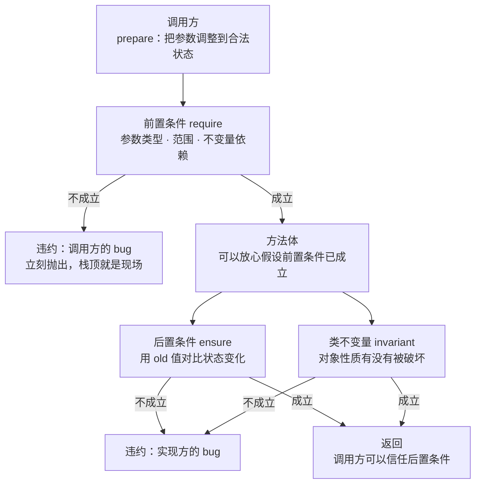
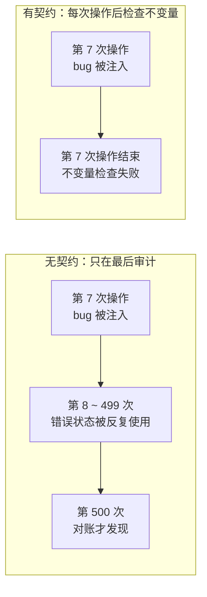

几乎每个接口文档里都有这样几行字：

> `amount` 必须是正整数。调用前请确保余额充足。

这几行字通常出现在三种地方：注释、文档站、以及**没有人读的** PR 描述里。它们的共同命运是——**写下那一刻是对的，三个月后就不是了**。代码改了，注释没改；调用方以为有人在检查，被调方以为调用方会守规矩。

契约式设计（Design by Contract, DbC）就是对这行字的回答：**把"应该"写成"必须"，并且让机器来检查。**

## 一、它从哪来

**1985 年前后，Bertrand Meyer** 在设计 Eiffel 语言时提出了 Design by Contract，并在 1992 年的 IEEE Computer 论文《Applying "Design by Contract"》里系统阐述。

它的概念骨架只有三件东西：

| 名称 | Eiffel 关键字 | 含义 | 谁负责保证 |
|------|--------------|------|-----------|
| **前置条件** precondition | `require` | 调用这个方法**之前**必须为真的条件 | **调用方** |
| **后置条件** postcondition | `ensure` | 方法返回时**必须为真**的条件 | **被调方** |
| **类不变量** class invariant | `invariant` | 对象生命周期内**始终为真**的性质 | **被调方** |

Eiffel 里它长这样：

```eiffel
deposit (amount: INTEGER)
    require
        positive: amount > 0
    do
        balance := balance + amount
        ledger.extend (amount)
    ensure
        increased: balance = old balance + amount
        recorded:  ledger.count = old ledger.count + 1
    end
```

理论根基比 Meyer 更早：**1969 年 C.A.R. Hoare 的《An Axiomatic Basis for Computer Programming》** 给出了 Hoare 三元组 `{P} S {Q}`——前置断言、程序、后置断言。Meyer 的贡献是把这个逻辑学概念**工程化**成语言特性，并加上一个关键主张：

> **违约（contract violation）不是异常，是 bug。**
> 前置条件被破坏，说明**调用方错了**；后置条件被破坏，说明**实现错了**。两者都该被当作缺陷处理，而不是被 catch 住。

Meyer 还强调两条容易被忽略的规则：**非冗余原则**（契约已经保证的东西，方法体里不该再检查一遍）和**继承规则**（子类可以**弱化**前置条件、**强化**后置条件，反过来不行——这正是里氏替换原则的契约版本）。

之后的几十年，这套思想以各种形态渗进了主流工具链：

- **Java**：`Objects.requireNonNull`、Guava `Preconditions`、`@NonNull` 注解族；
- **.NET**：Code Contracts（2010，已停更）→ `ArgumentNullException.ThrowIfNull`；
- **C++**：GSL 的 `Expects` / `Ensures`，C++20 contracts 提案被推迟，最终落到 C++26；
- **Rust**：`debug_assert!`，以及更彻底的一条路——**把前置条件编码进类型**（`NonZeroUsize`、`Refined`、newtype 模式）；
- **数据库**：`CHECK` / `NOT NULL` / `UNIQUE` / 外键，是**跨进程的契约**；
- **服务接口**：JSON Schema、OpenAPI、Protobuf 的 `required`/校验规则，是**跨服务的契约**。

一句话：契约式设计最早是"一种语言特性"，今天它是**一个分层的东西**——进程内靠断言，语言层靠类型，数据层靠约束，服务间靠 schema。

## 二、为什么需要它

因为它同时解决三个通常要分开解决的问题：**责任划分、文档腐化、检测距离**。

1. **责任划清了**。前置条件归调用方，后置条件与不变量归被调方。一旦某个断言炸了，你**立刻知道该去改哪一半代码**——这在跨团队、跨服务协作里价值极高，因为"这是你的锅还是我的锅"通常是事故初期最贵的问题。
2. **文档不会腐化，因为它就是代码**。注释靠人同步，契约靠编译器/运行时同步。改坏了实现，后置条件立刻炸——**文档从"参考物"变成"约束"**。这就是"可执行的文档"的真正含义。
3. **检测距离被压到 0**。这是最直接的收益，下面有实测：没有契约，错误可能在第 7 次操作注入、第 500 次对账才发现；有契约，就在第 7 次操作结束时炸。

还有一条反直觉的收益：**它能让代码里少一堆检查**。没有契约时，每个函数都会出于"万一"写出防御性 `if`，而这些检查分散、重复、且真正要害处反而没人管。契约把检查**集中到接口边界**，函数体内部可以放心假设前置条件成立——Meyer 管这叫非冗余原则。

**本质一句话：契约 = 把接口的"假设"与"保证"写成可执行、可追责的断言——调用方负责前置条件，被调方负责后置条件与不变量，违约是 bug，不是一条异常分支。**

## 三、两张图看懂

先看一次方法调用里契约的完整回路——它是一份**双向**的承诺：



再看检测距离的差别。同一个 bug（账面改了、流水漏记），两种写法的发现时刻完全不同：



差别不在于"能不能发现"，而在于**发现时你手上还有多少线索**：前者你要在 493 次操作里找原因，后者栈顶就是现场。

## 四、它有什么用

**1. 不变量：同一个 bug，检测距离 493 vs 0（本机实跑，脚本 `.workbuddy/dbc_demo.py`）**

一个账户对象，不变量是"账面余额 == 流水合计"。在第 7 次操作时注入同一个 bug（账面改了，流水漏记一笔）：

```text
[无契约] 共 500 次操作，bug 发生在第 7 次；全程没有任何异常
         第 7 次是一笔 withdraw 8，流水被漏记（弹出 -8）
         结束时账面 5655，流水合计 5663，差额 8 —— 正好是那一笔
         → 检测距离：第 7 次出错，直到第 500 次做审计才发现（相距 493 次操作）

[有契约] 同一个 bug 在第 7 次操作被注入
         第 7 次操作结束时抛出：[不变量被破坏] 流水合计 1085 ≠ 账面余额 1077
         → 检测距离：0 —— 出错的那一次操作，就是被发现的那一次
```

两边的差异只有一处：**有契约的版本在每次操作结束时检查不变量**。代价是每次操作多一次 `sum(ledger) != balance` 的比较；回报是错误不再有机会"跑"493 次。

顺带一个工程细节：**不变量必须便宜且没有副作用**。上面这个 `sum(ledger)` 是 O(n)，在 500 次操作的演示里没问题，但如果放到每秒百万次的热路径上就会成为瓶颈。现实做法是维护一个增量累加值，或者把重不变量降级为"调试模式才检查"。

**2. 前置条件：把调用方的错误挡在门口（同一脚本实跑）**

```text
  deposit(-100)       （金额为负）→ 当场拒绝：[前置条件] deposit 只接受正整数，收到 -100
  deposit('50')       （传了字符串）→ 当场拒绝：[前置条件] deposit 只接受正整数，收到 '50'
  deposit(0)          （金额为 0）→ 当场拒绝：[前置条件] deposit 只接受正整数，收到 0
  deposit(True)       （传了布尔）→ 当场拒绝：[前置条件] deposit 只接受正整数，收到 True
  withdraw(999999)    （余额不足）→ 当场拒绝：[前置条件] 余额不足：1000 < 999999
  deposit(50.0)       （传了浮点）→ 当场拒绝：[前置条件] deposit 只接受正整数，收到 50.0
  deposit(50)         （正常调用）→ 通过，余额 1050
```

注意 `deposit(True)` 这一行：在 Python 里 `True == 1`，如果不显式排掉布尔，它会**合法地存进 1 块钱**。这类"类型上能过、语义上不该过"的输入，正是前置条件该拦的东西。

反过来看：如果没有这些前置条件，`deposit("50")` 会在某个更深的层次上炸（可能是字符串拼接、可能是序列化），而那时你面对的异常信息已经跟"调用方传错了参数"毫无关系了。

**3. 用 `-O` 再跑一次：`assert` 不是契约**

```text
  __debug__ = True                              __debug__ = False   （python -O）
  assert v > 0, v=100  → 通过                    assert v > 0, v=100  → 通过
  assert v > 0, v=-1   → AssertionError           assert v > 0, v=-1   → 通过
  assert v > 0, v=0    → AssertionError           assert v > 0, v=0    → 通过
```

Python 的 `-O` 会把 `assert` 语句整个从字节码里删掉。所以**契约不能用 `assert` 写**，除非你明确接受"生产环境没有契约"。稳妥写法是显式 `raise`，或者 `if not cond: raise ContractError(...)`——像上面演示里那样。

这条边界值得放大：**契约的价值来自"它一定会被检查"**。一个可能被运行参数关掉的契约，等于一份可能不生效的合同——比没有合同更危险，因为你以为它有。

**4. 契约在系统里的四个层次**

| 层次 | 载体 | 例子 |
|------|------|------|
| 进程内 | 断言 / 显式 raise | `require` / `ensure` / `invariant` |
| 语言层 | 类型系统 | Rust `NonZeroUsize`、TypeScript 字面量类型 |
| 数据层 | 数据库约束 | `NOT NULL` / `CHECK` / `UNIQUE` / 外键 / STRICT 表 |
| 服务间 | 接口 schema | JSON Schema、OpenAPI、Protobuf 校验 |

越往下越"绕不过去"，也越难修改。**好的设计是把能在下层表达的契约尽量下沉**——比如"金额必须为正"放在数据库 `CHECK` 上，就再也不用担心某个新来的服务忘了校验。

这也是 "parse, don't validate" 的思路：**把校验的结果编码进类型**，让"已经校验过"这件事在类型系统里可见，从而不必在每个函数里重复校验。校验一次，之后靠类型传递。

## 五、反例与边界

- **契约不能替代测试**。契约保证的是"不变量不被破坏"，不是"行为符合需求"。转账金额算错了 10 倍，但不变量完好——契约一声不响，测试才会说话。**两者管的是不同的问题。**
- **前置条件不是用户错误处理**。用户填错表单是**正常业务事件**，应该转成业务错误（返回给用户、可重试）；契约违约是**程序 bug**（该崩、该修）。把两者混成一个异常类型，日志里就会全是"错误"，真正的缺陷反而淹没。
- **契约过强会绑死调用方**。前置条件写太严，演化时寸步难行；而按里氏替换规则，子类只能**弱化**前置、**强化**后置——反过来就会让已有调用方失效。契约是接口的一部分，改它就是破坏性变更。
- **不变量选错比不写更糟**。"余额 == 流水之和"很漂亮，但它会禁止一些**合理的中间状态**（比如批量操作的事务中途），也可能让实现被逼着绕路。不变量要挑**业务上真正恒真**的那些，而不是"看起来应该有"的那些。
- **检查本身可以有 bug，也可以有副作用**。不变量检查如果修改了状态，你就引入了新的 bug 源；如果它自己算错，你会收到假警报——而**假警报会让人关掉整个检查机制**，这比没有检查更糟。
- **热路径要分层**。全量检查的代价在低 QPS 接口上无所谓，在每秒百万次的内循环里不可接受。常见做法：**边界全量检查 + 内部调试期断言 + 数据层约束兜底**。
- **分布式里没有同进程断言**。跨服务无法共享对象与断言，契约退化成：schema 校验（静态部分）+ 幂等 + 重试 + 补偿（动态部分）。这不是退步，而是同一个思想在不同尺度上的形态。想做"真正的分布式契约"，就进入了两阶段提交、Saga 这类协议的地盘。
- **契约要机器可检查，否则又会腐化**。写在文档里、写在模板注释里、写在设计稿里的"约定"，一年后一定会和代码脱节——**这正是契约式设计想要终结的那种状态**。落不到检查上的契约，本质上还是注释。

## 六、对比表与小结

| 方式 | 检查在哪 | 谁负责 | 出错时你知道什么 | 会不会腐化 |
|------|---------|--------|----------------|-----------|
| 写在注释/文档里的约定 | 没人检查 | 无人负责 | 什么都不知道 | **必然腐化** |
| 到处撒防御性 `if` | 每个函数内部 | 混乱 | 一堆"参数非法"，不知道是谁的问题 | 不腐化但臃肿 |
| **契约（DbC）** | 接口边界 + 操作前后 | 调用方 / 被调方分明 | 哪一半错了、哪个条件错了 | 不腐化（可执行） |
| 类型系统 | 编译期 | 类型检查器 | 精确到表达式 | 不腐化（最强） |
| 数据库约束 | 落库时 | 数据库 | 哪条约束、哪一行 | 不腐化（绕不过） |

| 契约要素 | 该写什么 | 不该写什么 |
|---------|---------|-----------|
| 前置条件 | 调用方必须保证的、便宜的、语义性的条件 | 用户输入校验（那是业务逻辑）、重活（O(n) 扫描） |
| 后置条件 | 返回值与状态变化的断言（用 old 值对比） | "业务结果正确"这类无法断言的东西 |
| 不变量 | 业务上恒真的性质（余额=流水之和） | 实现细节、中间状态、会被合法打破的性质 |
| 违约处理 | 明确抛出 / 明确崩溃 + 可观测 | 静默 catch 掉、当默认值处理、混进业务错误 |

🐾 **小结**：契约式设计的价值不在"多写几行断言"，而在于**它把接口的假设从"人脑里的默契"变成了"机器检查的条款"**——责任划到两半，检测距离压到 0，文档再也不会和代码脱节。落地时只需要问两个问题：**"这个方法的调用方必须保证什么？"**（那是前置条件）和**"这个方法返回时，什么东西必须仍然为真？"**（那是不变量与后置条件）。答不上来的地方，就是未来会出事故的地方。

**相关阅读**

- 快速失败：让 Bug 早点现形（契约违约就是最正式的 fail fast 场景）：[/posts/princ-fail-fast/](/posts/princ-fail-fast/)
- 鲁棒性原则（Postel）：接收要宽松，发送要严格（契约对外的那一半）：[/posts/princ-postel/](/posts/princ-postel/)
- 幂等性：让重试变得安全（跨服务场景下契约的替代形态）：[/posts/princ-idempotency/](/posts/princ-idempotency/)
- 二八定律（Pareto）：热点总是集中（为什么不变量检查要挑便宜的位置放）：[/posts/princ-pareto/](/posts/princ-pareto/)
