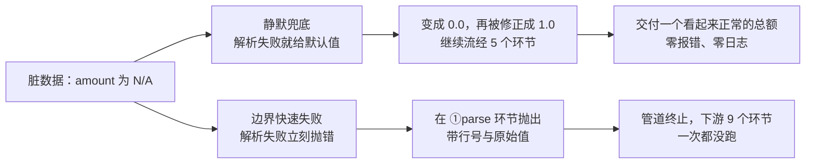
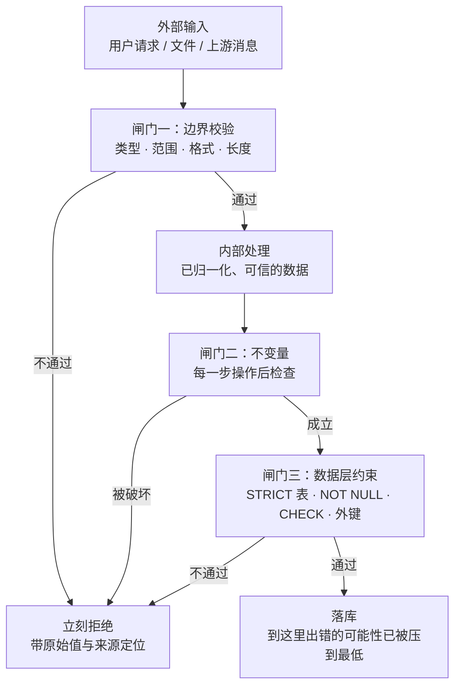

三个你大概都见过、但很少连在一起看的现象：

- 一个金额字段解析失败，于是 `except: return 0.0` —— 脏数据变成了 0，报表照样出，没人知道；
- 数据库列是动态类型，`'N/A'` 就这么写进了 `REAL` 列，几个月后 `SUM(amount)` 已经少算了；
- 生产环境用 `-O` 启动 Python，所有 `assert` 校验被静默剥掉，而没人记得这件事。

它们的共同点不是"出错了"，而是**错误没有被消灭，只是被推迟了**——推迟到了一个完全没有上下文的地方。

## 一、它从哪来

**1985 年，Tandem Computers 的 Jim Gray** 在《Why Do Computers Stop and What Can Be Done About It?》里给出了一对概念：

> **fail-fast module**：要么产生正确结果，要么立刻发出失败信号——**绝不产生"看起来正确"的结果**。
> **fail-stop processor**：出错就停，而不是带着错误状态继续跑。

这是容错计算的地基。逻辑很朴素：**冗余要能接管，前提是故障可被检测**。一个"悄悄算错"的模块，比一个"立刻倒下"的模块危险得多——因为后者能让备份接手，前者会污染备份。

更早的 Unix 传统里也有同一条直觉。Eric S. Raymond 在《The Art of Unix Programming》（2003）把它列为 **Rule of Repair**：能修就修；**但当你必须失败时，要尽早、响亮地失败**（fail noisily and as soon as possible）。

之后的形态基本是在"让失败更容易被检测到"这个方向上堆工具：

- **1998 年，JDK 1.2**：集合引入 **fail-fast 迭代器**。一边遍历一边改集合，立刻抛 `ConcurrentModificationException`，而不是给你一个错乱的遍历结果。
- **2009 年，ES5**：JavaScript 的 **严格模式**。一批原本静默通过的操作（给未声明变量赋值、改只读属性、删除不可配置属性）改成直接抛错。
- **2015 年起**：Rust 的 `panic!` / `unwrap` / `#[must_use]`，把"忽略返回值"和"忽略错误分支"变成编译器提醒的事。
- **2021 年，SQLite 3.37**：引入 **STRICT 表**，把"动态类型静默转换"这条老路封上。
- **Erlang 的 `let it crash`**：看着像反面，其实是同一条原则的分布式版本——**让崩溃尽快、尽量局部地发生**，再由 supervisor 决定重启策略。

一句话：快速失败不是什么新技巧，它是**故障可检测性**这条主线在语言、库、数据库、运行时里反复长出的一层壳。

## 二、为什么需要它

因为"错了"和"被发现错了"之间隔着一段距离，而**这段距离就是修复成本**。

三个具体的代价：

1. **状态污染**。错误发生后继续运行，脏值会一路写进缓存、数据库、下游系统。你要改的不只是代码，还有已经被污染的数据——而这往往是真正贵的部分。
2. **上下文丢失**。在源头，你知道"第 3 行 amount 是 N/A"；在末端，你只知道"总额对不上"。中间隔了五个环节、两次序列化、一次异步投递，定位成本指数级上升。
3. **"看起来正确"的输出会被信任**。这是最容易被低估的一条：一个崩溃会立刻引来注意力，一个静默兜底出来的 0 会安安静静地进入决策。**静默失败生产的是错误的事实，而不是错误的状态。**

还有一条针对不可逆操作：支付、转账、发券、发短信。在坏输入上执行一次，回滚的成本远高于拒绝一次。

**本质一句话：快速失败 = 承认错误一定会发生，于是把"发现的时刻"尽量前移到"错误发生的现场"——它优化的不是不报错，而是报错的位置。**

## 三、两张图看懂

先看同一条脏数据在两种写法下的分叉。左边是"尽力而为"，右边是"边界就拦"：



再看"闸门该放在哪"。快速失败不是到处加 `if`，而是把校验集中到几个**必经的窄口**：



两个图的含义合起来是：**内部尽量不重复校验（数据已被闸门保证），闸门必须绝对可靠（不能是会被剥掉的 assert）。**

## 四、它有什么用

**1. 五级管道的对照实验（本机实跑，脚本 `.workbuddy/fail_fast_demo.py`）**

4 行数据，第 3 行 `amount` 是 `"N/A"`，管道有 5 个环节：

```text
[静默兜底]
  → 全程零报错；已穿越环节 20 个（4 行 × 5 环节）
  → 汇总金额：130545 分 —— 看起来是个正常数字，实际混入了脏数据

[快速失败]
  → 在第 3 行的 ①parse 环节抛出：amount 不是合法数字：'N/A'
  → 已穿越环节 11 个；管道在此终止，后面 9 个下游环节一次都没跑
  → 进入汇总的金额：123104 分（只算了 2 行）

  结论：静默模式让脏数据多流经 9 个下游环节；
        且最终交付的 130545 分里，有 7441 分是凭空补出来的。
```

被静默修正的那一行，轨迹是这样的：

```text
    ①parse           → 0.0
    ②check-positive  → 1.0
    ③discount        → 0.9
    ④tax             → 0.95
    ⑤to-cents        → 95
```

`"N/A"` 最后变成了 95 分。**没有崩溃、没有日志、没有告警——只是数字错了。** 这就是"检测距离 = 修复成本"最直观的样子。

**2. 语言层的开关：严格模式让五个静默操作当场现形（Node 22 实跑）**

```text
代码写法                      非严格模式                    严格模式
--------------------------------------------------------------------------
给未声明的变量赋值             静默通过（错误被吞）             ReferenceError: leakedGlobal2 is not defined
给只读属性 NaN 赋值           静默通过（错误被吞）             TypeError: Cannot assign to read only property 'NaN'
delete Object.prototype      静默通过（错误被吞）             TypeError: Cannot delete property 'prototype'
函数形参重名                  静默通过（错误被吞）             SyntaxError: Unexpected string
给 Object.freeze 对象赋值     静默通过（错误被吞）             TypeError: Cannot assign to read only property 'n'
--------------------------------------------------------------------------
非严格模式下"静默通过"：5 / 5        严格模式下"静默通过"：0 / 5
```

注意最后一行 `Object.freeze`：非严格模式下给冻结对象赋值**不抛错、不生效**，你以为改了，其实没改。这类 bug 在非严格模式里可以藏几个月。

**3. 数据层的开关：SQLite 动态类型表 vs STRICT 表（sqlite 3.53.1 实跑）**

```text
  loose     INSERT N/A → 入库成功   typeof(amount)=text  值='N/A'
  strict_t  INSERT N/A → 拒绝入库   IntegrityError: cannot store TEXT value in REAL column strict_t.amount

  loose 表 SUM(amount) = 100.0（2 行参与，脏行被当成 0 悄悄跳过，零报错）
```

同一句 `INSERT`，动态类型表让你"成功"，STRICT 表让你"当场失败"。而第一行那个 `typeof(amount)=text` 是个时间炸弹：它躺在 `REAL` 列里，等着某天的聚合悄悄少算一笔。

**4. 用 `-O` 再跑一次：assert 不是校验**

```text
  __debug__ = True                      __debug__ = False   （python -O）
  assert v > 0, v=-1  → AssertionError   assert v > 0, v=-1  → 通过
  assert v > 0, v=0   → AssertionError   assert v > 0, v=0   → 通过
```

Python 的 `-O` 会**把 assert 语句整个从字节码里去掉**，连表达式都不求值。所以校验逻辑写在 `assert` 里，等于把"生产环境是否需要校验"这个决定交给了启动参数——而启动参数通常写在某个没人读的脚本里。

**5. 真实系统里的落点**

- **类型系统**：Rust 的 `Option`/`Result`、TypeScript 的 `strict`，本质是把一整类运行时错误提前到编译期。
- **Schema 校验**：Kafka Schema Registry、OpenAPI 校验、Pydantic —— 消息进业务代码之前先过闸门。
- **数据库约束**：`NOT NULL` / `CHECK` / `UNIQUE` / 外键 / STRICT 表，是最后一道、也是最难绕过的一道。
- **启动自检**：进程启动时校验配置与依赖，失败就退出，让编排系统别把流量导进来（而不是带着坏配置跑）。
- **`@Validated` / fail-fast 迭代器**：把"并发修改""参数非法"这类隐蔽问题从"结果错乱"提前成"当场异常"。

## 五、反例与边界

- **内部严格 ≠ 对外严格**。"快速失败"说的是**内部契约**要严格；对**外部输入**必须宽容，再把宽容后的结果归一化。把二者搞混，就会得到一个"用户少传一个字段就 500"的系统。这条边界和鲁棒性原则（Postel）是互补的两半。
- **一条坏数据不该炸掉整批**。批处理里 fail-fast 会放大故障：一条脏记录让 10 万条任务全挂。工程做法是**逐条校验 + 失败隔离**（死信队列 / 跳过 + 记录），关键是把"跳过多少条"做成指标——**静默跳过就等于静默兜底，只是换了个位置。**
- **校验要放在闸门，不是撒满全流程**。每个函数都做一遍防御性 `if` 的代价是：代码里到处都是"万一"，而真正该拦的地方反而漏了。**集中闸门 + 内部信任**才划算。
- **误报率高会把人逼到绕过校验**。如果校验器三天两头误报、每次都要人工介入，团队会学会关掉它。快速失败的可用性前提是：**它报的错都是真的、都可定位。**
- **快速失败必须配可观测性**。只"崩得早"而没有结构化错误、没有上下文（哪个租户、哪条消息、哪个版本），你只是把一次静默错误换成了一次无从下手的崩溃。
- **别用 assert 实现生产校验**（见上面 `-O` 的实测）。要"一定生效"就用显式 `raise` / `if + error`，或者干脆交给类型系统和数据库约束。
- **分布式里要谨慎**。单点快速失败会把局部错误放大成整体不可用：一个下游延迟就让上游全体拒绝。这时需要的是背压、熔断、降级——**快速失败负责"别把错误算成正确"，稳定性机制负责"别把局部故障变成全局故障"。**
- **用户输入错误不是"违约"**。前置条件被违反是**调用方的 bug**（该崩、该修）；用户填错表单是**正常业务事件**（该提示、该重试）。把两者混成一个异常类型，会让日志里到处是"错误"，而真正的 bug 淹没在里面。

## 六、对比表与小结

| 维度 | 静默兜底（fail-safe 误用） | 快速失败（fail-fast） |
|------|--------------------------|---------------------|
| 错误发生时 | 给默认值，继续跑 | 立刻抛出，带原始值与位置 |
| 检测距离 | 几步到几个月 | 0（就在现场） |
| 输出形态 | 看起来正常的**错**数字 | 明确的失败，没有数字 |
| 数据污染 | 可能已写进库、缓存、下游 | 未落库，或落在可回滚范围内 |
| 定位成本 | 需要回溯整条链路 | 栈顶就是现场 |
| 主要风险 | 错误被信任、被拿去决策 | 校验误报、单条坏数据放大故障 |
| 兜底要求 | 无（它自己就是兜底） | 死信队列、隔离、可观测性、快速通道 |

| 闸门层次 | 抓手 | 一句话要点 |
|---------|------|-----------|
| 编译期 | 类型系统、`strict` 模式 | 能提前到编译期的错误，别留到运行时 |
| 输入边界 | Schema 校验、`@Validated` | 只在边界宽容，进来就归一化 |
| 内部不变量 | 契约、断言（显式 raise） | 每次操作后检查，检测距离 = 0 |
| 数据层 | STRICT 表、NOT NULL、CHECK | 最后一道，也是最难绕过的一道 |
| 启动 | 配置与依赖自检 | 带着坏配置跑，比启动失败更贵 |
| 分布式 | 死信队列、隔离、指标 | 跳过要计数，否则只是换了位置的静默兜底 |

🐾 **小结**：快速失败最容易被误解成"让程序更爱崩溃"。它真正在做的事是**把错误的发生地和发现地重合起来**——因为修复成本不取决于错误有多严重，而取决于你离现场有多远。落地时只需要反复问一个问题：**"这条数据要是错的，我是在哪一步、靠什么发现的？"** 如果答案是"月底对账的时候"，那它现在就不是在快速失败，而是在慢慢积累。

**相关阅读**

- 契约式设计：把应该写成必须（前置条件/后置条件/不变量，正是"闸门"的正式写法）：[/posts/princ-dbc/](/posts/princ-dbc/)
- 鲁棒性原则（Postel）：接收要宽松，发送要严格（"内部严格"的对面那一半）：[/posts/princ-postel/](/posts/princ-postel/)
- 幂等性：让重试变得安全（快速失败之后，调用方需要能安全重试）：[/posts/princ-idempotency/](/posts/princ-idempotency/)
- 背压：慢消费者的保护机制（局部失败如何不放大成全局故障）：[/posts/princ-backpressure/](/posts/princ-backpressure/)
