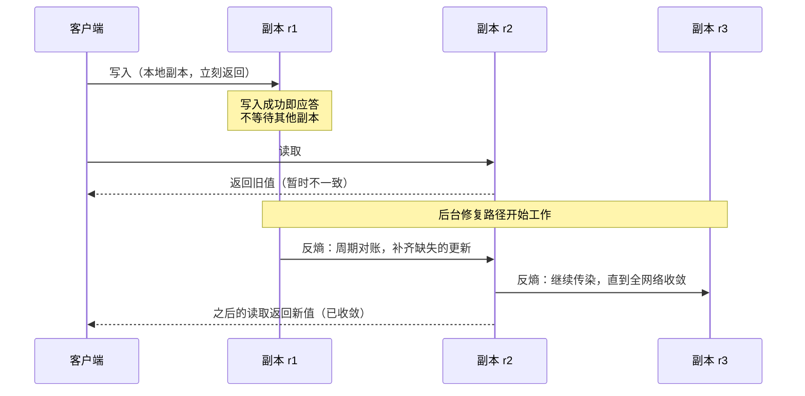
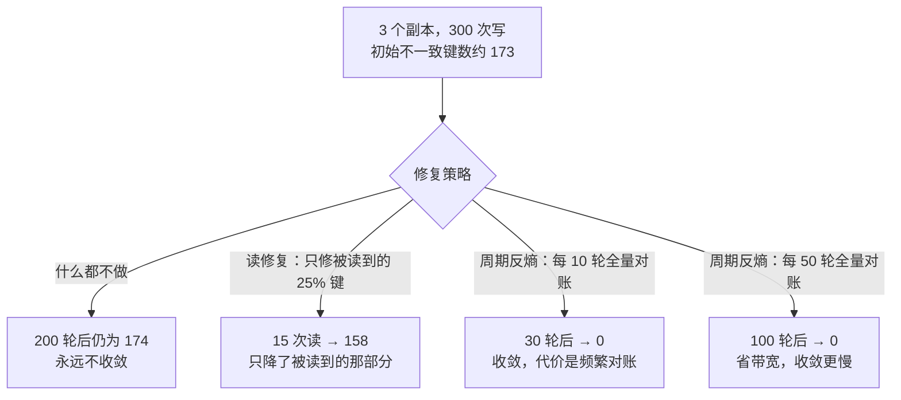

三个副本，写了 300 次，然后什么都不做：

```text
    r1 本地 counter = 103
    r2 本地 counter = 99
    r3 本地 counter = 98
```

三个数不一样。**如果你以为"最终一致"的意思是"放着不管，过一会儿它们自己就一样了"，那这三个数字就是反例——晾 1000 轮也不会变。**

最终一致性被误解得最厉害的地方就在这个"最终"上。它不是"时间会治愈一切"，而是一份**有条件的承诺**：*在停止写入、并且修复机制跑完之后，所有副本会收敛到同一个值。* 注意后半句——**修复机制必须存在。**

## 一、它从哪来

最终一致性的谱系，比大多数人以为的要长。

- **1975 年，Johnson 与 Thomas** 在《The Maintenance of Duplicate Databases》（RFC 677）里提出用时间戳来解决副本冲突——这是 **Last-Write-Wins** 的雏形，也是"让副本自己收敛"这一思路最早的落地。
- **1987 年，Xerox PARC 的 Demers 等人** 发表《Epidemic Algorithms for Replicated Database Maintenance》，给出一整套**反熵（anti-entropy）** 与 **gossip** 机制：副本之间周期性地互相"传染"数据，直到全网络收敛。这是"收敛"从口号变成工程手段的关键一步。
- **1989–1995 年，同样是 Xerox PARC 的 Bayou 项目**：Douglas Terry 等人在 SOSP 1995 的《Managing Update Conflicts in a Weakly Connected Replicated Storage System》里，**明确提出了 eventual consistency 这个术语**，并配上一套今天还在用的 **session guarantees**（read-your-writes、monotonic reads、writes-follow-reads）。Bayou 的动机非常具体：**移动计算**——笔记本电脑会断网，断网也得能用。
- **2000–2002 年**：Eric Brewer 的 CAP 猜想被 Gilbert 与 Lynch 证明，给"为什么必须放弃一部分一致性"提供了理论框架。
- **2007 年，Amazon Dynamo**（SOSP 2007）：把最终一致性推向工业主流，并给出了一整套配套机制——**quorum（R + W > N）、向量时钟、读修复、带 Merkle 树的反熵、hinted handoff**。今天你能见到的"最终一致系统"，几乎都能在这篇论文里找到对应零件。
- **2008–2009 年**：Werner Vogels 的《Eventually Consistent》把这个词变成通用术语；Dan Pritchett 的《BASE: An Acid Alternative》给出 **Basically Available / Soft state / Eventually consistent** 这套对照 ACID 的命名。
- **2011 年，INRIA 的 Marc Shapiro 等人** 提出 **CRDT**（Conflict-free Replicated Data Types），把"合并"从"靠时间戳猜"升级为"靠数学性质保证"——要求合并操作满足**交换律、结合律、幂等**，从而得到比"最终一致"更强的 **强最终一致（Strong Eventual Consistency）**：只要收到全部更新，副本立刻一致，不需要"等一等"。

值得一提的还有两次"反转"：

- **2012 年，Brewer 自己写了《CAP Twelve Years Later》**，澄清"C 是线性一致性"、"分区发生时 CAP 才适用"、"三选二是误读"——因为"最终一致 vs 强一致"的二分，本来就是 CAP 被过度简化后的产物。
- **2020 年 12 月，AWS S3 宣布所有读写都强一致**，结束了 S3 长达十四年的"最终一致"叙事。这提醒我们：**最终一致经常是工程折中的产物，而不是理想——当底层技术允许时，提供方会把它换成强一致。**

## 二、为什么需要它

因为**强一致的代价是延迟与可用性，而且这个代价由物理定律决定**。

要保证"任何一次读都能看到之前所有成功的写"（线性一致性），系统必须让写**同步**到足够多的副本才能返回。这意味着：

- **延迟下限 = 最慢那个副本的往返时间**。跨地域多副本时，这一条直接把延迟钉死在几十到上百毫秒；
- **可用性下限 = 需要同时活着的副本数**。网络一分区，少数派一侧就不许读写——宁可不可用，也不给可能过期的数据；
- **写入吞吐受限于最慢的参与者**。

最终一致换掉的是"立刻"，保住的是"正确**最终**会到"。它做的事很直白：**把写操作先接住、立刻返回，把"让副本对齐"这件事从写路径挪到后台**。收益是延迟从"最慢副本的 RTT"降到"本地"，可用性从"多数派存活"放宽到"只要写得到某一个副本"。

它的典型适用场景也就自然浮现：

- **跨地域/多活部署**，物理距离摆在那里；
- **读多写少、且能容忍短暂陈旧**的场景（商品详情、用户资料、时间线）；
- **断连/弱网/离线优先**（Bayou 的初衷，今天的移动端本地优先架构、Notion/Figma 类协作工具）；
- **可用性优先于新鲜度**的核心链路（购物车"加进去就一定成功"，而不是"加不进去就报错"）；
- **无法强一致的技术形态**：DNS 传播、CDN 缓存、消息队列的跨集群复制。

**本质一句话：最终一致性是把一致性的责任从写路径转移到后台修复策略上——它承诺的不是"数据会自己变一致"，而是"只要停止写入，并且存在一套在跑的修复机制，副本最终会收敛到同一个值"。**

## 三、两张图看懂

先看收敛这件事在系统里长什么样。注意图中**写路径**和**修复路径**是两条独立的路：



再看"最终"到底要多久——这取决于你选了哪种修复策略，实测数据如下：



这张图要传达的核心是：**"最终"不是一个时间承诺，而是一个策略选择。** 同样叫"最终一致"，什么都不做是永远不一致，每 10 轮对账是 30 轮收敛，每 50 轮对账是 100 轮收敛。

## 四、它有什么用

**1. 没有修复机制，"最终"永远不会到来（本机实跑，脚本 `.workbuddy/eventual_demo.py`）**

3 个副本，300 次写随机落在各副本上，写后不做任何信息交换：

```text
    r1 本地 counter = 103
    r2 本地 counter = 99
    r3 本地 counter = 98
  三个数不一样，而且差异不会自己变小。两两不一致键数：
    r1 vs r2：不一致键数 = 1
    r1 vs r3：不一致键数 = 1
    r2 vs r3：不一致键数 = 1
  即使再空转 1000 轮，只要没有信息交换，这个数字不会变
```

**2. 三种修复策略的收敛速度（同一脚本实跑）**

```text
  无修复（写后不管）                初始不一致  174 → 结束  174，耗时 200 轮
  读修复（只修被读到的那 25% 键）       初始不一致  173 → 结束  158，耗时  15 轮
  周期反熵（每 10 轮全量对账）         初始不一致  172 → 结束    0，耗时  30 轮
  周期反熵（每 50 轮全量对账）         初始不一致  173 → 结束    0，耗时 100 轮
```

这四行几乎就是最终一致系统的完整经济学：

- **无修复**：不花钱，也永远不收敛——**"最终一致"必须有人为它付账**；
- **读修复（read repair）**：只修**被读到**的键。15 次读让不一致从 173 降到 158——降幅 15，正好对应"被读到的键"。**好处是"热点数据自动修复"（被读的东西恰好是最该对的），坏处是"冷数据永远不对"**——没人读的数据，分歧就一直躺着。Dynamo 的读修复正是这个语义。
- **反熵（anti-entropy）**：定期全量对账，能真正收敛到 0。间隔 10 轮 → 30 轮收敛；间隔 50 轮 → 100 轮收敛。**间隔越短越快、也越贵**（对账本身要传数据、算摘要）。真实系统用 Merkle 树来压缩对账流量——先比树根，只传不同的子树。

工程上的标准答案是**两者都要**：读修复负责热点与延迟，反熵负责兜底冷数据。

**3. 收敛 ≠ 没丢数据：冲突解决才是真正的难点（同一脚本实跑）**

3 个副本各自本地自增（彼此看不到对方，这就是并发），20 轮后全量互相同步，期间共发生 420 次自增：

```text
  并发自增总数（三个副本本地自增之和）：420
  ------------------------------------------------------------
  r1：LWW 计数 =  140    G-Counter 计数 =  420
  r2：LWW 计数 =  140    G-Counter 计数 =  420
  r3：LWW 计数 =  140    G-Counter 计数 =  420

  LWW：三副本最终值 [140] —— 收敛了，但只剩 140，并发写被静默覆盖
  G-Counter：三副本最终值 [420] —— 收敛，且每一次自增都留下了
```

这是全文最该记住的一组数字：**两种方案都"最终一致"，都收敛到三个副本完全相同。但 LWW 把 420 次点赞记成了 140 次——三分之一。**

**收敛描述的是"副本之间是否一致"，跟"结果是否正确"完全是两件事。** LWW（Last-Write-Wins）的规则是"时间戳大的赢"，在并发自增场景下，每一次合并都等于把对方那一次增量**丢掉**。它是一致的、确定的、可解释的——**只是错的**。

G-Counter 走的是另一条路：**改变数据的表示**。不存"总数是多少"，而存"每个副本贡献了多少"，合并时逐副本取最大值再求和。这样合并天然满足**交换律、结合律、幂等**——无论同步顺序怎样、重复几次，结果都一样，而且每一次自增都被保留。

这就是 CRDT 的核心思想：**与其在合并时试图"判断谁对"，不如把数据结构设计成"怎么合并都对"。**

**4. 真实系统里的落点**

- **Dynamo 式系统（Cassandra、Riak、早期 DynamoDB）**：`R + W > N` 的 quorum 保证读写集合有交集，配合向量时钟检测冲突、读修复 + Merkle 反熵兜底、hinted handoff 处理临时不可达的副本。
- **副本复制**：MySQL 主从、Redis 主从默认都是**异步复制**——从库落后几毫秒到几秒是常态。所以"写完立刻读从库读不到"不是 bug，是模型。
- **多活架构**：同城/异地双活、单元化部署，跨单元的数据靠消息或 CDC 异步同步，冲突靠业务规则或 CRDT 解决。
- **DNS 与 CDN**：TTL 就是"你接受多久的陈旧"。改一次解析记录，全球收敛可能要几小时——这是最古老、也最被接受的最终一致。
- **离线优先应用**：本地库先写、后台再同步，冲突留给业务层或 CRDT 处理。
- **计数器/集合类数据**：点赞数、播放量、购物车内容、被标记已读的集合——这些正是 CRDT 的甜区。

## 五、反例与边界

- **"最终"没有时限，可能永远不来**。副本长期离线、墓碑（tombstone）被 GC 掉、修复任务静默失败，都会让某些键永远不收敛。**必须以"复制延迟"为指标持续观测，而不是相信"最终"会自动发生。**
- **收敛不等于业务正确**（见上面 420 → 140 的实测）。**冲突解决策略是业务决策，不是技术默认值。** 电商库存用 LWW 会超卖，点赞数用 LWW 会少算，用户资料用 LWW 一般无所谓——**同一个策略在不同业务上的正确性完全不同。**
- **读到旧数据会直接破坏业务不变量**。"注册完立刻登录"、"转账后立刻查余额"、"下单后立刻查订单"——这些都需要 **session guarantee**（read-your-writes / monotonic reads）。Bayou 在 1995 年就提出了这套东西，今天仍然经常被忘掉。**解决办法不是"改回强一致"，而是给会话提供保证**（粘性路由、写后读走主库、会话内版本号）。
- **删除比写入更容易出事**。删除在副本上表现为墓碑，如果墓碑被过早清理，而被删的数据从慢副本"复活"，就会得到一个**删不掉的幽灵记录**。这是最终一致系统里最经典的一类诡异故障。
- **反熵的成本随数据量增长**。全量对账在 TB 级数据上不可行，所以必须靠 Merkle 树/分片摘要来"只比不同的部分"——**而这又引入新的实现复杂度与故障模式**。
- **别把 CAP 当成"最终一致 vs 强一致"的二选一**。CAP 里的 C 指的是**线性一致性**（一个非常强的模型）；分区不发生的时候，CAP 根本不适用。真实系统更多是在**一致性谱系**上取点（线性一致 → 顺序一致 → 因果一致 → 读己之写 → 单调读 → 最终一致），而不是二选一。
- **"最终一致"最容易被当成不做的借口**。"反正是最终一致，冲突以后再说"——这句话之后通常就是数据错乱。**正确的姿势是：先定义冲突如何解决，再决定要不要用最终一致。**
- **不是所有场景都值得付这份复杂度**。需要强一致的场景（账务、库存扣减、唯一性约束、权限变更）**应该老老实实上强一致**。S3 在 2020 年把最终一致换成强一致，就是行业对"这个折中未必值得"的一次表态。

## 六、对比表与小结

| 维度 | 强一致（线性一致） | 最终一致 | 强最终一致（CRDT） |
|------|------------------|---------|------------------|
| 写延迟 | 取决于最慢的副本（跨地域可达上百毫秒） | **本地延迟即可返回** | 本地延迟 |
| 分区时可用性 | 少数派一侧不可用 | **几乎总可写** | 几乎总可写 |
| 读到什么 | 一定是最新已提交值 | 可能是旧值 | 可能缺更新，但**不会算错** |
| 收敛保证 | 不需要（本来就一致） | 停止写入 + 修复机制跑完 | 收到全部更新即一致 |
| 冲突处理 | 不存在冲突 | **必须自己定义** | 由数据结构保证可合并 |
| 实现复杂度 | 高（共识协议） | 中高（修复 + 冲突解决） | 中（但要求数据结构受限） |
| 典型代价 | 延迟、可用性 | 陈旧读、业务不变量风险 | 无法表达任意语义 |
| 适用场景 | 账务、库存、唯一性、权限 | 读多写少、跨地域、离线优先 | 计数、集合、协作编辑、购物车 |

| 修复/收敛机制 | 修什么 | 成本 | 覆盖不到的地方 |
|--------------|-------|------|--------------|
| 读修复 read repair | 读写路径上碰到的键 | 低（搭在正常读写上） | **冷数据永远不修** |
| 反熵 anti-entropy | 全量对账 | 高（可被 Merkle 树压缩） | 延迟取决于间隔 |
| hinted handoff | 临时不可达副本的写 | 低 | 只解决暂时性故障 |
| Merkle 树比对 | 只传不同的子树 | 中 | 本身要维护树结构 |
| 向量时钟 / 版本向量 | 检测并发冲突 | 低 | 只负责**发现**，不负责**解决** |

🐾 **小结**：最终一致性最容易误解的一点，就是把"最终"当成一个时间承诺。它其实是**一份有条件的工程合同**：写路径先接住、立刻返回，后台必须有修复机制（读修复管热点、反熵兜全量），并且必须**先定义冲突怎么解决**——否则你会得到一个完美收敛、但数据是错的结果。落地时问自己两个问题：**"这个数据不一致一段时间，业务能接受吗？"** 以及**"两份并发的写入撞在一起，我到底要哪一个——还是都要？"** 第一个问题决定要不要用最终一致，第二个问题决定用了之后会不会出事。

**相关阅读**

- CAP 定理：分布式的取舍三角（最终一致是从哪条边被推出来的）：[/posts/princ-cap/](/posts/princ-cap/)
- 幂等性：让重试变得安全（弱一致环境下的必备前提）：[/posts/princ-idempotency/](/posts/princ-idempotency/)
- 写前日志 WAL：先记账、后落库（另一条"先记录、后处理"的思路）：[/posts/princ-wal/](/posts/princ-wal/)
- 快速失败：让 Bug 早点现形（不一致被静默容忍，等于另一种静默兜底）：[/posts/princ-fail-fast/](/posts/princ-fail-fast/)
