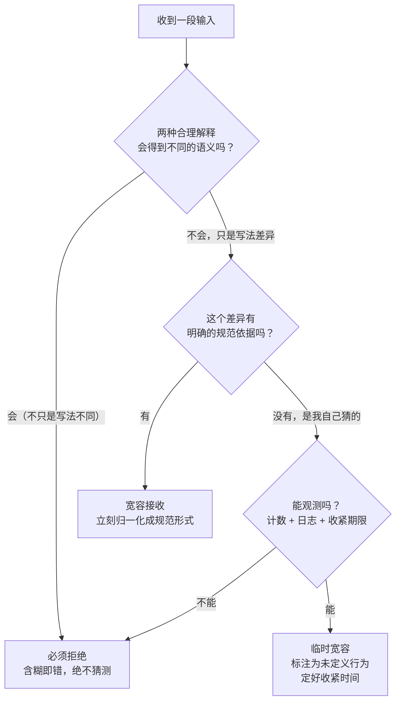

同一个 HTTP 请求，链路上两个解析器给出了两个答案：

- 前端（取第一个 `Content-Length`）认为消息体是 **6** 字节，解析完一个请求，剩下的当垃圾丢掉；
- 后端（取最后一个 `Content-Length`）认为消息体是 **13** 字节，把多出来的 7 字节当成了**下一个请求的开头**。

两边都没报错，都觉得自己很宽容，都"成功"处理了请求。而攻击者要的就是这 7 个字节的差值。

这就是**鲁棒性原则（Robustness Principle）**——"接收要宽松，发送要严格"——最经典的一张脸，也是它从互联网地基变成安全漏洞清单的完整弧线。

## 一、它从哪来

**1980 年，Jon Postel** 在 TCP 的早期规范 RFC 760 里写下这句现在被引用了半个世纪的话；1981 年的 **RFC 793（TCP）** 把它正式列为一条通用原则：

> TCP implementations will follow a general principle of robustness:
> **be conservative in what you do, be liberal in what you accept from others.**

1989 年的 **RFC 1122** 把它整理成今天更常见的措辞，并直接起名为 **Robustness Principle**：

> **Be liberal in what you accept, and conservative in what you send.**

Jon Postel（1943–1998）不是随手写的。他是 RFC 编辑几十年、IANA 的实际管理者、SMTP/DNS/FTP 标准化背后的关键人物，被同行称作"互联网的仁慈独裁者"。他面对的工程现实是：**互联网没有"全网协调升级"这个按钮**。

于是这条原则的原始动机是**互操作性**，而不是"代码写得松一点"：

- 对端可能是个 1978 年的实现，某个字段就是少一个空格；
- 规范刚升级，新实现已经上线，老实现还在跑；
- 有成千上万个实现，不可能同时更新。

如果每个接收端都严格拒绝一切不合规输入，那么**任何一次规范演进都会把互联网割成互不相通的两半**。宽容接收，本质上是给"渐进部署"买的一份兼容性保险。

它的最佳战绩是 HTML：浏览器对畸形 HTML 近乎无限的容忍（HTML5 规范里明确要求遇到 parse error 继续解析、并规定"该怎么修"），换来了对整个 Web 的向后兼容——**这也是它最恶名昭著的地方**，因为容错解析器恰恰是 XSS 的温床。

所以这条原则后来被正式"限缩"了。**2023 年，Martin Thomson 与 David Schinazi 发布 RFC 9413《Maintaining Robust Protocols》**，系统记录了宽容接收造成的长期伤害，并给出三条修正方向：

1. **接收端应当严格**，除非有明确、可写进规范的宽容理由；
2. 宽容只能用于**已知的、有限的**问题，而不是"什么都收"；
3. **宽容要有期限**，并且要和协议版本/能力协商绑定，不能变成永久默认。

一句话概括今天的主流共识：**接收要严格，"接收要宽松"只在这条原则被精确限定时才成立。**

## 二、为什么需要它

因为它要解决的是一个**结构性问题**：分布式系统里没有全局时钟，也没有全局版本。

没有宽容接收会发生什么：

- **部署不同步就是断链**。A 服务升到 v2 加了个字段，B 服务还是 v1 的严格解析器，直接拒收——一次正常发布变成一次事故。
- **未知即致命**。严格实现遇到没见过的枚举值、没见过的头、多出来的字段就报错。可扩展性直接归零。
- **规范与实现永远有缝**。现实中的设备、老系统、硬件、政企接口，总有各种"实际就是这样"的偏差。协议是给人用的，不是给编译器用的。

反过来，没有严格发送会怎样：

- **接收端要写越来越多的宽容代码**，而且每个接收端各写一套，分歧由此产生；
- **歧义被留给链路**，而链路上任何两个组件的理解差异都是攻击原语；
- **错误被推给对方**：我方发出含糊的报文，让对端去猜——出问题的责任也跟着模糊了。

**本质一句话：接收端的宽容，是为异构实现与渐进部署买的兼容性保险；发送端的严格，是给对端的一份确定性承诺——而宽容必须"有边界、有观测、有期限"，否则它会从保险变成漏洞。**

## 三、两张图看懂

先看这条原则的正常形态——**宽容集中在唯一入口，进来就归一化，内部一律用规范形式**：


关键是**宽容只出现在 `C` 这一个环节**。一旦宽容代码散落到业务逻辑里（"这里也顺手兼容一下""那个字段有时候是字符串"），你就永远说不清系统到底接受什么。

再看"什么时候不该宽容"的判定树。这也是 RFC 9413 那套思路的可操作版本：



判定树的核心只有一条：**区分"写法不同"和"语义不同"**。大小写、空白、字段顺序属于前者，可以宽容；长度冲突、编码冲突、同一字段两种含义属于后者，必须拒绝。

## 四、它有什么用

**1. 接收端的宽容，标准库自己就是最好的样本（本机实跑）**

```text
  int("   42   ")                    → 接受：42
  int("+42")                         → 接受：42
  int("1_000")                       → 接受：1000
  float("1e3")                       → 接受：1000.0
  float("  .5 ")                     → 接受：0.5
  float("nan") / float("inf")        → 接受：(nan, inf)
  json.loads('{"a": 1,}')            → 拒绝：JSONDecodeError: Illegal trailing comma before end of object
  json.loads('{"a": 1}')             → 接受：{'a': 1}
```

注意最后两行：**同一个标准库里，`int/float` 极其宽容，`json` 却严格到拒绝一个尾随逗号。** 这不是不一致，而是按场景做的取舍——`int()` 面对的是人随手敲的数字，`json` 面对的是机器生成的结构化数据，后者一旦含糊就必然有歧义。**"宽容还是严格"从来不是气质问题，是场景问题。**

**2. 宽容过头的代价：CSV 把后面的行整个吞掉**

```text
  strict=False（默认）: 解析出 2 行
     ['name', 'note']
     ['Alice', '未闭合的引号\nBob,第二行\nCarol,第三行\n']

  strict=True: 拒绝解析 → Error: unexpected end of data
```

一个未闭合的引号，让 `Bob` 和 `Carol` 两行**人间蒸发**——没有报错，没有警告，你拿到的是一个行数不对但格式正常的 CSV。这就是"宽容"最贵的地方：**它不告诉你它吞了什么。**

**3. 宽容 + 分歧 = 攻击原语（本机实跑）**

```text
  原始请求头（同一个 Content-Length 出现两次）：
     Host: shop.example
     Content-Length: 6
     Content-Length: 13

  解析器 A（取首个）→ Content-Length = 6
  解析器 B（取末个）→ Content-Length = 13

  A 认为 body 只有 6 字节：'0\r\n\r\nG'
  B 认为 body 有 13 字节：'0\r\n\r\nGET /a'

  两者相差 7 字节。多出来的 'ET /a' 会被链路上后一个解析器当成「下一个请求」的开头。
```

这一段就是 **HTTP 请求走私（request smuggling）** 的最小骨架。要点不是"取首个还是取末个谁对"，而是：**当报文本身有歧义时，链路上每个组件都会用自己的宽容规则去猜，而它们的猜测不一致。** 前端按 6 字节放行、后端按 13 字节解析，中间多出来的字节就成了攻击者注入的通道——可以绕过鉴权、投毒缓存、劫持别人的请求。

规范后来的处理方式，恰好是**把 Postel 反过来了**：RFC 7230/9112 要求，出现多个不一致的 `Content-Length`、或 `Content-Length` 与 `Transfer-Encoding` 冲突时，**必须视为不可恢复错误并拒绝该连接**——不猜、不选一个、不容忍。

**4. 发送端该怎么做（Postel 的后半句）**

```text
  发送端该怎么做：
     ✅ 只发一个 Content-Length，且与实际字节数精确一致
     ❌ 不发重复头、不发前导零（Content-Length: 006）、长度不许含糊
     本例 body 实际 11 字节，而请求头声明了 6 和 13 ——
     严格发送端在序列化阶段就会拒绝这样构造出来的报文。
```

发送严格的几条通用落点：

- **长度、编码、字符集必须显式且精确**（UTF-8 不带 BOM、时间用 ISO 8601 带时区、数字不带千分位）。
- **不要发明私有扩展去填已有字段**，宁可加一个新字段。
- **枚举要有未知值兜底**，但写出时必须落在规范集合内。
- **能由机器校验的输出，就不要由人来检查**——发送严格的收益是**对端不必写宽容代码**。

**5. 工程上真正管用的做法：把宽容关进一个门**

- 入站数据先过**归一化层**：去空白、统一大小写、补默认值、转成规范形式，之后全系统只用规范形式。
- 对"放宽了的输入"**打点**：计数 + 样本日志。宽容一旦不可观测，就再也收不回来了。
- 出站数据过**序列化层**：所有字段走同一个编码器，禁止手拼字符串（手拼 JSON 是严格发送最常见的破口）。
- 对接第三方时，把对方的实际行为**写成测试固件**（golden files），宽容就有据可查，而不是靠"上次好像能过"。

## 五、反例与边界

- **含糊即错，不能猜**。这是最重要的一条边界：**当两种解释会导致不同语义时，拒绝是唯一正确答案。** 猜测只会把分歧从你这里转移到链路上，而链路上的分歧就是漏洞。
- **宽容会掩盖对端的 bug，让错误实现活得比正确实现更久**。你的接收端越宽容，发错的一方越没有动力改——**整个生态的质量由最宽容的那个接收端决定**。RFC 9413 把这一条列为主要危害，不是偶然。
- **一旦接受了非标准输入，就有人开始依赖它**。之后想收紧就变成破坏性变更。所以宽容从第一天起就要标注为**未定义行为**，并给出收紧时间表。
- **宽容 ≠ 语义等价**。只容忍**表达形式**的差异（空白、大小写、字段顺序、可选字段缺失），绝不容忍**语义的歧义**（多个长度、冲突编码、一个字段两种含义、`01/02/2024` 到底是哪天）。
- **宽进严出不能用在输出侧**。"我这边输入比较宽松"不能推导出"我这边输出也可以随意"——恰恰相反，**你越宽容地收，越应该严格地发**，否则链条上的宽容债越滚越大。
- **宽松解析还有一类隐蔽风险：解析差异本身就够用**。`127.1`、`0x7f.1`、`2130706433` 是同一个地址的不同写法；大小写不敏感的比较、Unicode 归一化（同一个可见字符的不同码点序列）、前导零，都可能让"校验时看的东西"和"真正用的时候用的东西"不一样。**访问控制绕过、SSRF、ACL 失效，很多都出自这里。**
- **也不能走到另一个极端**。全盘严格会在对接老系统、硬件设备、政企接口时寸步难行。真正可操作的姿势是：**默认严格，宽容要逐条登记、带依据、带期限、带指标。**
- **别把 Postel 当成不写校验的借口**。"反正接收要宽松"是这条原则被误用最多的形式。宽容指的是**对合规性偏差的容忍**，不是**对非法输入的放行**。

## 六、对比表与小结

| 维度 | 宽进严出（Postel 原教旨） | 严进严出（RFC 9413 之后的默认） | 宽进宽出 |
|------|------------------------|---------------------------|---------|
| 互联互通 | 最好，对接老系统无痛 | 需要能力协商、版本机制 | 看起来最好 |
| 歧义处理 | 靠猜，链路上分歧必然存在 | 含糊即拒，无分歧 | 分歧被放大 |
| 安全面 | 攻击面大（走私、绕过、解析差异） | 攻击面小 | 攻击面最大 |
| 升级演进 | 容易僵化（靠宽容续命） | 有明确收紧路径 | 无法演进 |
| 实现成本 | 每个接收端各写一套宽容逻辑 | 需要规范写清"什么算合规" | 最低 |
| 适用场景 | 过渡期、对接遗留系统、HTML 这类"必须兼容历史"的格式 | 新协议、内部服务、有分歧即危险的链路（支付、鉴权） | 基本没有合适场景 |

| 输入形态 | 该怎么处理 | 理由 |
|---------|-----------|------|
| 多余空白 / 大小写 / 字段顺序 | 宽容接收并归一化 | 只是写法差异，语义唯一 |
| 可选字段缺失 | 宽容，补默认值 | 规范允许，语义唯一 |
| 新增的未知字段 | 宽容，忽略并保留 | 可扩展性的前提 |
| 未知的枚举值 | 收下但记为未知，**不要静默当默认值** | 静默当默认值等于编造语义 |
| 多个冲突的长度 / 编码 | **拒绝** | 两种解释语义不同 |
| 同一字段两种含义 | **拒绝** | 同上 |
| 格式歧义的日期数字 | **拒绝或要求显式格式** | `01/02/2024` 无法判定 |
| 同一字符的多种码点写法 | 归一化后再比较，比较时只用规范形式 | 否则校验与使用会脱节 |

🐾 **小结**：鲁棒性原则是互联网"没有全局升级按钮"这一现实逼出来的妥协，它换来了几十年的渐进演进能力，也留下了整整一类解析差异漏洞。今天可用的版本是：**发送端严格到不给自己留含糊，接收端对"写法差异"宽容、对"语义歧义"零容忍——并且宽容要逐条登记、能被观测、有收紧期限。** 落地时问自己一个问题：**"这段输入我宽容了，是因为规范允许，还是因为我不想改？"** 如果答不出依据，那它不是宽容，是漏洞。

**相关阅读**

- 快速失败：让 Bug 早点现形（"内部严格"的另一半，两者是一笔交易的两面）：[/posts/princ-fail-fast/](/posts/princ-fail-fast/)
- 端到端原则：TCP 为什么把可靠性放在两端（同属互联网设计原则的原始谱系）：[/posts/princ-end-to-end/](/posts/princ-end-to-end/)
- 最小权限原则：安全的第一道闸（宽松解析如何变成越权入口）：[/posts/princ-least-privilege/](/posts/princ-least-privilege/)
- 最少惊讶原则：接口设计的隐形标准（"猜"为什么总比"拒绝"更贵）：[/posts/princ-least-astonishment/](/posts/princ-least-astonishment/)
