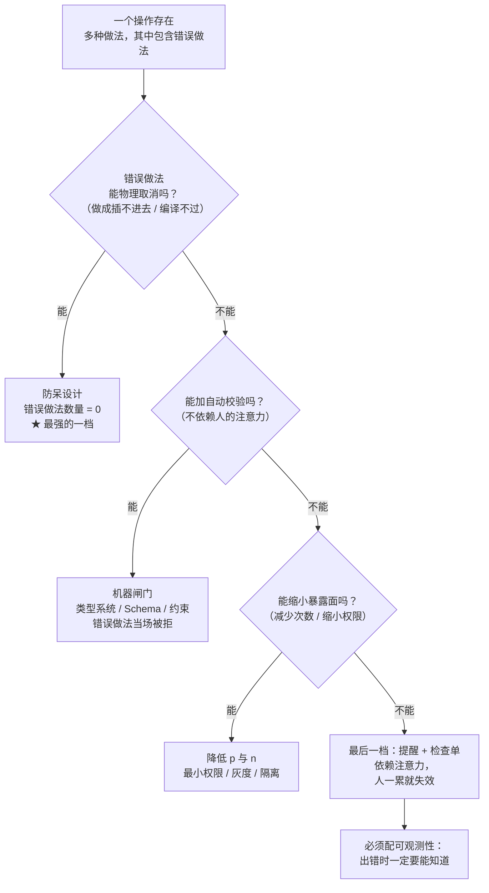

「墨菲定律」大概是所有工程格言里被引用最多、被认真对待最少的一条。

它的日常用法是这样的：「今天演示肯定出问题，墨菲定律嘛。」——说完就过去了，像一个用来消解焦虑的段子。然后演示果然出了点小问题，大家哈哈一笑，散会。

但如果只把它当段子，就错过了它真正有用的那一半。因为这句话在工程语境里其实是一个**关于概率的断言**，而概率可以被计算。一旦你能计算它，它就从「自我实现的悲观预言」变成一条可以量化、可以设防的设计约束。

本文讲的是**工程意义上的墨菲定律**：它最初说了什么、为什么它会成立、它给出的那个具体判据（"有几个方式做一件事"）、以及它怎么变成了可靠性工程里一整套具体做法。

## 一、它从哪来

这句话的出处没有想象中古老。

**1949 年**，美国空军在加州 Muroc 干湖（后来改名叫爱德华兹空军基地）做一项叫 **MX981** 的项目，测试人类对突然减速的耐受极限——通俗说，就是"人能被刹车刹到什么程度"。参与测试的工程师里有一位叫 **Edward A. Murphy Jr.**（爱德华·墨菲），当时是莱特航空发展中心的试飞工程师。

故事的版本有好几个，最广为流传的一版是：墨菲注意到某位技术员把一组传感器**全部装反了**——而每一个传感器都有两种装法，理论上有一半概率装对，结果全装错了。于是他抱怨了一句大意是「**If there's any way to do it wrong, he'll find it.**」（只要有办法装错，他就一定会装错。）

项目负责人 **John Paul Stapp**（就是那位亲身坐火箭滑车、承受 40 倍重力把自己当实验对象的上校）在记者会上把这句抱怨浓缩成了后来传遍世界的形式，并把它当成了一个**项目座右铭**：

> **Whatever can go wrong, will go wrong.**
> 会出错的事情，总会出错。

注意两个关键背景，它们决定了这条定律的性质：

1. **它是从测试现场长出来的，不是从哲学书里长出来的。** 墨菲关心的不是"世界为什么充满恶意"，而是一件很具体的事：**一个接口/零件/操作有若干种可能的做法，其中错误做法的数量不为零，那么在一个足够长的流程里，错误做法会被碰到。**
2. **它当时是用来做设计的，不是用来抱怨的。** Stapp 把它当座右铭，是因为这句话能推动一件事：**让错误的装法在物理上不可能发生。** 后来那次事故的直接产物，就是给传感器做了**防呆（pokayoke）设计**——插头做成不对称的，装反了就插不进去。

**1958 年**，这句话被收进《Aviation Mechanics Bulletin》，正式进入工程文献。此后它又被不断"再发现"和改写：**George Nichols** 在 1950 年代把它提炼成今天最常见的措辞；**Arthur Bloch** 在 1977 年的 **《Murphy's Law》** 汇编里把它扩展成几十条"墨菲定律变体"（著名的"面包掉在地上总是抹黄油那面朝下"就出自这里）；软件工程里则有了 **SNAFU 原则**——"Situation Normal: All Fouled Up"，形容系统常态就是"到处都有点小破"。

而软件工程对它的第一次严肃回应，出现在 **1969 年**：**Melvin Conway** 在《How Do Committees Invent?》里写下了那句后来被称作**康威定律**的话——这里之所以提它，是因为**墨菲定律和康威定律是同一种思维的两种用法**：一个管"错误一定会被撞上，所以把路堵死"，一个管"结构一定会复刻沟通，所以先改沟通"。

## 二、为什么需要它

因为**大多数系统的正确性假设是"运气"而不是"约束"**。

把这句话拆开看，会得到三个非常具体的工程事实。

**事实一：人不是不会出错，而是不能被假设为不出错。**

冗余设计里有一条铁律：**冗余要能接管，前提是故障可被检测**（这条在快速失败那篇里已经讲过）。墨菲定律补上了前半句：**只要故障有可能发生，在足够的次数下它就会发生。** 这里的"足够次数"不是玄学——一个 99% 正确的操作，重复 100 次后全部成功的概率是 **0.99¹⁰⁰ ≈ 36.6%**；重复 500 次是 **0.66%**。也就是说，**一个每天都有一点点可能出错的流程，在一年里几乎必然出错。**

**事实二：错误做法的数量决定了错误率，而这通常是可以数出来的。**

这是墨菲定律里最被忽略、也最实用的一点。回到那次传感器事故：一个有 2 种装法的接口，错误做法有 1 种；如果有 4 种装法，错误做法就有 3 种。**接口的设计者实际上是在选一个"错误率"**，只不过大多数时候没意识到。这就是"防呆"这个词的由来——**不是提醒人小心，而是把错误做法的数量压到 0。**

**事实三：没有被观测到的错误会被无限保留。**

系统出了错但没人知道，这个错误就会一直存在，而且会在每一次"看起来正常"的运行里得到一次"掩盖成功"。等到它终于以另一个形式暴露出来时，你面对的是一个长满了的、无法追溯的问题（这条同样是**快速失败**那篇的核心）。

反过来看，如果承认墨菲定律，工程姿势会发生什么变化：

- 设计阶段问的不是"这样能跑通吗"，而是「**这个流程里，有哪几种办法把它做错？**」
- 实现阶段问的不是"正常路径对不对"，而是「**异常路径会怎么表现？崩溃、静默、还是假装成功？**」
- 运维阶段问的不是"系统稳定吗"，而是「**上一次故障是什么时候？我们是怎么知道的？**」——如果答不上来，那只是"故障还没被发现"，不是"没有故障"。

**本质一句话：墨菲定律说的是——只要一个流程存在非零的出错概率，那么在足够多的重复次数下，出错就是一个必然事件；所以可靠性不来自"人小心一点"，而来自把错误做法的数量压到零。**

这句话里有两个地方需要读准：

- **"足够多的重复次数"才是关键**。墨菲定律不是"任何事情立刻就会出错"，而是一个**关于时间的渐进结论**。这个特性让它和概率计算直接挂钩，而不是和"运气"挂钩。
- **落点是"把错误做法的数量压到零"，不是"预测错误"**。你不能指望提前猜到错在哪，你能做的是让错的那条路走不通。

## 三、两张图看懂

先看这条定律在时间轴上的真实形态。单次出错的概率不高，但重复次数一上去，"一次都不出错"就变成了小概率事件：

```mermaid
flowchart LR
    A["单次操作的<br/>出错概率 p"] --> B{"重复 n 次，<br/>n 很大吗？"}
    B -->|"n 小<br/>（一次性脚本 / 手工操作）"| C["整体成功率 ≈ 1 - n·p<br/>偶发失败，<br/>可能被"运气好"掩盖"]
    B -->|"n 大<br/>（每天跑的任务 / 每笔请求）"| D["至少出错一次的概率 → 1<br/>不是"会不会"，是"什么时候""]
    C --> E["危险区：<br/>以为是自己写得对，<br/>其实是碰上了运气"]
    D --> F["必然区：<br/>必须假设错误已发生"]
    F --> G["设计目标转向：<br/>把"错误做法"的数量压到 0<br/>＋让错误一旦发生必被观测"]
```

再看"防呆"这条设计路线的判定树。它的思路是：**先问能不能取消，再问能不能约束，最后才是提醒**：



两图合起来的意思：**墨菲定律的工程价值是把"小心一点"替换成"让错误做法不存在"，并且明确排出了防呆、校验、缩面、提醒四档优先级。** 排在前面的档位不依赖人的状态，排在最后的档位一旦人疲劳就失效——而人疲劳是一个必然事件。

## 四、它有什么用

**1. 先把它算出来：概率不是修辞（本机实跑）**

先看"重复次数"到底有多致命。下表是单次成功率 p 在不同重复次数下，**至少失败一次**的概率：

```text
单次成功率 p      重复 10 次        重复 100 次       重复 1000 次
--------------------------------------------------------------------
0.999999          0.001%            0.010%            0.100%
0.9999            0.100%            0.995%            9.517%
0.999             0.996%            9.521%            63.230%
0.99              9.562%            63.397%           100.000%
0.95              40.126%           99.408%           100.000%
```

读法：**一个"99.9% 可靠"的操作，每天跑一次，一年之后至少有 30% 的概率已经出过错。** 如果它是每秒跑一次的请求（一天 86400 次），失败几乎是必然的：

```text
  p = 0.999999   每秒一次、跑满一天 → 至少失败一次的概率 = 0.0828
  p = 0.9999     每秒一次、跑满一天 → 至少失败一次的概率 = 0.9998
  p = 0.999      每秒一次、跑满一天 → 至少失败一次的概率 = 1.0000（已到浮点精度上限）
  p = 0.99       每秒一次、跑满一天 → 至少失败一次的概率 = 1.0000
```

这就是"会出错的总会出错"的定量版本：**它不是预测哪一次会错，而是告诉你"翻车次数"的期望值。** 系统规模越大、运行越久，"运气"这一项就越接近零。

**2. 再看"错误做法的数量"：这是接口设计者真正在选的参数（本机实跑）**

同一件事可以有两种实现——一种防呆，一种不防呆——用"随机尝试直到蒙对"来模拟人面对陌生接口时的行为：

```text
  [不防呆] 8 引脚、无键位限制，全部接法 = 8! = 40320
    错误接法数 = 40319 种（随机盲插"很难"接反）
  [危险中间态] 8 引脚、只有 1 个键位区分方向
    选对方向概率 = 1/2，错误接法 = 1 种，但这条错路"插得进去"
  [完全防呆] 键位 + 不对称壳体：错误接法 = 0 种

  模拟 10000 次"用力硬插"：
    中间态：插反 5030 次 / 10000（错误率 ≈ 50.30%）
    防呆态：插反    0 次 / 10000（错误率 = 0.00%）
```

这段模拟想说明的是：**危险的不是"错误做法多"，而是"错误做法走得通"。** 一个 40320 分之一的方向错误几乎不会发生；一个"用力就能插反"的接口，错误率接近二分之一。所以防呆的判据不是"减少可能性"，而是：

> **让错误的那条路在物理上走不通、在编译期过不去、在数据库里写不进。**

**3. 工程里的四个真实落点：错误做法的数量被压到零**

- **物理层（防呆）**：SIM 卡的切角、主板供电接口的键位、PCIe 插槽的防呆缺口——**装反了就装不进去**。这是墨菲定律最原始的答案。
- **类型层（本机实跑，Python）**：`Literal` / `Enum` / 新型联合类型把"这个参数只允许这几个值"写进类型，非法值在静态检查阶段就被拦下，而不是等到运行时才发现传了个字符串。

```text
  Mode = Literal["read", "write"]
  parse_mode("read")   → READ                       （合法值，正常返回）
  parse_mode("reaad")  → 类型检查器报错             （错的那条路静态就不通）
  对比：mode.strip().lower() 手工归一化
        → 静默接受 " REAAD " 之类的拼写错误，无任何提示
```

- **驱动层（权限最小化）**：把写操作做成只走一个函数、一个入口，其他所有路径一律 `readonly`。**这不是"提醒你别写错地方"，而是"没有别的地方可写"。**
- **数据库层（约束）**：`NOT NULL`、`CHECK`、`UNIQUE`、外键、SQLite 的 **STRICT 表**（3.37 起）——把"数据不合法"从应用层的自觉变成存储层的拒绝。**约束一旦落到库里，绕过应用直连数据库也写不进去。**

**4. 真实的"墨菲事件"通常长这样**

- **磁盘满**：所有服务都会遇到一次。它的形态不是"磁盘坏了"，而是"日志把磁盘写满，然后**所有**依赖写盘的服务一起挂"——一个单点、一个可预见的必然事件，被预留了整整一个时代的教训。
- **时间/时区**：只要有 `DateTime` 参与，就一定会遇到夏令时切换、闰秒、跨时区边界。真正出问题的往往不是"算错了"，而是**同一个时间在两个层里被当成两种东西**（墙上时间 vs 瞬时时间）。
- **重试放大**：某下游超时 → 上游重试 → 超时更多 → 重试更多。这个模式每年都会在某个公司重演一次，它的解药（退避 + 抖动 + 熔断）恰恰是"假设错误一定会发生"的直接产物。
- **配置漂移**：手工改过的那台机器，一定会在下一次部署时被漏掉。所以"配置即代码"不是洁癖，是墨菲定律的必然要求。

## 五、反例与边界

- **它不是"消极不作为"的许可证**。「反正会出错，那就不做了」是最常见的误读。墨菲定律的正确用法恰好相反：**既然错误必然发生，那就预先设计好错误发生后的行为**（降级、隔离、快速恢复），以及**让错误无法发生**（防呆）。它要求的是更多的设计，不是更少。
- **不是所有"小概率"都值得设防**。设防有成本。工程上真正的判据是**期望损失**：`p × n × 单次损失`。一个 p 极小又便宜的错误，可以只做观测不做防护；一个 p 很小但损失是"整个库被删"的错误，必须防呆。**墨菲定律给的是"次数放大"这个视角，不是"什么都得防"这个结论。**
- **它会自我实现**。如果整个团队都相信"我们一定会搞砸"，就容易放弃投入，把失败当成"本来就该发生"——这时的墨菲定律已经不是预测，而是**借口**。区分方法很朴素：**说出你在这次故障里，把哪几种"错误做法"从流程里删掉了。** 说不出来，就是拿它当借口。
- **观测比预防更优先**（在成本受限时）。因为预防依赖"你想到了所有错误做法"这个不可能的前提，而**观测只需要你承认"我可能没想到"**。这就是为什么日志、指标、追踪、告警的投入优先级往往高于防御性代码。
- **注意"必然事件"的边界**：墨菲定律说的是**非零概率在足够多次下必然发生**。如果一个错误做法的概率是真的零（物理不可能、编译不可能、数据库不可能），那它就不在定律的管辖范围内——**所以"把错误做法数量压到零"的工程收益是实打实的，它把这条定律从流程里彻底移除了一部分。**
- **别让"防呆"变成"防人"**。有些团队把防呆做成了对人的不信任（层层审批、处处留痕），成本极高而错误率不降。真正有效的防呆是**无感的**：插头插不反、`mypy` 自动跑、CI 直接拦——**需要人记住才能生效的防呆，本身就是一条墨菲定律的候选。**

## 六、对比表与小结

| 维度 | 把墨菲定律当段子 | 把墨菲定律当设计约束 |
|------|----------------|--------------------|
| 面对失败 | 事前自嘲，事后归因于运气 | 事前量化 `p × n`，设计错误发生后的行为 |
| 提问方式 | 「应该没问题吧？」 | 「有哪几种办法把它做错？」 |
| 接口设计 | 靠文档提醒、靠约定 | 靠防呆：错误做法在物理/编译/存储层走不通 |
| 校验位置 | 散在业务代码里，靠人记得调 | 集中在闸门，机器自动执行 |
| 对"人"的假设 | 人会小心 | 人在重复劳动中必然疏忽（且疲劳是必然事件） |
| 失败后 | 不知道，直到某个更大的问题暴露 | 必被观测：指标 + 告警 + 可追溯 |
| 投入优先级 | 出过事才补 | 按期望损失排：`p × n × 单次代价` |

| 防呆档位 | 手段 | 错误做法数量 | 是否依赖人的注意力 |
|---------|------|------------|------------------|
| 物理防呆 | 键位、切角、不对称接口 | 降到 0 | 否 |
| 编译期约束 | 类型系统、`strict`、`Literal`/`Enum` | 降到 0（合法写法之外全不通） | 否 |
| 运行时闸门 | Schema 校验、断言（显式 raise）、状态机 | 大幅下降 | 否 |
| 存储层约束 | `NOT NULL` / `CHECK` / 外键 / STRICT 表 | 大幅下降 | 否 |
| 暴露面收缩 | 最小权限、灰度、隔离、限流 | 降低 `p` 与 `n` | 否 |
| 流程提醒 | 检查单、Code Review、规范文档 | 略有下降 | **是**（疲劳即失效） |

🐾 **小结**：墨菲定律常被当成一句用来提前泄气的话，但它真正的形态是一条**概率陈述**：非零的错误概率，乘以足够多的重复次数，就等于必然。它给出的工程动作非常具体——**先问"这件事有几种做法"（错误做法的数量就是你的错误率），再分四档把它压下去：物理防呆 → 编译期约束 → 运行时闸门 → 存储层约束，最后才是提醒。** 因为"提醒"这一档唯一依赖的东西（人的注意力）恰好是最先耗尽的资源。落地时问自己一个问题：**「如果我现在注意力只剩一半，我做的这一步还会对吗？」** 如果答案是"不会"，那这一步就不该只靠人守着。
