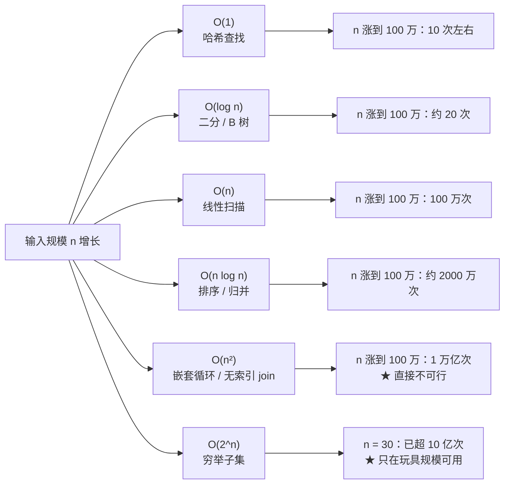
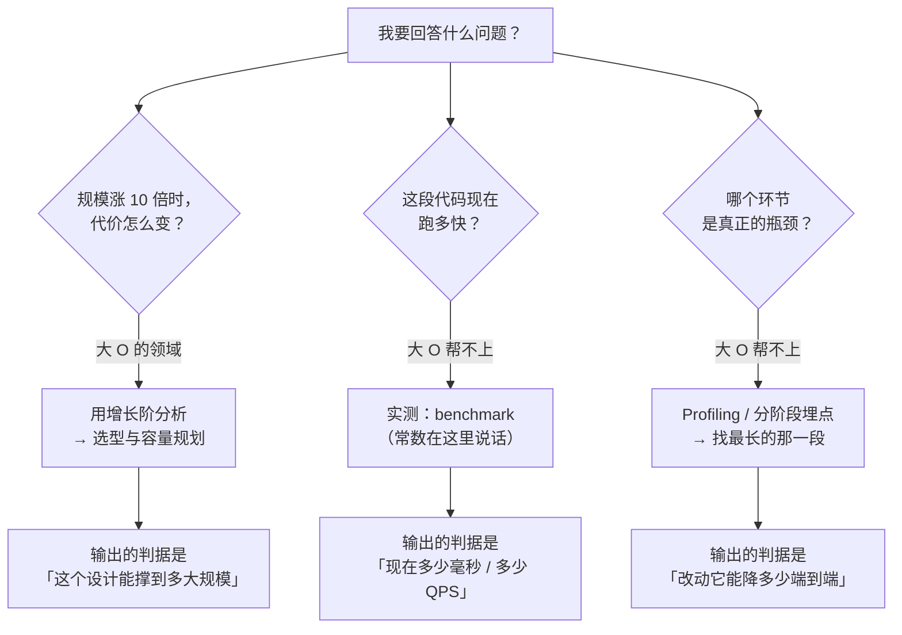

先看三个真实反复发生的场面：

- 一段跑得飞快的代码，上线后数据量涨了 100 倍，直接超时——**代码一个字没改**；
- 一个"优化"把平均耗时从 3 毫秒降到 1 毫秒，但 P99 反而变差了——**因为新的实现有更差的最坏情况**；
- 面试里能默写"快排平均 O(n log n)、最坏 O(n²)"，但在实际项目里从没算过自己写的查询嵌套是几阶。

这三件事的共同点：**大 O 不是用来背结论的，它是用来回答"规模变化时，代价怎么变"这个问题的语言。** 会背结论和会用这门语言，是两件事。

本文不再从"排序算法对比表"讲起——那部分在 CS 课程里已经讲过。这里讲的是**复杂度作为一门工程语言**：它到底说了什么、没说（也说不了）什么、以及它怎么变成实际系统里的性能判断和容量决策。

## 一、它从哪来

**大 O 记号的数学源头是 1894 年**，德国数论学家 **Paul Bachmann** 在《解析数论》里首次引入 `O` 记号，用来描述函数增长的**上界**；**1909 年 Edmund Landau** 系统化地使用它，所以它在欧洲常被称为 **Landau 记号**。在数学里，它描述的是"当变量趋于无穷时，函数被另一个函数控制住"。

把它搬进计算机科学的关键人物有三位：

- **1963 年**，**Donald Knuth** 开始在《TAOCP》里系统使用大 O 分析算法——**他做的最重要的一件事，是把 `O` 从纯数学的"渐近上界"变成了工程语言：既用 `O` 表示最坏情况的上界，也用 `Ω` 表示下界、`Θ` 表示紧确界。**
- **1960 年代后期**，**Robert Tarjan** 等人把**摊还分析**（amortized analysis）发展成一套方法，解决了"单次操作贵但长期便宜"这类大 O 单独看不出来的问题（动态数组的扩容就是最经典的例子）。
- **1970 年代起**，"渐进复杂度"成为算法课的核心度量，并在 **P vs NP** 的框架下获得了理论意义：**复杂度不只是"快慢"，它是一条分界线**——多项式时间可解 vs 不可解。

这里有一个必须说清楚的历史事实：**大 O 从来不是"性能指标"，而是"增长率的上界"。** 它不是为"这段代码跑几毫秒"设计的，而是为"规模涨十倍时，代价涨多少"设计的。这个定位决定了它的全部优点和全部局限。

**它的形式定义**（写成中文就是这一句）：

> `f(n) = O(g(n))` 意味着：**存在常数 `c > 0` 和 `n₀`，使得对所有 `n > n₀`，都有 `f(n) ≤ c · g(n)`。**

拆开看三个关键信息：

1. **它描述的是"上界"，不是"精确值"**——所以"冒泡排序是 `O(n²)`"这句话是**对的但也是不完整的**：它同时也是 `O(n³)`、`O(n!)`，因为那些也都是它的上界。**工程上说 `O(n²)` 时，隐含的意思是"这是我们能给出的最紧的上界"。**
2. **它只在 `n > n₀` 时成立**——这就是"小数据时快排不如插入排序""小数据时线性查找比二分快"的理论依据。**大 O 明确声明放弃小 n 的精度。**
3. **它丢了常数 `c`**——所以 `O(n)` 和 `O(n)` 的实际耗时可能差 100 倍。**这就是"复杂度一样但性能差十倍"的来源。**

## 二、为什么需要它

因为**性能问题几乎从来不是"这段代码慢"，而是"这个形状在规模上不可持续"**。

先看没有这门语言的后果：

- **只能靠压测**。压测能告诉你"现在 1 万 QPS 时耗时 20ms"，但**无法告诉你"10 万 QPS 时会怎样"**——除非你真的把负载做到 10 万（可能做不到，也可能很贵）。大 O 给了你一条**外推**的路径：知道形状，就能估算规模上去之后的样子。
- **无法在写代码时做判断**。等到上线才发现，代价是重写。**复杂度分析是唯一能在"代码还没跑起来"时就给出规模判断的工具**（这也是它成为面试题的原因）。
- **优化打错地方**。就像**帕金森定律**那篇里讲的：如果不知道哪一段的增长阶最高，优化就只是在给非瓶颈扩容。

更重要的是，大 O 在工程上其实服务于**三个不同的决策**，而它们对精度的要求完全不同：

1. **选型**（用哈希表还是有序数组？）：只需要知道**增长阶**——`O(1)` 还是 `O(log n)` 还是 `O(n)`。
2. **容量规划**（数据涨 10 倍，机器要加多少？）：需要知道**形状与常数**——`O(n)` 就是加 10 倍机器，`O(n²)` 就是加 100 倍（这就是**梅特卡夫定律**那篇里"n² 成本"的另一面）。
3. **性能调优**（这里为什么慢？）：需要知道**实测分布**——大 O 在这一步几乎帮不上忙，取而代之的是**帕金森定律**那套"找真正瓶颈"的方法。

也就是说：**大 O 管"形状"，压测和 profiling 管"数值"。两者缺一不可，用错了地方就会得出荒谬结论。**

**本质一句话：大 O 描述的是"规模趋于无穷时，代价增长的上界形状"，它故意丢掉常数和小规模行为——所以它能回答"这个设计能否随着规模活下去"，但不能回答"这段代码现在跑多快"。**

## 三、两张图看懂

先看"形状"这件事。不同增长阶的曲线，在 n 变大之后的差距不是几倍，而是几个数量级：



再看"大 O 说什么、不说什么"这张判定图。它决定了大 O 该用在哪个环节：



两张图合起来看：**大 O 只负责"形状"，而且只在规模足够大时才准确。** 它的最大误用就是拿它当性能指标——"我用了 `O(1)` 的哈希，所以一定快"这句话在工程上经常是错的，因为**哈希的一次查找可能比一次数组访问慢几十倍（缓存不友好）**。

## 四、它有什么用

**1. 先看形状的威力量级（本机实跑）**

不同增长阶在真实数值上的差距，比直觉大得多：

```text
 输入规模 n     O(log n)   O(n)        O(n log n)     O(n²)
--------------------------------------------------------------------------
 10             3          10          33             100
 100            6          100         664            10,000
 1,000          9          1,000       9,965          1,000,000
 10,000         13         10,000      132,877        100,000,000
 100,000        16         100,000     1,660,964      10,000,000,000
 1,000,000      19         1,000,000   19,931,568     1e+12
--------------------------------------------------------------------------
★ n 从 1,000 涨到 1,000,000（1000 倍）：
    O(log n)  从 9 涨到 19（约 2 倍）
    O(n)      从 1e3 涨到 1e6（1000 倍）
    O(n log n) 从 9,965 涨到 19,931,568（2000 倍）
    O(n²)     从 1e6 涨到 1e12（100 万倍）
```

这张表最重要的一行是 **`O(log n)`**：输入规模涨 1000 倍，代价只涨 2 倍。**这就是为什么"索引"和"二分"是所有大规模系统的地基**——它们把 "规模" 和 "代价" 这两个量**解耦**了。

**2. 大 O 测不出常数：同一增长阶的真实性能差距（本机实跑）**

这是大 O 最容易被忽视的边界。下面用 Python 对比两个**同为 `O(n)`** 的操作：

```text
 同为 O(n) 的两件事，在 n = 1,000,000 时的实测耗时

  操作                    增长阶     耗时        相对倍数
--------------------------------------------------------------------
  list 求和（C 层循环）      O(n)      0.0030 s    1.0x
  Python for 循环累加        O(n)      0.0472 s    15.9x
--------------------------------------------------------------------
★ 增长阶完全一样，实测差 16 倍 —— 差距全部来自常数
★ 结论：「同为 O(n)」不代表性能可比；
       大 O 只保证"规模上去之后的形状"，不保证"当下的速度"
```

**3. 摊还分析：大 O 看不出来的"长期便宜"（本机实跑）**

动态数组（Python 的 `list`、C++ 的 `vector`）的 `append` 就是经典案例：**单次最坏是 `O(n)`（触发扩容时要搬整个数组），但一序列操作的均摊代价是 `O(1)`。**

```text
 Python list 连续 append 100 万次的耗时分布

    总耗时          0.1953 s
    平均每次        0.20 微秒
    单次最慢        2033.50 微秒（那一瞬间触发了扩容）
    最慢 / 平均     10412 倍   ← 这就是扩容尖峰

★ 结论：
   - 单次操作最坏 O(n)，一序列操作的摊还代价 O(1)
   - 若按"最坏情况"做容量规划，会严重高估；按"摊还"才贴近真实
   - 但延迟敏感场景必须看这个 10412 倍的尖峰
```

**为什么工程上要区分这两个**：写实时系统（每秒必须处理完一个请求）要按**最坏情况**算，因为一次 `O(n)` 的扩容就可能顶穿延迟预算；写批处理系统（吞吐优先）按**摊还**算就够，因为扩容的尖峰会被长尾摊平。**同一个数据结构，两种场景下的结论完全相反——而"哪种复杂度该用"取决于系统承诺的是延迟还是吞吐。**

**4. 复杂度增长阶的实际选型判据**

有了形状和数量级的感觉，选型就变成一张可查的对照：

```text
 需求                          可选方案              增长阶对比        实际选择依据
----------------------------------------------------------------------------------------
 按 key 精确查找              哈希表 vs 有序数组      O(1) vs O(log n)  哈希更快，但不支持范围查询
 范围查询（时间区间）           B 树 vs 哈希           O(log n) vs O(n)  B 树是唯一选择
 保持有序 + 频繁插入            链表 vs 跳表 vs B 树    O(n) vs O(log n)  跳表实现更简单，B 树更省内存
 去重                          哈希集合 vs 排序去重     O(n) vs O(n log n) 内存换时间
 判断"是否存在"（海量元素）      哈希集合 vs 布隆过滤器   O(n) 内存 vs O(1)  布隆用误判率换空间
 多字段组合过滤                 无索引 join vs 复合索引   O(n·m) vs O(log n) 索引是唯一答案
----------------------------------------------------------------------------------------
★ 每一行的选择，本质都是在"时间增长阶"和"空间增长阶"之间做交换
  —— 这正是「空间换时间」这条母题的落点
```

**5. 复杂度分析的三个"不能"**

- **不能替代压测**。`O(1)` 但常数巨大（比如一次 `O(1)` 的网络调用）的实现，可能比 `O(n)` 的本地数组遍历慢得多。
- **不能忽略数据分布**。哈希表在**退化为链表**时是 `O(n)`（这就是随机化哈希和树化的动机）；快排在**已排序输入**上是 `O(n²)`（这就是随机取轴或三数取中的动机）。**大 O 描述的是算法在一个"输入族"上的行为，而不是某一次运行。**
- **不能忽略内存层次**。缓存不友好的 `O(n)`（如链表遍历）常常打不过缓存友好的 `O(n log n)`（如数组上的二分）。**这就是为什么 B 树在数据库里战胜了红黑树——它把 `O(log n)` 的层数做到极低，让每层一次磁盘/内存页访问。**

## 五、反例与边界

- **大 O 会骗人：小 n 时高阶层反而更慢**。插入排序对 `n < 16` 比快排快（常数小、无递归开销），所以生产级的排序实现都是**混合策略**（快排 + 小区间走插入排序）。
- **忽略常数的代价可能是几十倍**。前面实测里同为 `O(n)` 的两个实现对差 17 倍。**在常数差距远大于增长阶差距的规模区间里，大 O 给出的选型结论是错的。**
- **平均 vs 最坏 vs 摊还，三个答案可能完全不同**。哈希表：平均 `O(1)`、最坏 `O(n)`、摊还 `O(1)`。**做延迟 SLA 时看最坏，做吞吐规划时看摊还**——用错一个就得出相反结论。
- **`O` 不等于 `Θ`（紧确界）**。"这个算法是 `O(n²)`"可能意味着"它其实就是 `n²`"，也可能意味着"它是 `n log n`，但我说了个更松的上界"。**严谨表述应尽量用 `Θ`，工程沟通里则要养成"这是最紧上界吗"的习惯。**
- **"优化到 `O(log n)`"不总是好事**。把 `O(n)` 的线性扫描换成 `O(log n)` 的树，需要额外内存、额外维护成本、以及更差的缓存局部性。**在 n 只有几百的场景，线性扫描常常更快也更简单。**
- **性能数据里的"复杂度"常常不是算法复杂度**。真实的慢往往来自：网络往返（`O(1)` 但 `c` 极大）、锁竞争（`O(n)` 的排队）、GC 停顿、数据库连接池耗尽。**这些都不在你的渐近分析里。**
- **它和**帕金森定律**的关系很直接**：复杂度分析解决了"这段代码的增长形状"，而帕金森定律解决"到底该优化哪一段"。**先算形状，再找瓶颈，顺序不能反。** 反过来（先优化再看形状）通常是在优化一个占比 5% 的 `O(1)` 组件——收益接近零。
- **它也解释了为什么"加机器"救不了某些系统**：`O(n)` 的问题加机器能线性摊平，`O(n²)` 的问题加机器只会让 n 更大——**这是梅特卡夫定律那篇里 n² 成本的同一个算术。**

## 六、对比表与小结

| 度量 | 回答的问题 | 擅长 | 不擅长 |
|------|-----------|------|-------|
| 大 O（增长阶） | 规模涨 10 倍，代价怎么变 | 选型、容量外推、判断可扩展性 | 具体毫秒数、小 n 行为 |
| 最坏情况复杂度 | 最差的一次会多慢 | 延迟 SLA、实时系统 | 高估常态化成本 |
| 平均复杂度 | 典型输入下多快 | 吞吐规划 | 需要假设输入分布 |
| 摊还复杂度 | 一序列操作的平均代价 | 动态数组、哈希扩容 | 单次尖峰（延迟敏感场景会踩坑） |
| Benchmark / Profiling | 现在到底跑多快、慢在哪 | 定数值、定瓶颈 | 无法外推到未测规模 |

| 增长阶 | 典型来源 | n = 1,000 | n = 1,000,000 | 工程含义 |
|-------|---------|-----------|--------------|---------|
| `O(1)` | 哈希查找、数组下标 | 1 | 1 | 与规模解耦 |
| `O(log n)` | 二分、B 树、平衡树 | ~9 | ~19 | 规模涨 1000 倍，代价只涨 2 倍 |
| `O(n)` | 线性扫描、单层循环 | 1,000 | 1,000,000 | 加机器能线性摊平 |
| `O(n log n)` | 排序、归并、分治 | ~10,000 | ~2×10⁷ | 大规模排序的实际下限区 |
| `O(n²)` | 嵌套循环、无索引 join | 10⁶ | 10¹² | **不可行**，必须换算法或加索引 |
| `O(2ⁿ)` | 穷举子集、朴素递归 | 溢出 | 溢出 | 仅适合 n ≤ 20~30 |

🐾 **小结**：大 O 被当成面试题太久了，以至于它的工程身份被遮住了——它不是"性能指标"，而是一门**描述"规模与代价关系"的语言**。它的三条边界必须记牢：**只讲上界形状、放弃小 n、丢掉常数**。所以正确的用法是把它放在"选型与容量规划"这一段，把"现在多快、慢在哪"留给压测与 profiling；反过来用，就会得出"用了 `O(1)` 的哈希所以一定快"这类看起来对、实际错的结论。落地时问自己一个问题：**「如果我的数据量涨 100 倍，这段代码的代价会涨成什么样——我是算过的，还是"应该没事"？」** 如果答案里没有形状，那它现在就不是在设计，而是在赌。
