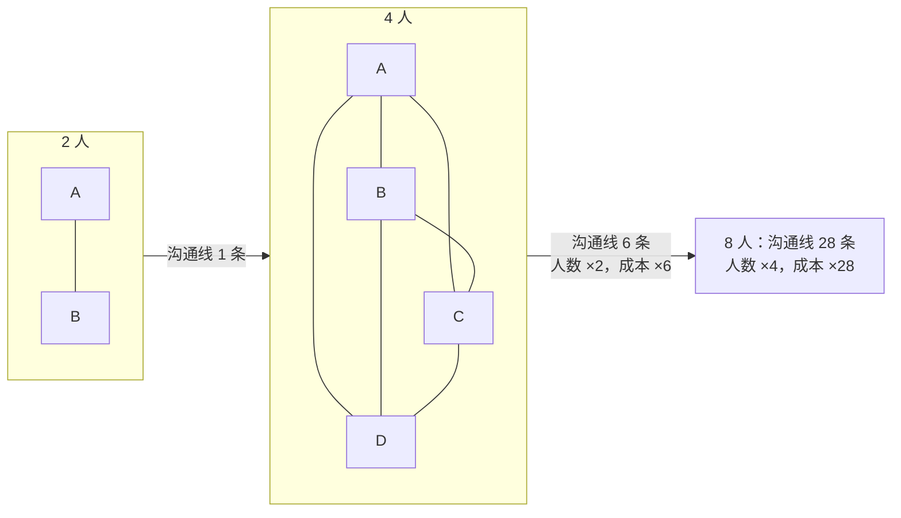
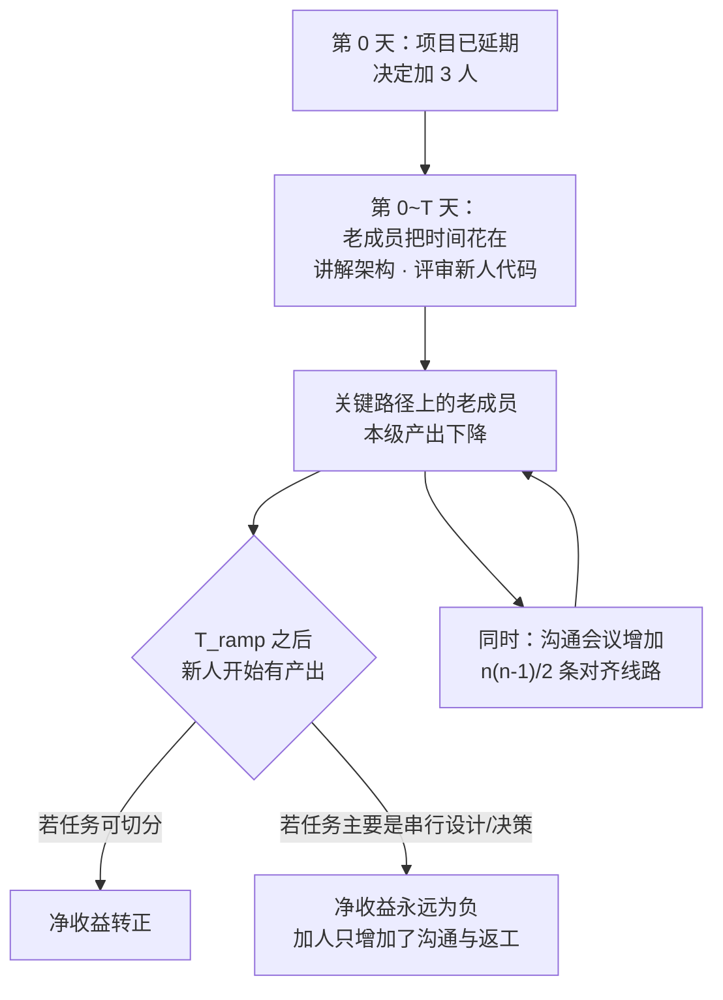

1975 年，一本讲操作系统的书里，有一章不是讲技术，而是讲**人**。它的名字后来成了软件工程里最常被引用、也最常被无视的一句话：

> **Adding manpower to a late software project makes it later.**
> 向已经延期的软件项目增加人力，只会让它更晚。

这句话之所以反直觉，是因为它违背后勤部式直觉——**活多了就加人，这有什么问题？** 于是几乎每一个延期的项目都会重演一遍它：加人、更晚、再加人、再更晚，直到某天有人想起这本书。

这就是**布鲁克斯定律（Brooks's Law）**。它讲的是**沟通成本随人数增长的非线性**——一条在分布式系统、组织设计、乃至微服务拆分里反复出现的规律。

## 一、它从哪来

**Frederick P. Brooks Jr.（弗雷德里克·布鲁克斯，1931–2022）** 是 IBM 在 1960 年代最著名的操作系统项目 **OS/360** 的项目经理——那是一个投入了上千人年、最终交付但严重超期超预算的项目。

**1975 年**，他把这段经历写成了 **《The Mythical Man-Month》（人月神话）**，全书的核心洞察都围绕一个词：**人月（man-month）**。

"人月"是项目管理里最常见的度量单位：一个 12 人月的工作，看起来等于 1 个人干 12 个月，或者 12 个人干 1 个月。布鲁克斯指出，**这个等式只在一种情况下成立——任务可以被完整切分，且参与者之间零沟通。** 而软件开发恰恰两条都不满足：

> **人月是危险的度量单位：它假设人和月可以互换。** 只有当任务可以被完美分割、且不需要参与者之间的沟通时，人和月才是可互换的。

书里还有一句更精准的表述——**"生一个孩子要九个月，但九个女人不能在一个月内生出一个孩子。"**

他给出的核心机制是**沟通路径的组合爆炸**：`n` 个人之间需要协同的路径数是 `n(n-1)/2`。

> **《人月神话》的核心论断："向延期项目增加人力，会让你更晚。"** 原因有三层：
> 1. **上手成本（ramp-up）**：新人需要时间学习系统，而这段时间**只能靠老成员来教**——老成员本来就在关键路径上；
> 2. **沟通成本**：`n` 人的沟通路径是 `n(n-1)/2`，人越多，开会、对齐、评审、接口协商的成本增长得越快；
> 3. **任务不可分割性**：有一部分工作是**串行的**（设计、决策、关键架构），无法通过加人缩短。

第三条正是**阿姆达尔定律**在人身上的版本，也是布鲁克斯定律与它最深的联系。

**1975 年之外，这本书还留下了另两个同样著名的论断**：

- **"没有银弹"（No Silver Bullet, 1986）**：软件开发的根本困难（本质复杂度，essential complexity）无法被任何单一技术或方法在十年内提升一个数量级；能被工具解决的只是**偶然复杂度**（accidental complexity）。
- **第二系统效应（Second-System Effect）**：由小系统成功走向大系统时，设计者容易把之前没做成的所有功能都堆进第二个系统，导致过度设计。

## 二、为什么需要它

因为**加人带来的收益是线性的（甚至次线性的），而带来的成本是超线性的**。

把账算清楚，就能看到为什么加人经常是负收益：

**收益侧**：新人上手需要 `T_ramp`（通常几周到几个月）。在上手期内，他几乎不产生价值，**还要消耗老成员的时间**——也就是说，**在最早的那段时间里，加人是纯负数。**

**成本侧**：沟通路径 `n(n-1)/2` 增长，而真正在写代码的**有效时间**在下降：

- 每加一个人，所有人多一条沟通线；
- 每多一条沟通线，就多一份对齐成本（会议、文档、接口约定、评审）；
- 每次对齐都可能引入新的误解，而误解本身就是 bug 的来源。

**不可分割侧**：一部分工作是串行的，无法并行——这是最硬的约束。即使沟通成本为零、新人零成本上手，也依然存在一个"加人无效"的天花板。

还有一个更隐蔽的效应：**延期项目本身处于"追赶模式"**。此时团队的判断力已经被压缩（要快速补救），新人加入后引进的错误和返工也更快地进入主分支。**向一个正在冒烟的系统注入未经训练的新变量，等于同时提高了故障率。**

那如果不承认这条定律，会发生什么：

- **延期 → 加人 → 更晚 → 再加人**，形成一个自我强化的死亡螺旋，直到预算或士气先崩；
- **关键路径上的人被拉去"带新人"**，本来最稀缺的资源（懂系统的那几个人）被进一步稀释；
- **沟通成本吃掉了所有新增产能**，团队规模翻倍，产出几乎不变——这就是所谓的"**人员过多导致的项目死亡**"（Brooks 原话里把这种状态描述为项目进入"人越多越慢"的区间）。

**本质一句话：布鲁克斯定律说的是——软件项目的产出受制于沟通成本和不可分割的串行工作，两者都随人数非线性增长，所以"加人"只在项目足够小、任务足够可分时有效；对已经延期的项目，加人只会让关键路径更长。**

这句话里有两个必须读准的点：

- **它针对的是"已经延期的项目"**，不是"所有项目"。（严格说，Brooks 的原始表述针对的就是 late project，因为此时 ramp-up 成本最致命。）
- **它是成本公式，不是宿命论**。它的正确用法是**在项目开始前就控制参与人数和划分方式**，而不是等到延期后才承认它。

## 三、两张图看懂

先看沟通路径的组合增长。这是布鲁克斯定律最直观的一张图——**人也增加，沟通线按平方增长**：



再看"为什么加人会让关键路径更长"。这张图把时间轴摊开：新人的贡献要等 `T_ramp` 之后才出现，而在他上手之前，**关键路径上的老成员还要额外付出教学时间**：



两张图合起来讲：**加人的成本立刻发生（沟通 + 教学），收益延迟出现（ramp-up），而收益能不能出现还取决于任务是否可切分。** 在延期项目里，这三点同时不利，于是加人成了负收益。

## 四、它有什么用

**1. 先把它算出来：不同人数下的沟通线与净产出（本机实跑）**

下面的模拟用两个参数描述团队：**沟通系数 c**（每人每天花在沟通上的时间占比）和 **上手时间 T_ramp**（新人达到有效产出的天数）。

```text
参数：单人满产出 = 1 单位/天；沟通占比随人数上升；有效产出 = n × (1 - c)

 人数 n   沟通线 n(n-1)/2   人均沟通占比 c    稳态有效产出    相对 5 人的倍数
--------------------------------------------------------------------------------
 3        3                  12%               2.64            0.64x
 5        10                 18%               4.10            1.00x
 8        28                 23%               6.13            1.49x
 12       66                 28%               8.63            2.10x
 20       190                34%               13.21           3.22x
 40       780                42%               23.20           5.65x
--------------------------------------------------------------------------------
★ 人数从 5 涨到 40（8 倍），产出只涨到 5.65 倍 —— 边际收益持续递减
```

注意这张表的形状：**产出在涨，但越涨越慢。** 更要紧的是，如果这是"已经延期的项目"，那么在第 0~T_ramp 天里，实际产出是**下降**的：

```text
延期项目加人后的时间线（原 5 人，加 5 人，T_ramp = 30 天）

  第 0~30 天：  新人产出 ≈ 0，老成员分出 25% 时间做教学
                → 总产出 4.10 降至 3.08（75%，负收益区）
  第 30~60 天：  新人半产出，老成员仍在补课
                → 总产出 5.44（133%，刚刚回本）
  第 60 天+ ：   稳态产出 7.41（180%）

★ 结论：如果项目剩余工期 < T_ramp（本例 30 天），加人是纯粹净损失
```

**2. 收益衰减的真实形状：边际递减**

把上面的表再推一步——**每加一个人的边际产出**：

```text
 从 n 加到 n+1 时的边际产出（单位/天）

 5 → 6    : +0.69
 8 → 9    : +0.64
 12 → 13  : +0.60
 20 → 21  : +0.54
 40 → 41  : +0.46

★ 人数越多，"多加一个人"带来的产出越小
★ 当边际产出 < 该人带来的沟通与协调成本时，总产出开始下降
```

这就是"人员过多导致死亡"的数学形态：**不是产出掉到零，而是边际产出小于边际成本。**

**3. 为什么有些工作加人真的有效：任务可切分性**

布鲁克斯定律不是"加人绝对无效"，而是"**取决于任务的可切分性**"。看一组对照：

```text
任务类型                          可切分性   加人效果
--------------------------------------------------------------------
修 100 个独立的编译警告            高         接近线性，加人立刻有效
给 200 个接口补单测                高         接近线性
写一个全新模块（接口未定）          低         负收益（接口一直在变，代码要重写）
定位一个线上疑难 bug               极低       负收益（多个人同时改会互相掩盖）
重构核心数据结构                   极低       负收益（串行决策，沟通成本最高）
翻译 100 篇文档                    高         接近线性
--------------------------------------------------------------------
判据：任务能否被切成互不通信的独立单元？
      能 → 加人有效；不能 → 加人先增成本
```

这一列"可切分性"正是**微服务拆分**想解决的东西：**不是为了让系统更快，而是为了让组织能并行工作**（这一点直接连到**康威定律**）。代价是：切分之后，原本的函数调用变成了网络调用，**沟通成本从"会议"换成了"分布式事务"**——成本没有消失，只是换了形态。

**4. 真实的应对方式：不是加人，是换策略**

工程史上对布鲁克斯定律的正解有这样几类，全部来自"不加人"这一侧：

- **砍范围（Scope）**：把功能分成"必须上线"和"下个版本"，这是唯一**立刻见效**的手段。**延期的项目从来不缺人手，缺的是能砍的范围。**
- **加时间**：直接改交付日期，成本是市场窗口。它有效，但需要有勇气公开承认。
- **调整关键路径**：把串行工作并行化（接口先冻结、模块走 mock、契约先定），**这是唯一能"结构性"提速的手段**，也是真正的技术工作。
- **复用而非重写**：**第二系统效应**的反面——不为了"设计更漂亮"而重写已经能用的部分。
- **减少沟通成本**：小团队 + 明确接口 + 异步沟通（文档而非会议）。这条直接攻击 `n(n-1)/2` 这一项，是规模化的唯一可行方向。

## 五、反例与边界

- **它不是"永远别加人"**。对**高度可切分、沟通需求低**的工作（数据标注、独立 CRUD 页面、批量补测试），加人是有效的。布鲁克斯定律的准确含义是"**加人不会缩短延期的软件项目**"，不是"人多总是不好"。
- **它最准的场景是"已经延期"**。这一点常被忽略：原书针对的是 late project 的追加人力。在**项目启动阶段**按合理规模配人是正常做法，不属于定律的管辖范围。
- **它不适用于紧急故障处置**？恰恰相反——**故障现场是最需要控制人数的地方**。多人同时改同一系统会互相掩盖证据（这一点在**快速失败**那篇里也提过：可观测性的前提是变量可控）。正确的做法是**一个主操人 + 若干只读观察者**，而不是围观团。
- **小团队的"加人"未必是负的**。从 1 人到 2 人往往收益极高（可以分工、可以互审），从 2 到 3 也常常正收益。**负收益通常出现在已经过了沟通成本拐点之后**（这个拐点按经验常在 5~8 人，但取决于任务的耦合程度）。
- **"小团队"不是万能药**。过小的团队会缺少必要的技能多样性、Bus Factor 低（关键人一走全线停摆）、认知负荷过载。**规模问题的答案是"减少耦合"而不是"永远保持 3 个人"。**
- **别拿它当拒绝协作的借口**。"加人没用，所以我不需要 review、不需要对齐"——这是把定律读反了。**定律反对的是"靠加人解决延期"，支持的是"降低沟通成本"，而降低沟通成本恰恰需要纪律严明的接口与文档。**
- **它和**康威定律**是一对**：康威说"系统架构会复刻沟通结构"，布鲁克斯说"沟通结构有成本"。合起来的意思是：**组织怎么切，系统就怎么长；而一切割都会产生沟通成本——所以要按"能独立工作"的最小边界来切，而不是按人数平均切。**

## 六、对比表与小结

| 维度 | 加人（人数换产能） | 砍范围（减需求） | 改关键路径（并行化串行工作） |
|------|------------------|----------------|------------------------|
| 见效时间 | `T_ramp` 之后（数周~数月） | 立刻 | 立刻（但要先做接口设计） |
| 对关键路径 | 前 `T_ramp` 天**变长** | 变短 | 变短 |
| 沟通成本 | `n(n-1)/2`，显著上升 | 不变或下降 | 需要一次性投入设计成本 |
| 风险 | 新人引入返工、老成员被抽走 | 功能缺失、客户不满 | 接口设计错误会放大成本 |
| 适用 | 任务高度可切分、项目未延期 | 延期项目的第一选择 | 真正的技术提速手段 |
| 成本形态 | 人力成本 × 时间 × (1 + 沟通损耗) | 商业成本 | 设计与验证成本 |

| 场景 | 该做什么 | 不该做什么 |
|------|---------|-----------|
| 项目已延期，剩余工期 < 上手时间 | 砍范围 or 改交付日期 | 加人 |
| 任务可高度切分（补测试、改警告） | 可以加人，接近线性收益 | 为它专门开同步会议 |
| 核心模块接口未定 | 先冻结接口，再并行 | 多人同时改接口 |
| 线上故障 | 一个主操 + 只读观察 | 围观团齐上手 |
| 组织规模变大 | 按可独立工作的边界拆 + 异步沟通 | 用更多会议来"对齐" |
| 想真正提速 | 找出串行部分并想办法并行化 | 期待加人自动解决 |

🐾 **小结**：布鲁克斯定律戳破的不是"人多力量大"，而是**"人月可以互换"这个会计幻觉**。软件的产出上限不受人数约束，而受**沟通成本**和**串行工作**约束——前者按 `n(n-1)/2` 涨，后者加人根本碰不到。所以在延期项目上，"加人"几乎总是把成本立刻拉高、把收益推到 `T_ramp` 之后，甚至永远不来。落地时问自己一个问题：**「我现在要加的这个人，他的贡献要多久才能出现在关键路径上？在他出现之前，谁的时间被占掉了？」** 如果答案里"关键路径上的人"被占了，那这一步就是在借高利贷。

**相关阅读**

- 康威定律：架构复制沟通结构（"怎么切"与"切多少"是同一问题的两面）：[/posts/princ-conway/](/posts/princ-conway/)
- Amdahl 定律：并行加速比的天花板（串行部分无法通过加资源消除，这是定律的数学版本）：[/posts/princ-amdahl/](/posts/princ-amdahl/)
- 帕金森定律：工作会膨胀到占满时间（"额度会被填满"——时间、人手、预算都一样）：[/posts/princ-parkinson/](/posts/princ-parkinson/)
- 墨菲定律：会出错的总会出错（为何"人越多、变量越多、故障越难定位"）：[/posts/princ-murphy/](/posts/princ-murphy/)
