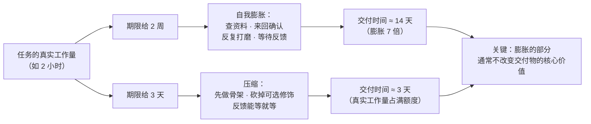

先看两个看上去毫不相干的场景：

- 你在 `SELECT *` 后面加了一个 `LIMIT 10`，页面的响应时间没有变好——因为前端已经在等那个 2 秒的接口了，接口慢一点快一点，用户感受到的都是 2 秒。
- 团队里三个人的工作量，两个人的团队也能扛——不是因为那三个人在摸鱼，而是因为**工作会自己长出来**：检查更多、文档更全、会议更密、评审更细。

这两个场景背后是同一条规律：**一件事所消耗的资源，会膨胀到把可用资源全部占满——不管那件事实际需要多少。**

这就是**帕金森定律（Parkinson's Law）**。它常被当成一句吐槽官僚主义的俏皮话，但在工程上，它是**资源分配与性能优化里最能解释"为什么优化没效果"的那条规律**。

## 一、它从哪来

**1955 年 11 月 19 日**，英国历史学家、海军史学者 **Cyril Northcote Parkinson（西里尔·诺斯古德·帕金森）** 在《经济学人》（The Economist）上发表了一篇讽刺短文《Parkinson's Law》，开篇第一句就是那句名言：

> **Work expands so as to fill the time available for its completion.**
> 工作会膨胀，直到占满所有可用的时间。

**1957 年**，他把文章扩写成同名书籍《Parkinson's Law, or The Pursuit of Progress》，并给出了他最著名的一个"经验公式"——**官僚机构每年膨胀 5.17% 定律**：

> 英国海军部（Admiralty）的官僚人数在 1914 到 1928 年间增长了 **78%**，而同期皇家海军的主力舰数量**减少了 68%**，军官和水兵人数下降了 **31%**。

帕金森要讽刺的是**机构膨胀与真实工作量脱钩**：事情变少了，管事的人变多了。他还提出了配套的两条"子定律"：

- **官员会互相制造工作**（Officials make work for each other）——一个领导需要下属，下属之间需要彼此汇报和审查，于是流程本身就生产新的流程；
- **会议时间与议题的重要程度成反比**（Law of Triviality，俗称"自行车棚效应"）——一个 1000 万的项目可能几分钟就通过了，而自行车棚的用料要讨论一个小时，因为**人人都懂车棚，人人都能发言**。

这三条合起来才是完整的帕金森定律：**资源（时间、人力、预算）一旦被划定，需求侧就会自动向上迁移，把这个额度花满。**

## 二、为什么需要它

因为系统里**大部分"资源浪费"不是来自错误，而是来自"把额度用满"这个默认行为**。

先看它在时间维度上长什么样：

- 一个 2 小时能写完的报告，给了 2 周，它就会用掉 2 周——多出来的时间里，填充的是"再查查资料""再把排版调一下""再等一个同事的反馈"。**这些不是偷懒，是工作的自相似膨胀：任何任务都可以被分解成更多子任务。**
- 于是**给别人留余量，反而抬高了交付时间**。这是它最反直觉的一面：给出 2 周的期限，得到的就是 2 周的交付；给出 3 天，得到的是 3 天（可能质量略降，但通常不会降到你担心的程度）。

再看它在机器维度上长什么样，也就是工程师最常踩的那个坑：

**一个链路的耗时 = 最慢的那一段，而不是所有段的平均值。** 如果你把一个占链路 50% 的组件优化了 10 倍，整条链路的耗时下降可能**接近于零**——因为剩下的部分立刻把时间吃满：

- 每段都有"排队 + 处理"两个部分；
- 每段的排队容量会**自动填满**上游的产出（这就是排队论里的"拥塞"）；
- 更慢的上游会**制造更多并发**，把下游的队列灌满。

这其实就是**利特尔法则（Little's Law）**在说话：`L = λW`——系统里的并发数 = 到达率 × 停留时间。如果你把某段的处理能力提高了，但到达率没变，那么变化的是**排队长度**，不是端到端延迟。**时间额度一旦存在，它就会被占满。**

反过来说，如果你不承认这条定律，会发生什么：

- **优化投入全部打水漂**。花两周优化了一个非瓶颈组件，指标不动，团队信心受损。
- **计划永远不准**。因为估算本身会把"空闲"算进工期，而空闲一定会被填满，所以估算值系统性偏高。
- **人力永远不够，但也永远不饱和**。加人之后工作量会随之膨胀（这一点与**布鲁克斯定律**是同一枚硬币的两面）。

**本质一句话：帕金森定律说的是——资源额度会被需求侧占满，所以性能优化的唯一正确入口是找到真正的瓶颈（关键路径）；给资源扩容或给任务延期，都只会把额度填满，而不会缩短交付。**

这句话里有两个必须读准的点：

- **它描述的是一个"填充"行为，不是"懒惰"**。填充是系统的默认行为，和参与者的意愿无关。所以解法不是"提高觉悟"，而是**改变额度本身**（缩短期限、收紧约束）。
- **"占满额度"等价于"优化必须打在最长的那个环节上"**。这条直接给出了性能优化的判据：在没找到瓶颈之前做的任何优化，都是在给额度扩容，而不是在缩短交付。

## 三、两张图看懂

先看时间维度：同一个任务，给不同的期限，交付时间会跟着期限走——而"实际需要"的那条线，往往远低于两者：



再看机器维度，也就是最该被工程记住的那张图。**一段链路的总耗时由最慢的一段决定，而优化任何非瓶颈段，收益都会被下游的排队吃掉**：

```mermaid
flowchart TD
    A["请求进入：需要经过 A·B·C·D 四段"] --> B["A 段 20ms"]
    B --> C["B 段 200ms ← 真正的瓶颈"]
    C --> D["C 段 30ms"]
    D --> E["D 段 10ms"]
    E --> F["端到端 ≈ 260ms"]
    F --> G{"优化哪一段？"}
    G -->|"优化 C：30ms → 3ms"| H["端到端 233ms<br/>只降 10%——因为要等 B 的 200ms"]
    G -->|"优化 B：200ms → 20ms"| I["端到端 80ms<br/>直接砍掉 69%"]
    G -->|"优化 A 或 D"| J["端到端几乎不动<br/>连"额度"都没填满，优化立刻被下游排队吃回去"]
```

两张图讲的是同一件事的两个面：**时间额度（期限 / 链路耗时）会被填满，所以"缩短交付"的唯一办法是缩短最长的那个环节，而不是把其他环节做得更快。**

## 四、它有什么用

**1. 时间维度：不同期限下的"填充比"（本机实跑模拟）**

用一段模拟来量化"给多少时间就用多少时间"。假设任务的**真实必要工作量**固定，剩余的期限额度会被"填充活动"消耗掉：

```text
 给的期限      实际交付耗时     填充耗时      填充占比     交付物核心价值
-----------------------------------------------------------------------
 2 小时        120 分钟          0 分钟        0%           完整
 4 小时        199 分钟          79 分钟       40%          完整
 1 天(8h)      382 分钟          262 分钟      69%          完整
 1 周(40h)     2309 分钟         2189 分钟     95%          完整
 1 个月(160h)  9221 分钟         9101 分钟     99%          完整
-----------------------------------------------------------------------
结论：期限越长，填充占比越高；但"交付物核心价值"这条线一直是平的。
```

这张表里最值得注意的不是"填充率升高"（那很符合直觉），而是**最后一列是不变的**：把期限从 2 小时拉到一个月，多出来的九千多分钟**并没有转化成更好的交付物**。它们转化成了确认、等待、打磨边角、重排文档这些**看起来像工作、但不改变核心价值**的活动。这就是为什么"多给点时间，做扎实一点"在工程上经常无效。

**2. 机器维度：优化非瓶颈 vs 优化瓶颈（本机实跑）**

同样用一个四段链路来对照。下面的每一次优化，都只改了其中一段：

```text
 基线（A=20ms, B=200ms, C=30ms, D=10ms）
   端到端 = 260ms

 ① 把 C 从 30ms 优化到 3ms（提速 10 倍）
   端到端 = 233ms        降幅 10.4%   ← 投入 10 倍提速，只换来 10% 收益

 ② 把 C 从 30ms 优化到 0ms（理论极限，免费）
   端到端 = 230ms        降幅 11.5%   ← 把 C 优化没了，也就这么多

 ③ 把 B 从 200ms 优化到 100ms（提速 2 倍）
   端到端 = 160ms        降幅 38.5%   ← 只提 2 倍，收益是 C 的 3.7 倍

 ④ 把 B 从 200ms 优化到 20ms（提速 10 倍）
   端到端 = 80ms         降幅 69.2%

 ⑤ 把 A/B/C/D 全部提速 10 倍
   端到端 = 26ms         降幅 90.0%   ← 天花板由"最慢那段的剩余"决定
```

第 ① 和第 ③ 的对比就是帕金森定律在性能上的直接后果：**同样的"提速 10 倍"和"提速 2 倍"，收益差了 3.7 倍——因为优化打在了不同的段上。** 而第 ② 行更残酷：把 C 优化到理论极限（0 毫秒），端到端也只降 11.5%。

**3. 排队维度：额度不清零，延迟就填满**

处理能力提升后，延迟并不会按比例下降——多出来的能力会被队列吃掉。这在系统容量规划里有个非常具体的名字：**当利用率 ρ 趋近 1 时，排队延迟 `W = W_service / (1 - ρ)` 会爆炸性上升。**

```text
 利用率 ρ      平均排队延迟（相对服务时间）
--------------------------------------------------------------------
 0.50          2.0 倍
 0.80          5.0 倍
 0.90          10.0 倍
 0.95          20.0 倍
 0.99          100.0 倍
```

这就是为什么"把 CPU 用到 99% 才划算"在生产环境里是个危险的直觉：**利用率越高，延迟对负载波动的敏感度越大**——一个 1% 的突发流量就能让延迟翻倍。运维上"留 20%~30% 余量"的惯例，本质就是在给这条曲线留一段平坦区。

**4. 这个定律在工程上的三个具体落点**

- **性能优化：先找瓶颈，再动手。** 方法是**压测到接近生产负载** + 分段埋点（被优化组件的耗时占比必须可测）。如果一个组件只占端到端 3% 的时间，把它优化到 0 也只降 3%。**在找到关键路径之前动手，等于给额度扩容。**
- **接口设计：把"额度"主动收窄。** 分页（`LIMIT`）、超时（`timeout`）、上限（`max_connections` / `max_body_size`）不是限制，而是**防止额度被无意义填满的硬约束**。**没有上限的地方，一定会被长满。**
- **项目管理：用短期限换真实进度。** 把一个大任务拆成若干个**看得见结果的小周期**（一周一个可演示的增量），期限短到"填充活动"塞不进去。这不是赶工，而是**压缩额度、逼出真实工作量**。

## 五、反例与边界

- **它不是"压工期"的理由**。期限太短会砍掉必需的工作（测试、文档、异常处理），把成本转移到后期。正确的区间是**略紧但覆盖必要工作量**——超出这条线之后的每一分压缩，都是在借高利贷。
- **"优化瓶颈"的前置条件是真的找到了瓶颈**。很多"瓶颈"其实是**测量假象**：埋点本身的开销、测试环境的配置偏差、缓存命中率与线上不同、连接池大小与实际并发不匹配。**在错误的瓶颈上优化，比不优化更糟——因为你还会相信它有用。**
- **瓶颈会移动**。把 B 从 200ms 优化到 20ms 之后，瓶颈很可能变成 A 的 20ms 或者新出现的数据库锁。**优化是一个循环，不是一次性动作。**
- **不是所有资源都该被"填满"的反面**。有些资源的**低利用率本身就是收益**：内存留余量是为了吸收突发、磁盘留空间是为了避免元数据碎片、连接池留空是为了避免等待。**把"必须留余量"当成"帕金森式浪费"是另一种误读。**
- **人的工作不是纯可压缩的**。创意、调试、设计这类任务有明显的"不可压缩内核"，压缩期限只会降低质量或把工作推到别人身上。**帕金森定律在"可分解、结果可验证"的任务上最准，在"需要发散思考"的任务上最不准。**
- **要小心它和"多给时间做扎实"的冲突**。对**安全性关键**的系统，冗余的审查、更多的测试、更慢的发布节奏确实是必要的——那时"用满额度"是对的。判断标准是：**多出来的时间有没有转成可验证的质量指标**（覆盖率、故障率、缺陷密度）。没有指标的"扎实"，就是填充。
- **个人的"忙"不等于"有效"**。帕金森定律经常被用来指责"大家都在瞎忙"，但这个指责通常没用——**填充是系统行为，不是个人选择**。改系统（缩短期限、减少环节、明确验收标准）比要求个人（提高觉悟、加班）有效得多。

## 六、对比表与小结

| 维度 | 期限给足（"做扎实一点"） | 期限压缩（"先出可运行版本"） |
|------|----------------------|--------------------------|
| 实际耗时 | 占满额度，常是必要工作量的 5~10 倍 | 接近必要工作量 + 少量压缩代价 |
| 多出来的时间去哪 | 确认、等待、反复打磨、扩写文档 | 不存在这段额度 |
| 交付物核心价值 | 与短期限版基本一致（实测表最后一列是平的） | 一致 |
| 风险 | 反馈周期长、错误发现晚、时间成本高 | 可能漏掉必需工作（测试、异常处理） |
| 适用 | 安全关键、不可逆变更、需要多方对齐 | 可迭代、结果可验证、失败廉价 |
| 正确姿势 | **多出来的时间要绑定可验证的质量指标** | **压缩到覆盖必要工作量，再往下就是借债** |

| 优化位置 | 收益 | 原因 |
|---------|------|------|
| 优化瓶颈段（占比 77% 的 B） | 端到端降 38%~69% | 直接缩短了关键路径 |
| 优化非瓶颈段（占比 12% 的 C） | 端到端降 10%~11% | 收益被下游排队与上游等待吃掉 |
| 优化占比 8% 的 A / 4% 的 D | 接近 0 | C 段被优化到 0 也只降 11.5%，更小的段更无意义 |
| 扩容（加机器 / 加人 / 加期限） | 常为负 | 额度和协调成本一起涨，多出来的容量被填满 |
| 找出真实瓶颈（先测量） | 决定以上全部收益 | **没有测量的优化是在给额度扩容** |

🐾 **小结**：帕金森定律表面上讲的是"官僚机构和拖延"，但它的机制跟人的意愿无关——**额度存在，需求就会向上迁移把它填满**。这个机制在工程上有两个几乎等价的后果：一是**"给更多时间/资源"不会缩短交付**，二是**"优化非瓶颈"不会降低延迟**。所以落地时真正该问的问题只有一个：**「这个链路/这件事里，最长的那一段是什么？我是量出来的，还是猜的？」** 如果答的是"猜的"，那不管接下来做什么，都是在给额度扩容而已。
