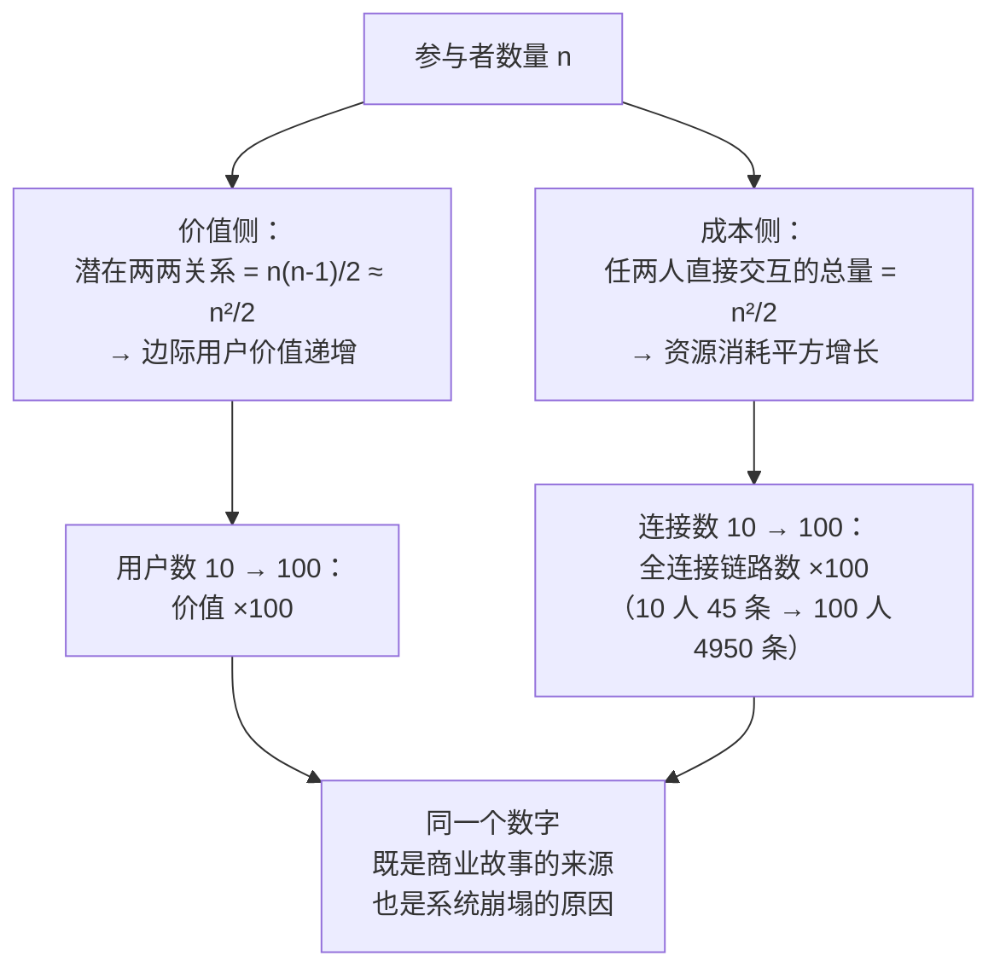
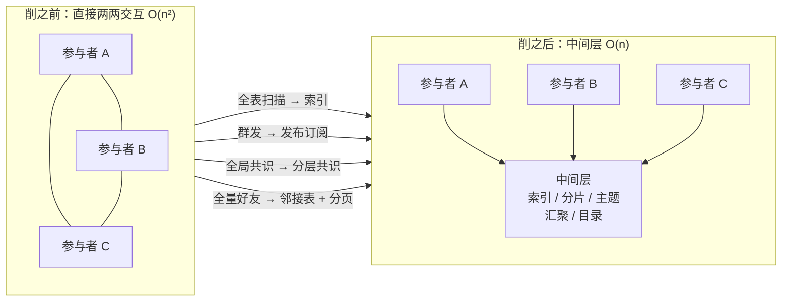

在讲这条定律之前，先看一个所有做系统的人都遇到过的场景：

你设计了一个服务，一开始很轻松。连接数从 10 涨到 100 涨到 1000，成本几乎不涨——直到某个时刻，它突然开始崩，而且**不是线性地崩，是断崖式地崩**。加机器、调参数都只能往后拖一点。

这里藏着一个容易被误读的数字：**n²**。梅特卡夫定律说网络的价值正比于 `n²`，这句话被用来给一切"连接更多用户"的商业故事做背书。但它其实同时在讲另一件事，而这件事对工程师更重要：**任何"个人 × 个人"的互动关系，规模翻倍，交互总量就变成四倍。**

价值是这样涨的，成本也是。

## 一、它从哪来

**梅特卡夫定律（Metcalfe's Law）** 得名于 **Robert Metcalfe（罗伯特·梅特卡夫）**——以太网的发明者之一、**3Com** 的创始人。

关键年份是 **1980 年**。这一年他提出用一条简单的关系来**说服客户买网卡**：

> **网络的价值与联网用户数的平方成正比（V ∝ n²）。**

这个论断的推导极其朴素：如果网络里有 `n` 个人，那么**可能的两两连接**数是 `n(n-1)/2`，约为 `n²/2`。每当接入一个新用户，他带来的潜在连接是已有的 `n` 条——**新用户的边际价值随网络规模增长。**

真实的背景是**销售困境**：1980 年前后，网卡的价格不便宜，而"买一块网卡"对单个用户几乎没有价值——**除非别人也都有网卡**。梅特卡夫需要一个论证来说服客户"这张网卡的价值不是它本身的性能，而是**整个网络有多少人**"。`n²` 就是那个论证。

这个思路其实更早有人提：**1908 年，贝尔电话公司的总裁 Theodore Vail** 就主张"电话的价值随互联的电话数增长"；到了 1990 年代互联网繁荣期，梅特卡夫的版本因为好记、好算、好讲故事，成了公认的表述。

**但这条定律后来经历了一次重要的"自我修正"，这也是它最有工程价值的部分：**

- **1990 年代末**，`n²` 成了互联网泡沫时期估值模型的支柱——**.com 公司的估值被简化成"用户数平方 × 某个系数"**，融资路演里到处是梅特卡夫曲线的幻灯片。
- **2001 年泡沫破裂**后，**Bob Briscoe、Andrew Odlyzko、Benjamin Tilly** 在 2006 年发表了那篇著名的论文 **《Metcalfe's Law is Wrong》（IEEE Spectrum）**，给出了决定性的反例：**电话网络的连接度趋近饱和**。1980 年代美国的电话主线数是 2 亿左右，按理说应该有 `2亿²` = `4×10¹⁶` 条"连接"，但这个数字在现实中是荒谬的——**因为一个人不会有 2 亿个"和你在意的连接"，人只愿意维护有限的关系。**
- 他们提出的替代是 **Odlyzko 的 n log n 律**，以及"**网络价值来自小群体内的交互，而不是全网的成对关系**"这一观测。这篇论文是理解梅特卡夫定律的关键：**定律的正确部分和错误部分必须分开看。**

## 二、为什么需要它

因为 `n²` 这个数字在工程上有**两幅完全不同的面孔**，而人们只愿意看其中一幅。

**面孔一（价值侧）**：网络效应确实存在，而且**边际用户的价值随规模上升**——这是真的。一个新用户加入一个 10 人的网络，和一个新用户加入 100 万人的网络，感受完全不同。

**面孔二（成本侧）**：**任何需要"任两个参与者之间的交互"的系统，其资源消耗本身就是 `O(n²)`。** 这一面才是工程现实：

- 全连接网络：`n` 台机器两两通信，链路数 `n(n-1)/2` → 物理上不可能大规模部署（这是"**全网状上不了规模**"的根本原因）；
- 全表对比（join without index、笛卡尔积）：`n × n` 行；
- 所有用户之间的消息可见（群聊里"每个人都看到每个人的消息"）：消息投递总量 `O(n²)` 每轮；
- 所有节点互相 gossip 状态：带宽消耗 `O(n²)`；
- 一致性协调：`n` 个节点两两确认的通信量 `O(n²)`（这也是 **Paxos / Raft 为什么在节点数上如此收敛**的原因之一）；
- **你的服务依赖图**：`n` 个服务之间的调用关系一旦密集，链路数就是平方级。

所以梅特卡夫定律在工程上的真正价值，是它的**后半句**：

> **如果价值是 `n²`，那么任何试图"让所有人都能直接和所有人互动"的实现，其成本也是 `n²`——而价值可以不实现，成本必须付。**

这就是为什么所有做大 n 的系统，最终都会走上同一条路：**用中间层把 `O(n²)` 的成对交互，削成 `O(n log n)` 或 `O(n)`**——

- 广播 → 改成**发布订阅 + 主题**（一个人发，只推给订阅者）；
- 全网状态同步 → 改成**分片 + 汇聚**（不是每个都知道所有）；
- 全网共识 → 改成**分层共识 + 副本组**（Raft 只在组内做，不在全局做）；
- 好友关系 → 改成**邻接表 + 游标分页**（只取需要的那部分，而不是把 n² 条关系展开）。

**本质一句话：梅特卡夫定律说网络价值按连接数（约 n²）增长，但它的工程含义是双刃的——任何"任两人直接交互"的机制成本同样是 n²；所以规模化的关键不是"让所有人连上所有人"，而是用中间层（索引、分片、订阅、聚合）把平方级交互削成线性或 n log n 级。**

这句话里有两个必须读准的点：

- **"价值 n²"是上限模型，不是实测结论。** 现实中的价值增长更接近 `n log n`，因为**每个参与者能维护的有效关系是有限的**（Briscoe 等人的核心论据）。
- **"成本 n²"是下限风险，不是必然。** 只要设计得当，成本可以被压到 `O(n)` 甚至 `O(log n)`（这正是数据库索引、CDN、消息队列存在的理由）。**工程的全部工作就在这半步里。**

## 三、两张图看懂

先看两幅面孔的对照。同一个"n 个参与者"，价值侧和成本侧的曲线形状是一样的：



再看工程上的解法。这张图是"削平方"的四种典型手段，它们本质上都是**在参与者之间插入一个中介，把 `O(n²)` 变成 `O(n)`**：



两张图合起来的意思：`n²` 不是一个需要"消除"的东西，而是一个**必须被主动削掉的成本项**。**凡是"看起来很自然、很直接"的实现（谁都给谁发消息、谁都同步谁的状态），在 n 稍大之后都必然失效。**

## 四、它有什么用

**1. 先把它算出来：`n²` 在小数值上就已经失控（本机实跑）**

```text
 参与者 n     两两关系 n(n-1)/2    占 n² 比例
--------------------------------------------------------
 10           45                   45.0000%
 100          4,950                49.5000%
 1,000        499,500              49.9500%
 10,000       49,995,000           49.9950%
 100,000      4,999,950,000        49.9995%
 1,000,000    499,999,500,000      49.99995%
--------------------------------------------------------
★ n 到 1000 以上，n(n-1)/2 与 n²/2 的差距已可忽略
  —— 工程估算里直接用 n²/2 就够
```

把这张表换算成"真的要付的成本"，就是很多系统的第一次崩溃：

```text
 假设每个"两两关系"每轮需要 1 个单位的资源（一次网络调用 / 一行数据 / 一次检查）

 n = 1,000     → 每轮 499,500 单位
 n = 10,000    → 每轮 49,995,000 单位（比上一档多 100 倍）
 n = 100,000   → 每轮 4,999,950,000 单位（再多 100 倍）

★ 也就是说：用户数涨 10 倍，全连接式的成本涨 100 倍
★ 这就是"用户从 1 万涨到 10 万，机器加了 10 倍却还是扛不住"的算术原因
```

**2. 削平方的收益：`O(n²)` 与 `O(n)` 在具体数值上的差距（本机实跑）**

```text
 场景：n 个用户要"看到彼此的更新"

 方案 A（全展开）：每轮 n(n-1)/2 次投递
 方案 B（发布订阅）：每个用户只订阅自己关注的主题，投递次数 ≈ n × r（r = 平均命中数）

 n        方案 A（n²/2）        方案 B（n×r，取 r=3）   A / B 倍数
--------------------------------------------------------------------
 100      4,950                 300                     16.5x
 1,000    499,500               3,000                   166.5x
 10,000   49,995,000            30,000                  1,666.5x
 100,000  4,999,950,000         300,000                 16,666.5x
--------------------------------------------------------------------
★ 规模越大，中间层（订阅/索引）的价值越大 —— 倍数本身就是 n/(2r)
```

这一行是**索引**存在的全部理由：`n` 越大，把 `O(n)` 的线性扫描换成 `O(log n)` 的查找、把 `O(n²)` 的成对匹配换成一次哈希查找，收益就越大。**索引、路由表、订阅关系、分片目录，全都是"削平方"的具体形态。**

**3. "削平方"的另一种形态：把重分布从 O(n) 降到 O(1/n)（本机实跑）**

分片系统里最贵的操作往往是"增减节点"——如果分片方式是 `hash(key) % n`，那么 `n` 一变，**几乎所有键的位置都变了**：

```text
 场景：把键分布到 n 个节点，节点数从 n 变成 n+1

 n → n+1        取模法迁移比例        一致性哈希迁移比例
-----------------------------------------------------------------
 10 → 11        90.9%                 9.1%
 100 → 101      99.0%                 1.0%
 1000 → 1001    99.9%                 0.1%
-----------------------------------------------------------------
★ 取模法：加一个节点，几乎全量重分布（代价随 n 线性增长）
★ 一致性哈希：只迁移 ≈ 1/(n+1) 的数据（最小化重分布）
```

这是"网络效应"在**内部拓扑**上的另一面：**节点越多，任何一次"全局重算"的代价越大**。一致性哈希之所以成为分片系统的默认选择，就是因为它把"加节点"这件事从 `O(n)` 级灾难降成了 `O(1/n)` 级的常规操作——**这正是"用中间层（哈希环）削掉平方级耦合"的又一个实例。**

**4. 真实的"平方级成本"落点**

- **全网状（full mesh）的网络拓扑**：`n` 台机器两两建连，链路数 `n(n-1)/2`。这就是为什么生产环境里的服务发现和网关必须**分层**（边缘 + 汇聚 + 骨干），而不是让所有节点互连。
- **群聊的消息投递**：一个 500 人的群，每条消息要投递 500 次；若"每个人都必须看到所有人的反应"（读回执、正在输入），投递量就是 `O(n²)`。**这就是大群必须做聚合（不显示逐人头像）和节流的原因。**
- **缓存一致性**：`n` 个缓存节点互相失效通知，是 `O(n²)`；**分片 + 令牌环（只通知后继节点）** 把它压到 `O(n)`——这是一条真实存在的工程路径。
- **共识**：Raft 只有一个 leader，节点数超过 5~7 之后吞吐明显下降——**不是因为 `n²` 通信，而是因为每次提交都要多数派确认**，而签名/校验成本随 `n` 增长。这也解释了为什么生产上的共识组通常很小。
- **数据库 join**：无索引的 `join` 直接退化成笛卡尔积 `n²`（更准确说是 `n × m`）。**这就是"加一个索引，从 3 分钟变 30 毫秒"背后的算术。**

## 五、反例与边界

- **`n²` 是上限模型，不是实测规律**。Briscoe、Odlyzko、Tilly 在《Metcalfe's Law is Wrong》里给出两条关键反驳：①**人维护的有效关系是有限的**（Dunbar 数大约 150），所以新增用户不会真的带来 `n` 条新关系；②**电话网络的连接度在 1980 年代就接近饱和**，`n²` 预测的增长从未发生。更贴近现实的模型是 `n log n`。
- **估值叙事是它最容易的误用**。`n²` 被用来把"用户数"直接换算成"公司价值"，这是互联网泡沫时期最有破坏力的简化之一。**用户数增长和可货币化的价值增长之间没有平方关系**——这也是本文最想提醒的一条边界。
- **不是所有网络都有 `n²` 的成本**。如果交互是**广播式**（一个人发，所有人收）而不是**成对式**，成本是 `O(n)`；如果交互是**本地化**的（社区、分片、邻近节点），成本是 `O(n)` 甚至更低。**判据是：这个系统的交互是"人人对人人"，还是"人对中心""人对邻居"？**
- **`n²` 有时是刻意的设计**。小规模场景下（10 个节点的集群、小团队的 all-to-all 心跳），`O(n²)` 完全可接受，甚至更简单可靠。**别为了消灭 `n²` 而引入一个早产的中间层**——这是第二系统效应的常见形态。
- **"网络效应"不等于"护城河"**。多归属（multi-homing，用户同时用多个同类产品）、平台的补贴战、以及"连接数不等于活跃度"这三个因素，都会让理论上的网络效应在现实中失效。**理论上 `n²`，实测可能是 `n^1.2`。**
- **它和**布鲁克斯定律**共用同一个 `n(n-1)/2`**：人之间的沟通路径、网络里的成对连接，是同一个组合数。**所以"团队规模"和"系统规模"在这一点上是同一个约束——都需要靠分层与中间层来解决，而不是靠"更努力地连接"。**
- **注意饱和点**：任何"价值按连接数增长"的系统，都会在某个规模遇到**边际用户价值递减**（新用户的连接对象早已饱和）。识别饱和点比画出 `n²` 曲线重要得多。

## 六、对比表与小结

| 维度 | 两两直接交互（全连接） | 中间层（索引 / 分片 / 订阅） | 广播（一对多） |
|------|---------------------|--------------------------|--------------|
| 关系数 / 投递量 | `n(n-1)/2 ≈ n²/2` | `O(n)` 或 `O(n log n)` | `O(n)` |
| n 涨 10 倍 | 成本涨 100 倍 | 成本涨约 10 倍 | 成本涨 10 倍 |
| 单点风险 | 无（但对等节点太多） | 中间层是热点，需要自身可扩展 | 发送端是热点 |
| 实现复杂度 | 最低（最"自然"） | 高（需要索引/路由/失效） | 低 |
| 适用规模 | n 小（≤ 几十） | n 大（生产环境常态） | 只要接收端可控 |
| 典型形态 | 全网格、笛卡尔积、全展开好友 | 索引、发布订阅、分片目录、邻接表 | 消息队列、CDN、公告 |

| 落点 | `O(n²)` 的形态 | 削平方的做法 |
|------|--------------|------------|
| 网络拓扑 | 所有节点两两建连 | 分层：边缘 + 汇聚 + 骨干 |
| 消息投递 | 群内人人互相投递 | 发布订阅（按主题只推订阅者） |
| 缓存一致性 | 全节点互相失效通知 | 分片 + 令牌环（只通知后继） |
| 共识 | 全员互相确认 | 固定小规模副本组 + 分层共识 |
| 关系数据 | 全量展开好友关系 | 邻接表 + 游标分页 |
| 查询 | 无索引 join → 笛卡尔积 | B 树 / 哈希索引 |
| 团队沟通 | 所有人对齐所有人 | 小团队 + 明确接口 + 异步文档 |

🐾 **小结**：梅特卡夫定律被引用时，通常只讲价值那一半——`n²` 看起来是个好消息。但它真正值得记住的是另一半：**任何"任两人直接交互"的机制，成本也是 `n²`；用户涨 10 倍，这类成本涨 100 倍。** 而价值侧的 `n²` 本身也被高估了（人的有效关系有限，实测更接近 `n log n`）。所以工程上的正确姿势很明确：**别去实现"所有人都能连上所有人"，而是在中间插一层，把平方级交互削成线性或 n log n 级——索引、分片、订阅、汇聚、邻接表都是同一件事的不同名字。** 落地时问自己一个问题：**「我这个设计里，有没有哪一步是"每两个对象之间都要发生一次交互"？规模上去之后，它会不会变成成本的主要来源？」** 如果答案是"会"，那它现在就是在替你预支未来的崩溃。
