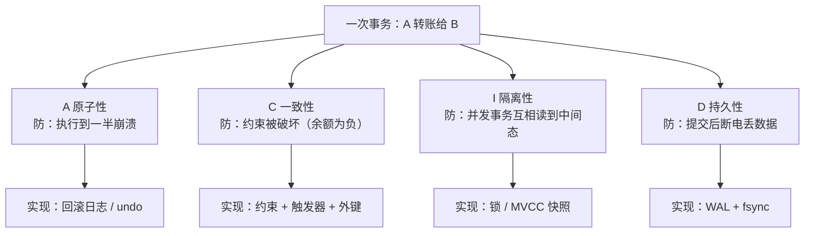

先看三个真实场面：

- 转账扣了钱但没到账，用户投诉——排查发现是「扣款成功、入账失败」，中间那一步没人负责回滚；
- 「秒杀超卖」在单库上从不发生，一拆成三个库就冒出来了；
- 同一个商品页面，用户刷新两次看到两个价格，过几秒又统一了——谁都没错，只是「读到了一个还没同步完的中间态」。

这三件事的共同点：**它们都不是「代码写错了」，而是「一致性的契约没签清楚」**。同一份数据在几个地方各存了一份，那么「写完之后别人什么时候能看到」这件事，必须有人负责——而 ACID 和 BASE，就是两种完全不同签法的契约。

本文不从「ACID 是哪五个单词」讲起——那部分背一下就行。这里讲的是这两种契约各自**承诺了什么、为此付出了什么代价**，以及在真实系统里它们各自被用在哪个位置。

## 一、它从哪来

**ACID 这个词是 1983 年造出来的。** 1983 年，德国学者 **Theo Härder** 和 **Andreas Reuter** 在论文《Principles of Transaction-Oriented Database Recovery》里，把当时已经积累起来的一堆「事务应该满足什么」的共识，归纳成了一个缩写。但真正把事务做成工业标准的，是 IBM 的 **Jim Gray**——他在 1970 到 1980 年代关于原子性、隔离级别、恢复系统的一系列工作，构成了现代数据库事务的理论地基（1998 年图灵奖）。

四个字母各指一件事：

- **A（Atomicity，原子性）**：一组操作要么全做，要么全不做；
- **C（Consistency，一致性）**：事务前后，数据库的约束（主键、外键、CHECK）都成立；
- **I（Isolation，隔离性）**：并发事务之间互相看不见对方未提交的中间态；
- **D（Durability，持久性）**：提交之后，即使断电，数据也不能丢。

**BASE 这个词则是 2008 年造的，晚 25 年。** 2008 年，eBay 的架构师 **Dan Pritchett** 在《ACM Queue》上发表《BASE: An Acid Alternative》，提出在互联网规模下，用另一种契约去换可用性：

- **BA（Basically Available，基本可用）**：允许部分功能降级、响应变慢，但不整体不可用；
- **S（Soft state，软状态）**：允许系统存在中间态，中间态对外可见；
- **E（Eventually consistent，最终一致）**：不再要求立刻一致，只要求「停止写入后，最终收敛到一致」。

这个时间差本身就是一段历史：**ACID 诞生在单机数据库时代，BASE 诞生在分布式系统时代**。前者要解决的是「一台机器上，多个事务怎么不互相踩」；后者要解决的是「多台机器上，一次写怎么在有网络分区、机器会挂的情况下活下来」。问题变了，答案自然跟着变。

## 二、为什么需要它

因为**「一致性」不是免费的，它和「可用性」和「延迟」是同一笔预算里的三个科目**。

先说没有契约的后果：

- **没有 A**：扣款和入账之间程序崩了，钱就悬在中间，没人知道该不该补。这是最原始也最常见的问题。
- **没有 I**：两个事务同时读同一个余额、各自扣一次，最后少了钱——这就是经典的丢失更新。
- **没有 D**：提交返回成功，用户以为落定了，重启之后数据没了。**这是最伤信任的一种失败**，因为「成功」这个信号撒了谎。
- **没有 BASE**：想跨三个机房做一次严格事务，那就必须让所有节点在写的时候达成一致——任何一个节点慢或不可达，整次写都得等或失败。这就是 CAP 里「牺牲可用性换一致性」的那条路。

所以这两种契约服务的其实是**两个不同的目标函数**：

- **ACID 优化的是「正确性」**：宁可拒绝这次请求，也不能让数据进入一个不合法或不可恢复的状态。它适合钱、库存、订单这类**错了要命**的数据。
- **BASE 优化的是「可用性」**：宁可暂时看到旧值，也要让请求能被受理。它适合点赞数、浏览计数、个性化推荐、CDN 内容这类**晚几秒正确没关系**的数据。

**本质一句话：ACID 和 BASE 不是「好方案」和「差方案」，而是两份取舍不同的合同——ACID 承诺「任何时刻读到的都是唯一正确的值，代价是可能拒绝服务」；BASE 承诺「服务永远接受请求，代价是读到的答案在一段时间内没有唯一值」。**

## 三、两张图看懂

先看 ACID 的四条各自在防什么。它们不是四个并列的口号，而是四道针对不同故障的闸门：



再看这两种契约在「一致性强度」这条轴上的位置。它们不是二选一，而是一条连续谱上的两端：


两张图合起来：**ACID 把赌注押在「一致性」上，BASE 把赌注押在「可用性」上。位置选在哪，取决于这份数据「错了的代价」有多大。**

## 四、它有什么用

**1. ACID 的四条，用 sqlite3 逐条实跑（本机实跑）**

先说明环境：**sqlite 3.53.1，WAL 日志模式**。它不是分布式系统，但它是把 ACID 四条都实现得很干净的最小样本。

```text
[0] 环境
  sqlite3 版本 : 3.53.1
  日志模式     : wal
  初始状态     : 账户1 = 1000, 账户2 = 1000, 总额 = 2000
```

**A —— 原子性：中间态必须能被完整抹掉**

```text
[A] Atomicity（原子性）：要么全做，要么全不做
  事务内：账户1 扣 800 后，事务内可见总额 = 1200（已破坏 2000）
  ROLLBACK 后：总额 = 2000  → 中间态被完整抹掉
  违反约束（CHECK constraint failed: balance >= 0）→ 整个事务回滚
  最终总额 = 2000  ★ 守恒，中间态没有泄漏
```

第二段才是重点：一次违背 `CHECK` 的更新让**整个事务**回滚，总额停在 2000。**原子性的价值不在于「能回滚」，而在于「回滚的粒度是整个事务，而不是一条语句」**——这才是转账能安全的原因。

**C —— 一致性：约束由数据库把守，不靠应用自觉**

```text
[C] Consistency（一致性）：约束在任何时刻都成立
  尝试更新不存在的账户 3：affected = 0
  INSERT 负余额被 CHECK 拒绝：CHECK constraint failed: balance >= 0
  负余额行数 = 0  ★ 约束由数据库把守，不靠应用自觉
```

注意 `affected = 0`：更新一个不存在的账户**不会报错，只会影响 0 行**。这是很多人踩过的坑——**应用如果不检查影响行数，就会把「什么都没做」当成「做成功了」**。一致性这一条里，最容易漏的从来不是数据库，是应用层没看返回值。

**I —— 隔离性：读不到「别人改了但没提交」的值**

```text
[I] Isolation（隔离性）：并发事务互相看不见未提交的中间态
  已提交的余额            : 1000
  写事务内改成的值(未提交) : 100
  另一个连接此刻读到      : 1000（等待 1 ms）
  ★ WAL 模式下 sqlite 允许「一写多读」：读事务不阻塞写事务，
    但它看到的仍是写事务开始前的已提交快照——这就是隔离（快照读）。
```

这里有一个细节值得展开：**读事务没有阻塞，它读到了 1000（旧值），而不是 100（未提交的新值）**。这体现的是「快照隔离」——读者拿到的是一份**一致的旧快照**，而不是最新值。所以严格来说，隔离性保护的不是「读到最新的正确值」，而是「读到一个**不掺假的**值」。

**D —— 持久性：COMMIT 之后数据活在日志里**

```text
[D] Durability（持久性）：COMMIT 返回后，数据必须活过崩溃
  COMMIT 后主库文件 4096 字节，WAL 文件 16512 字节
  ★ 先写 WAL（顺序追加）再返回成功；主库文件甚至还没更新——
    这就是「先记账、后落库」，崩溃后靠 WAL 重放恢复。
```

`COMMIT` 返回之后，**数据其实还在 WAL 里，主库文件还是 4096 字节的原始大小**。这个观察解释了为什么「持久性」和「性能」永远在打架：如果每次提交都去改主库文件并 `fsync`，代价是**随机写 + 一次磁盘同步**，慢得多；而追加 WAL 是**顺序写**，快得多。**这就是「写前日志 WAL」那条母题在事务里的落点**——把随机的、分散的写，换成顺序的、集中的写。

**2. 同样一次转账，放到 BASE 的 3 个副本上（本机实跑）**

现在把「转账」搬到一个最终一致的模型上，看同样四条是怎么被逐条放宽的：

```text
[BASE 对照] 把「转账」放到 3 个最终一致的副本上：ACID 的四条被逐条放宽
  t0 在副本0 扣款 800 后，各副本余额 = [200, 1000, 1000]
      → 同一逻辑值，三个副本读到三个答案：这是 BASE 的「软状态」
  反熵推进后余额 = [1000, 1000, 1000]
  第 8 轮收敛  → 「最终一致」
```

三个副本读到三个答案 `[200, 1000, 1000]`——**这不是 bug，这是 BASE 明确写进合同的条款**。然后在反熵（anti-entropy）推进下，第 8 轮收敛回 `[1000, 1000, 1000]`。

把四条放宽一一对上：

| ACID 的条款 | BASE 里的对应放宽 | 放掉的代价 |
|-------------|------------------|-----------|
| 原子性：全做或全不做 | **局部提交**：先扣一边，另一边稍后补偿 | 中间态可能在系统里存在一段时间 |
| 一致性：约束时刻成立 | **软状态**：允许中间态对外可见 | 读到「不合逻辑」的值是允许的 |
| 隔离性：并发互不可见 | **无全局隔离**：读到的可能是旧值 | 需要业务能容忍陈旧读 |
| 持久性：提交即落定 | **最终持久**：靠反熵 / 补偿达成 | 收敛时间无硬上限（只有工程上限） |

**这里最需要注意的是「补偿」这个词**：BASE 不是「不保证正确」，而是把保证从「数据库事务」搬到了**业务逻辑**里。转账在 ACID 里靠 `ROLLBACK` 撤销，在 BASE 里得靠**对账 + 冲正**去修。**工作量没有消失，只是从数据库挪到了应用层——而且从「自动」变成了「你要自己写」。**

**3. 那实际系统里到底该选哪个**

答案不是二选一，而是**按数据类型分线**：

```text
  数据类型              契约            典型实现              为什么
--------------------------------------------------------------------------------
  钱 / 库存 / 订单       ACID            单库事务 + 唯一索引    错了要赔
  用户账号 / 权限        ACID            单库事务              安全边界
  商品详情 / 配置        BASE            缓存 + 失效            晚几秒无所谓
  点赞 / 浏览 / 计数      BASE            本地计数 + 异步归并    近似值可接受
  搜索索引 / 推荐        BASE            CDC / 消息队列         追求吞吐
  跨机房主数据           ACID(局部) + 对账 同城强一致 + 异地异步  分区时保可用
```

这张表的读法是：**先问「这份数据错了会怎样」，再决定签哪份合同**。而不是先选技术栈，再想办法圆回来。

## 五、反例与边界

- **ACID 的「C」其实是应用的责任。** 数据库能保证的只是一部分约束（主键、外键、CHECK）。「每个订单必须属于一个有效用户」「库存不能被两个订单同时占用」这类业务一致性，靠的是**事务 + 正确的隔离级别 + 应用逻辑**三者合力。把 C 全甩给数据库，是最常见的误解。
- **隔离级别不是「有/无」，是四档。** 从「读未提交」到「可串行化」，中间还有「读已提交」「可重复读」。**级别越高，越安全，也越容易阻塞或产生冲突重试**。选错级别（比如在电商扣库存时用了「读已提交」）会引进幻读和丢失更新。
- **BASE 不等于「随便不一致」。** 它承诺的是**最终**一致，前提是「没有新的写入」。如果写入永不停歇、或者补偿逻辑有 bug，系统可能**永远收敛不了**——那就不是 BASE，是「不一致」。**BASE 需要能度量收敛时间（lag），否则它只是一句口号。**
- **BASE 的代价被低估得最狠。** ACID 的成本（锁、日志、同步）是**在数据库里**，会被压测暴露出来；BASE 的成本（对账、补偿、幂等、去重）是**在业务代码里**，要等到真出问题才暴露。**所以「看起来更简单的方案」，往往是把复杂度藏到了更晚的地方。**
- **别把 CAP 和 ACID 混着谈。** CAP 说的是**网络分区时**在一致性（C，指线性一致）和可用性（A）之间取舍；ACID 的 C 是**事务约束**，两者根本不是同一个 C。这是分布式领域最经典的术语陷阱。
- **同城强一致 + 异地最终一致，是当下最常见的折中。** 它不是「ACID 派」或「BASE 派」，而是**按距离分层**：同一机房内做到强一致（延迟低、能接受同步开销），跨地域用异步复制收尾。**一致性强度不必全局统一，可以按故障域分段。**

## 六、对比表与小结

| 维度 | ACID | BASE |
|------|------|------|
| 一致性强度 | 强（事务级唯一值） | 弱 → 最终收敛 |
| 可用性 | 分区时可能拒绝服务 | 优先接受请求 |
| 延迟 | 高（锁 + 同步 + fsync） | 低（本地提交，异步传播） |
| 复杂度位置 | 在数据库内部 | 在业务代码里（对账 / 补偿 / 幂等） |
| 出错时谁负责 | 数据库回滚 | 业务补偿逻辑 |
| 典型场景 | 钱、库存、订单、权限 | 计数、缓存、推荐、搜索索引 |
| 代表实现 | 单机 ACID 数据库 / 分布式事务 | 多副本 + 反熵 / CDC / 消息队列 |
| 失败模式 | 请求被拒（用户重试） | 读到旧值（业务容忍） |

| 你要写的一段逻辑 | 选 ACID 会怎样 | 选 BASE 会怎样 |
|------------------|----------------|----------------|
| 「扣库存 + 建订单」 | 一个事务，要么都成要么都不成 | 先扣后建，失败了对账冲正 |
| 「加一次阅读量」 | 每次都要写库，热点竞争 | 本地计数 + 定时归并，快得多 |
| 「改密码」 | 事务提交后才返回成功 | 不适用（安全边界必须强一致） |
| 「同步用户资料到搜索」 | 不现实（跨系统无法事务） | CDC / 消息队列，最终一致 |

🐾 **小结**：ACID 和 BASE 常被讲成「传统 vs 现代」「优 vs 劣」，这个框架从一开始就错了。它们是**两份取舍不同的合同**：ACID 拿可用性和延迟，换「任何时刻都只有一个正确答案」；BASE 拿「暂时没有唯一答案」，换「请求永远被受理」。真正要练的能力不是背四个字母，而是**在看到一份数据时，先问一句「它错了会怎样」**——答案决定了你该签哪份合同。至于「BASE 更简单」这个错觉，只要记住一句话就够了：**事务的回滚是数据库替你写的，BASE 的补偿得你自己写。**

---

**相关阅读**：
- [写前日志 WAL：先记账、后落库](/posts/princ-wal/)
- [CAP 定理：分布式的取舍三角](/posts/princ-cap/)
- [最终一致性：不一致是常态，收敛才是目标](/posts/princ-eventual-consistency/)
- [幂等性：让重试变得安全](/posts/princ-idempotency/)
