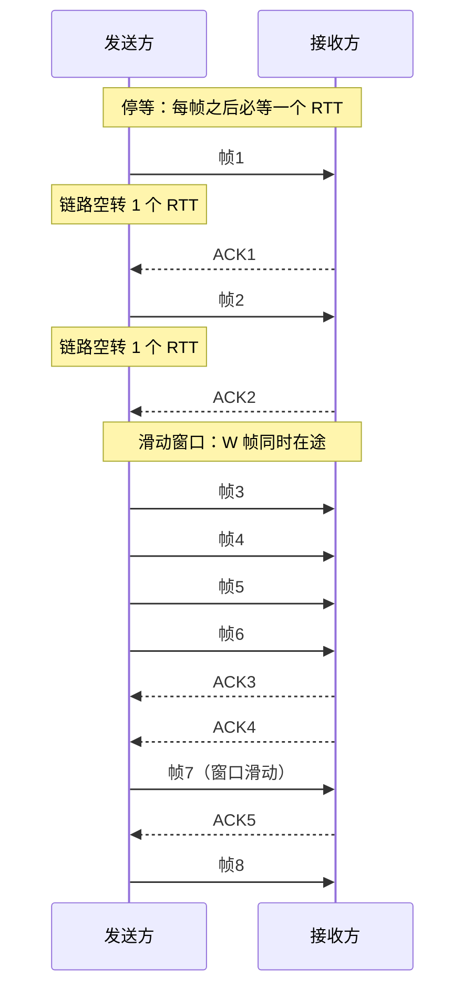
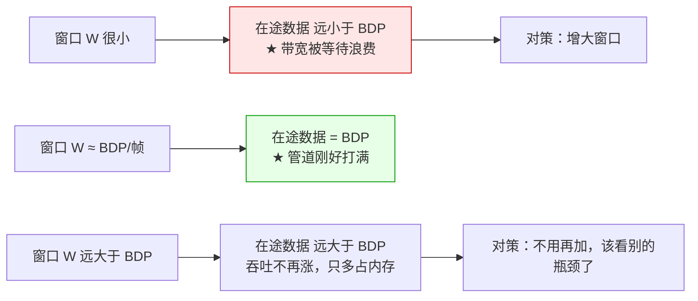

先看三个真实场面：

- 一个文件传到一半突然变慢，抓包发现发送方每发一个包就停下来等 ACK——不是网络差，是**窗口开得太小**；
- 一个跨机房接口，明明两边都是千兆网，实测吞吐只有几 Mbps，排查半天发现瓶颈是**RTT 太大而窗口没跟着调**；
- 面试时被问「TCP 怎么保证可靠传输」，答了「超时重传」，对方追问「那如果每一段都要等确认，网络岂不是白买了一半」——答不上来。

这三个场面指向同一条规律：**只要一条链路上「只有一份数据在飞」，那么链路的实际吞吐就由 RTT 决定，而不是由带宽决定**。而滑走这条限制的方法，叫**滑动窗口**。

## 一、它从哪来

这一切要从**自动重传请求（ARQ, Automatic Repeat reQuest）**说起：发送方发出数据后，如果超时没收到确认，就重发。最早的方案叫**停等（Stop-and-Wait）**——**发一帧，等一个 ACK，收到再发下一帧**。

它的实现极其简单，所以被早期链路协议广泛使用：**IBM 的 BSC（二进制同步通信）**、**1977 年的 XMODEM**（那个年代拨号上网传文件用的协议）都是停等式的。**实现的简单，换来的是效率的灾难**——后面会用具体数字说明。

**滑动窗口（Sliding Window）** 是在 1970 年代随着更高速的链路出现的，并在两处固化下来：

- **HDLC（高级数据链路控制）**——ISO 在 1970 年代标准化的链路层协议，用滑动窗口做流量控制；
- **TCP**——**1974 年 Cerf 和 Kahn 的 TCP 论文**提出了端到端的可靠传输框架，**1981 年的 RFC 793** 正式把滑动窗口作为 TCP 的核心机制。今天你在内核参数里调的 `net.ipv4.tcp_window_scaling`、`tcp_rmem`，源头都在这里。

窗口机制之后还分出了两种重传策略（经典教材里成对出现）：

- **回退 N（Go-Back-N, GBN）**：确认是累积的，一旦超时，**从丢失的那一帧开始，把后面已发的全部重发**；
- **选择重传（Selective Repeat, SR）**：**只重传丢失的那一帧**，接收端要缓存乱序到达的帧。

## 二、为什么需要它

因为**「确认」这个机制本身有延迟，而链路上的数据一旦「只有一份在途」，这条链路的带宽就被浪费了**。

先看因果链：

1. 发送方发一帧，必须等 ACK 回来才能发下一帧；
2. ACK 回来需要**一个往返时延（RTT）**；
3. 所以在这一个 RTT 里，链路上**只有一帧数据**；
4. 于是**实际吞吐 = 帧大小 / RTT**——**和链路带宽毫无关系**。

这引出一个关键概念：**时延带宽积（Bandwidth-Delay Product, BDP）**——**一条链路在「回程时间」内最多能容纳多少数据**。它就是管道里的「水量」：

```
BDP = 带宽 × RTT
```

**一节管子的容量，等于它的横截面积乘以长度。** 如果传输的东西比管子容量少，管子就空着。停等协议的问题就是「一次只放一帧进管子」。

滑动窗口的做法很直接：**允许「同时在途」多帧**。「窗口」就是**当前允许在途、还没被确认的帧的集合**；收到一个 ACK，窗口向前滑一格，这就是「滑动」二字的来历。

它换来了什么，是有硬上限的：**当窗口字节数 ≥ BDP 时，管道被打满，吞吐就触到带宽上限**。再开大窗口只会白占内存。**所以滑动窗口的工程问题不是「开不开」，而是「开多大」——这个量的答案就是 BDP。**

**本质一句话：停等把「链路容量」浪费在「等待」上，滑动窗口用「同时在途」把等待填满，判据只有一条：在途数据量（窗口）能不能覆盖一个 RTT 内的链路容量（BDP）。**

## 三、两张图看懂

先看停等和滑动窗口在时间轴上的差别。这是「管道空转」最直观的画面：



再看「窗口该开多大」这个问题的答案。横轴是窗口大小，纵轴是链路利用率——**分水岭就是 BDP**：



两张图合起来就是一句话：**滑动窗口的本质不是「快」，而是「别让管子空着」；而管子有多大，由 BDP 决定。**

## 四、它有什么用

**1. 先算停等协议到底浪费了多少（本机实跑计算）**

设一条 100 Mbps、RTT 50ms 的链路，帧大小取以太网 MTU 1500 字节：

```text
  链路带宽        : 100 Mbps
  往返时延 RTT    : 50 ms
  帧大小           : 1500 字节
  时延带宽积 BDP   : 625,000 字节 （= 在途数据量）
  填满管道所需帧数 : 417 帧

  停等协议：每发 1 帧就停下等 ACK，一个 RTT 只送 1 帧
    吞吐 = 帧大小 / RTT = 12000 bit / 0.05s = 240.0 kbps
    链路利用率 = 0.240 %  ★ 99.76% 的链路在空转
```

**一条 100 Mbps 的链路，停等协议只用到了 240 kbps，利用率 0.24%，99.76% 在空转。** 这个数字比直觉夸张得多，也解释了为什么「拨号时代的 XMODEM 慢得让人绝望」：**链路是瓶颈，但协议自己成了更大的瓶颈**。

**2. 窗口开多大才够：一张表看完（本机实跑计算）**

```text
      窗口 W |         在途字节 |             吞吐 |      链路利用率 | 判断
  ---------+--------------+----------------+------------+------
         1 |        1,500 |        0.24 Mbps |      0.24% | 停等
         4 |        6,000 |        0.96 Mbps |      0.96% | 管道半空
         8 |       12,000 |        1.92 Mbps |      1.92% | 管道半空
        16 |       24,000 |        3.84 Mbps |      3.84% | 管道半空
        64 |       96,000 |       15.36 Mbps |     15.36% | 管道半空
       128 |      192,000 |       30.72 Mbps |     30.72% | 管道半空
       256 |      384,000 |       61.44 Mbps |     61.44% | 接近打满
       417 |      625,500 |      100.00 Mbps |    100.00% | ★ 打满，再加窗也无用
       512 |      768,000 |      100.00 Mbps |    100.00% | ★ 打满，再加窗也无用
      1024 |    1,536,000 |      100.00 Mbps |    100.00% | ★ 打满，再加窗也无用
```

**注意几个反直觉的地方**：

- **窗口 128 时，利用率才 30%**。开到这个「感觉很大」的值，链路仍有 70% 空着；
- **分水岭在 417**（= BDP / 帧大小）。低于它，吞吐随窗口线性涨；高于它，**吞吐一条直线不再动**；
- **417 到 1024，配置开了 2.5 倍，吞吐一模一样**。多出来的那 600 KB 窗口，纯粹是白占内存。

**这就是「高 BDP 链路」的调优核心**：跨机房、跨洲际的链路 RTT 可能是 200ms 甚至更大，BDP 随之放大 4~10 倍，默认窗口往往远远不够——**这也解释了为什么 `tcp_window_scaling` 是长肥管道（Long Fat Network）上第一个要开的参数**。

**3. 丢一个包，两种重传策略差多少（本机实跑计算）**

窗口机制还要解决「丢了怎么办」。两种策略的代价差得很明显：

```text
  设定：窗口 W = 8，一次传送 1000 帧，其中恰好 1 帧丢失

            丢失帧在窗口内的位置 |     GBN 重传帧数 |     SR 重传帧数
  ---------------------+--------------+------------
           第 1 帧（偏移 0） |            8 |           1
           第 2 帧（偏移 1） |            7 |           1
           第 4 帧（偏移 3） |            5 |           1
           第 8 帧（偏移 7） |            1 |           1
```

**最坏情况（丢窗口第 1 帧）：GBN 要重发 8 帧，SR 只重发 1 帧，差 8 倍。** 但代价没有消失，只是换了地方：

- **GBN**：发送端只需要**一个计时器**（给最老的未确认帧），实现简单；代价是**丢一个包，白传一窗**。
- **SR**：带宽省了，但接收端要**缓存乱序帧**，发送端要**给每一帧维护计时器**——**状态数量从 O(1) 变成 O(W)**。

**省带宽还是省状态**，这是协议设计里永恒的一对。真实系统里往往取折中：比如 TCP 的 **SACK（选择性确认）** 就是把 SR 的思路引入 TCP——接收端告诉发送方「我收到了哪些不连续的块」，从而避免整窗重传，但不需要发送端维护逐帧计时器。

**4. 窗口不是想开多大就多大：序号空间是硬约束（本机实跑计算）**

```text
      序号位数 k |     序号空间 2^k |     GBN 最大窗口 2^k-1 |      SR 最大窗口 2^(k-1)
  -----------+--------------+--------------------+---------------------
           3 |            8 |                  7 |                    4
           4 |           16 |                 15 |                    8
           8 |          256 |                255 |                  128
          16 |        65536 |              65535 |                32768
```

**为什么 GBN 的窗口不能等于序号空间？** 假设窗口 = 8、序号也是 8 个（0~7）：发送方把 0~7 全发出去，接收方确认了全部，窗口滑回 0。此时发出去的新帧 0 和上一轮的旧帧 0 序号相同，如果这时收到一个**延迟的旧 ACK**，发送方会误以为新帧 0 已被确认。**序号必须能区分「在途的帧」，这是滑动窗口的数学下限。**

**5. 顺带澄清：此「滑动窗口」不是 LeetCode 的那个**

这个同名问题坑过很多人，值得单独说清：

```text
  协议层（本文）  ：滑动窗口 = 允许同时在途、尚未确认的帧的集合
                    → 解决「链路空转」，度量是吞吐 / 利用率
  算法题里的      ：滑动窗口 = 用双指针维护一个满足条件的连续子区间
                    → 解决「O(n²) 枚举子数组」，度量是时间复杂度
```

**两者共享的只是一个名字和「窗口会移动」的直觉**：一个管的是「**同时能有多少在途**」，一个管的是「**当前的候选区间**」。同名不同源，别被词汇骗了。这也是「缓存一致性一秒三义」之外，计算机领域里另一个典型的**术语超载**。

## 五、反例与边界

- **窗口开大不是万能的，它有维护成本。** 窗口越大，发送端要维护的发送缓冲区越大，重传的语义越复杂，内存开销也越高。**窗口是「用内存换带宽」——在内存受限的嵌入式设备上，这个交换可能不划算。**
- **窗口解决「链路空转」，不解决「链路拥塞」。** 这是两个不同的问题：**流量控制**（滑动窗口）防的是**接收方来不及处理**，**拥塞控制**（AIMD、慢启动）防的是**中间链路被压垮**。TCP 里两者叠加：发送窗口取「接收窗口 rwnd」和「拥塞窗口 cwnd」的**较小值**。**只调大窗口而不看拥塞控制，可能直接把网络打崩。**
- **BDP 是「最优窗口」的下界，不是充分条件。** 达到 BDP 只保证「管道填满」，但真实吞吐还受**接收端处理能力、内核缓冲区大小、丢包率**影响。**「窗口够大但还是慢」时，该换去查这些。**
- **别把「滑动窗口」和「拥塞窗口」混为一谈。** 前者是接收方广播的（「我还能收多少」），后者是发送方自己估的（「网络还能塞多少」）。**搞混这两个，会得出「调大 rwnd 就能提速」这种只在特定情况下成立的结论。**
- **SR 是「理论上更优」，工程上不总是更优。** 逐帧计时器在几十万条连接的内核里是实打实的开销；**这正是为什么 TCP 长期用累积确认 + GBN 语义，直到 SACK 才部分引入 SR 的好处。**
- **它和「背压」是同一件事的两个视角。** **背压**讲的是「慢消费者会反向施压，让生产者减速」；滑动窗口讲的是「接收方用窗口公告自己还能收多少」。**接收窗口就是背压机制在协议层的具体实现**，两者是一体两面。

## 六、对比表与小结

| 维度 | 停等（Stop-and-Wait） | 滑动窗口（Sliding Window） |
|------|----------------------|---------------------------|
| 在途数据 | 1 帧 | 最多 W 帧 |
| 吞吐上界 | 帧大小 / RTT | min(带宽, W·帧/RTT) |
| 链路利用率 | 极低（本机算例：0.24%） | 可达 100% |
| 实现复杂度 | 最低 | 需要窗口管理、序号回绕处理 |
| 内存开销 | 极小 | 需要 W 帧缓冲区 |
| 典型场景 | 简单链路、低速设备 | 高速链路、长肥管道 |
| 代表协议 | XMODEM、BSC | TCP、HDLC |

| 维度 | GBN（回退 N） | SR（选择重传） |
|------|--------------|---------------|
| 丢包后重传 | 从丢失处重发整窗 | 只重发丢失帧 |
| 最坏重传量（W=8） | 8 帧 | 1 帧 |
| 接收端缓冲 | 不需要（丢弃乱序帧） | 需要缓存乱序帧 |
| 发送端计时器 | 1 个 | W 个 |
| 最大窗口 | 2^k − 1 | 2^(k−1) |
| 现代对应 | TCP 累积确认 | TCP SACK |

🐾 **小结**：停等和滑动窗口讲的是同一件事的两面——**「确认」这个机制一旦引入，链路上就会出现「等待」，而有等待就会有空转**。停等把简单做到极致，代价是 99% 以上的链路被浪费；滑动窗口用一个「在途集合」把等待填满，代价是多一个需要管理的窗口。判据只有一条：**在途数据量能不能覆盖一个 RTT 的链路容量（BDP）**——小于它，带宽白买；大于它，内存白占。最后留一句提醒：计算机领域里同名不同义的东西太多了，「滑动窗口」既是一个协议机制、也是一道算法题模板；**下次听到一个熟悉的词，先花两秒确认大家说的是不是同一件事。**

---

**相关阅读**：
- [背压：慢消费者的保护机制](/posts/princ-backpressure/)
- [端到端原则：TCP 为什么把可靠性放在两端](/posts/princ-end-to-end/)
- [鲁棒性原则（Postel）：接收要宽松，发送要严格](/posts/princ-postel/)
- [幂等性：让重试变得安全](/posts/princ-idempotency/)
