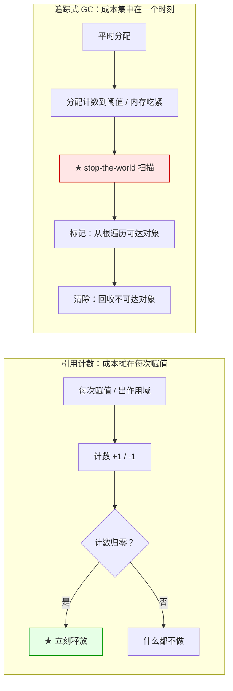
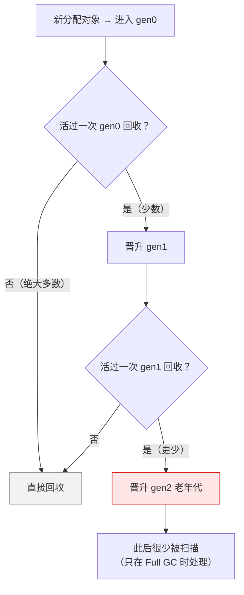

先看三个真实场面：

- 一段 C++ 代码用 `shared_ptr` 管对象，逻辑上没问题，但两个对象互相持有智能指针，内存一路涨到 OOM；
- 一个 Java 服务，平时 P99 是 20ms，每次 Full GC 时飙到 800ms，业务方以为是网络抖动；
- 一段 Python 代码，`with open(...)` 一离开作用域文件就关了，但一个自定义缓存类里的对象却要等到「某个不确定的时刻」才被清掉。

这三个场面看起来分别是「C++ 智能指针用错」「JVM 调优」「Python 语法」，但它们指向的是同一个问题：**一块内存什么时候可以被释放，以及由谁来决定？** 两种主流的回答方式——**引用计数**和**追踪式垃圾回收**——给出了两套完全不同的答案。

本文讲的不是「哪种 GC 算法更好」，而是这两种机制**各自的成本结构**：为什么有的语言选了引用计数、有的选了追踪式 GC，以及现代语言为什么大多是「混合体」。

## 一、它从哪来

很有意思的是，这两种方案**诞生在同一年：1960 年**。

- **引用计数（Reference Counting）**：1960 年，**George E. Collins** 在《A Method for Overlapping and Erasure of Lists》里提出——给每个对象记一个「有多少人在引用我」的计数，计数归零就释放。思路直观得像物理常识：**没人拿着了，就可以扔了。**
- **追踪式 GC（Tracing GC）**：同样在 1960 年，**John McCarthy** 为 Lisp 实现 GC 时提出了 **mark-and-sweep**——从一组确定的「根」（栈、寄存器、全局变量）出发，把所有能到达的对象标记一遍，没被标记的就是垃圾。它的思路是：**判断存活不应该去数引用，而应该从根出发问一句「还够得着吗」。**

两条路线的分歧从一开始就埋下了：

| | 引用计数 | 追踪式 GC |
|---|---|---|
| 判断依据 | 局部信息（这个对象被谁指） | 全局信息（从根能不能到达） |
| 何时回收 | 计数归零的那一刻 | 扫描时发现不可达 |
| 循环引用 | **数得到但拆不掉** | 天然处理（不可达即回收） |
| 谁做判断 | 每次赋值都判断 | 定期集中判断 |

后来这条线继续分叉：

- **1983–1984 年**，**Lieberman & Hewitt** 提出「代际垃圾回收」的想法，**David Ungar** 在 1984 年的 *Generation Scavenging* 里把它做成了可用的工程方案——这就是今天几乎所有高性能 GC（Java、Go、V8）的分代模型源头。
- **2001 年**，**David Bacon 和 V.T. Rajan** 在《Concurrent Cycle Collection in Reference Counted Systems》里给出了**如何用引用计数回收循环垃圾**的算法——这直接影响了 CPython 等「引用计数 + 循环回收」的混合方案。
- **2011 年**，Apple 在 LLVM 上推出 **ARC（Automatic Reference Counting）**，把引用计数的增减**在编译期静态插入**，砍掉了运行期判断的开销——这是引用计数路线的一次重要现代化。

## 二、为什么需要它

因为**「手动管理内存」这件事，人类做得并不好**。它的失败模式有三种，每一种都极其昂贵：

- **泄漏（leak）**：忘记释放，内存缓慢上涨，最后 OOM。**最阴险，因为它不会立刻出事**，可能上线几个月才爆。
- **悬垂（dangling）**：释放太早，还留着指针，之后访问就是未定义行为。**最危险，因为它可能表现为任何症状**——错误结果、随机崩溃、或者「悄悄改掉了别人的数据」。
- **重复释放（double free）**：释放两次，野指针被分配给别人，程序状态彻底乱掉。

而自动管理要解决的核心问题，本质是一个**判定问题**：「这个对象还有用吗？」两种方案的差别，就在于它们用什么信息来回答：

- **引用计数用「局部计数」回答**：被引用了就还有用。**优点是快、确定、不需要停顿；缺点是「互相引用的孤岛」在计数上看起来永远有用**——这就是循环引用。
- **追踪式 GC 用「可达性」回答**：从根能到达就还有用。**优点是能正确处理循环、判断更本质；缺点是必须定期停下来做全局扫描，而扫描时间随堆大小增长**。

**本质一句话：引用计数和追踪式 GC 回答的是同一个问题——「这块内存还有用吗」——但一个用「谁还引用我」这种局部信息来回答，另一个用「从根能不能到达」这种全局信息来回答；这个差异决定了一个没有停顿但有循环泄漏、另一个没有循环泄漏但有全局停顿。**

## 三、两张图看懂

先看两者在**回收时机**上的区别。这不是实现细节，而是它们最本质的分野：



再看追踪式 GC 的分代模型。它的整个赌注就写在图里：**大多数对象活不过第一代**。



两张图合起来说明：**引用计数把回收成本「摊平」到每一次赋值上，换来「随时可回收」；追踪式 GC 把成本「集中」到一个时刻，换来「平时零开销」——但那个时刻不可预测，而且随堆增长。**

## 四、它有什么用

**1. 引用计数是「即时」的（CPython 3.13 实跑）**

引用计数最容易被忽略的特点，是它的**确定性**：引用归零的那一刻，对象就被回收，不需要等任何后台进程：

```text
[1] 引用计数：对象一被引用就 +1，引用离开就 -1，归零即释放
  a = Cell()            → sys.getrefcount(a) = 2  （含 getrefcount 自己的临时引用）
  b = a                 → sys.getrefcount(a) = 3
  lst = [a, a, a]       → sys.getrefcount(a) = 6

[2] 确定性析构：引用归零的时间点可精确观测
  del x 之后 finalizer 是否已触发：True
  从 del 到对象被回收的间隔：3.90 微秒（同一语句内完成）
```

**这就是 CPython 里 `with` 语句、文件句柄能「离开作用域立刻关闭」的原理**，靠的不是 GC，是引用计数。C++ 的 RAII 能成立，也是同一套机制（`shared_ptr` 的计数归零即析构）。

**2. 引用计数的死穴：循环引用（本机实跑）**

```text
[3] 引用计数的死穴：循环引用，计数永远不为零
  构造 p <-> q 环后，sys.getrefcount(p) = 3
  del p, q 之后：环仍在，两个对象都无法被引用计数释放
  当前 gc 垃圾计数 = (1259, 8, 0)  → 追踪式 GC 才能收割
  gc.collect() 回收对象数 = 2，耗时 1.465 ms
  回收后再 collect：0 个（环已被清掉）
```

`p.next = q; q.next = p` 之后，`p` 的引用计数是 3（本地变量 `p` 一个、`q.next` 一个、`getrefcount` 的参数一个）。`del p, q` 之后，**两个对象的计数各剩 1，因为互相指着**，永远归不了零。引用计数在这里**彻底失效**，必须靠追踪式 GC 兜底。

CPython 的解法正是「混合」：**引用计数为主（处理绝大多数对象）+ 一个分代循环回收器（处理环）**。这个组合是 2000 年 Python 2.0 引入的，算法基础就是 Bacon & Rajan 那套循环回收。

**3. 暂停时间：两种成本结构的实测对比（本机实跑）**

```text
[4] 暂停时间：引用计数释放 vs GC 一次完整回收
  标量           | 操作                    |     耗时 | 说明
  -------------+-------------------------+----------+------------------
       100,000 | del 单向链表（引用计数）    |  2.917 ms | 逐对象立即释放，无扫描
       300,000 | del 单向链表（引用计数）    |  9.050 ms | 逐对象立即释放，无扫描
       600,000 | del 单向链表（引用计数）    | 16.008 ms | 逐对象立即释放，无扫描
       100,000 | gc.collect()（追踪式）    | 18.542 ms | 必须遍历存活对象图
       300,000 | gc.collect()（追踪式）    | 81.923 ms | 必须遍历存活对象图
       600,000 | gc.collect()（追踪式）    | 144.070 ms | 必须遍历存活对象图
```

**这张表要诚实地读**：两者都随对象数线性增长，引用计数并不是「零成本」，它把成本摊到了每一次赋值的 `+1/-1` 上。真正的差别在**两个方面**：

1. **可预测性**：引用计数的释放点由程序控制（`del x` 的那一刻），GC 的释放点由运行时决定，**你无法预知它会在哪个请求上停顿**。
2. **扫描范围**：引用计数只处理**被释放的对象**；GC 必须遍历**整张存活对象图**——**堆里活着的对象越多，暂停越长**，哪怕这次要回收的垃圾很少。

**这就是「低延迟」系统偏爱引用计数、「高吞吐」系统能容忍 GC 停顿的根本原因**：前者买的是确定性，后者买的是平时零开销。

**4. 分代假说：为什么 GC 敢只扫一小块（本机实跑）**

分代 GC 的赌注是：**新对象更可能很快死**。实测这个赌注赢得很明显：

```text
[5] 分代假说：绝大多数对象活不过第一代
  分配 400,000 个临时对象后，三代回收次数：
    gen0（新生代）:   366 次  ← 绝大多数对象死在这里
    gen1（中年代）:    33 次  ← 活过 gen0 的才被扫
    gen2（老年代）:     0 次  ← 长期存活的最后兜底
    观察到的 GC 暂停次数：399，最大暂停 1.570 ms，总暂停 94.362 ms
```

**同一个对象，被 gen0 回收扫描了 366 次，却没进过一次 gen2。**（注：最大暂停随机器负载波动，这里是单次运行观测值。）这就是分代的收益：**把「每次全堆扫描」的成本，压到只扫「新分配的那一小块」**，因为统计上，垃圾几乎都在新生代里。

赌注的另一面是：**如果有个长寿对象被放进 gen0，它会被反复扫描 366 次**，直到晋升到 gen2 才消停。这就是「晋升」这个机制要解决的效率问题，也是为什么「大对象直接进老年代」是个常见优化。

**5. 两种机制在现代语言里都是「混合」的**

```text
  语言 / 运行时        主机制             循环处理            补充
--------------------------------------------------------------------------------
  CPython            引用计数            分代循环回收器       弱引用 / finalizer
  Swift              引用计数(ARC)        需 weak/unowned 打断  编译期插入计数
  C++ shared_ptr     引用计数            需 weak_ptr 打断      手动选择
  Java HotSpot       追踪式(分代)        天然处理            G1 / ZGC 并发标记
  Go                 追踪式(并发标记)     天然处理            低延迟目标
  V8 (JS)            追踪式(分代)        天然处理            Orinoco 并发
```

**注意「循环处理」这一列**：选了引用计数的语言，都把「防环」的责任**部分转移给了程序员**：C++ 要你判断该用 `weak_ptr` 还是 `shared_ptr`，Swift 要你标 `weak`，Python 则选择用 GC 兜底。**这就是那条规律：没有免费的午餐，只有「谁在什么时候付账」。**

## 五、反例与边界

- **引用计数不是「没有停顿」，只是「停顿分散」。** 一次 `del` 一个十万节点的树，照样会有毫秒级卡顿。**「无停顿」是相对追踪式 GC 的 stop-the-world 说的，不是绝对承诺。**
- **追踪式 GC 的暂停也可能是「假象」。** 现代 JVM 的并发 GC（G1、ZGC）把大部分标记工作放在业务线程之外，暂停被压到毫秒级甚至亚毫秒，**「Java 一定会有几百 ms 停顿」这个印象，早已过时**。选型要看具体收集器，不是看语言。
- **引用计数有「计数溢出」风险。** 32 位计数在极端场景下（海量共享指针）会回绕，一些实现（如 Python 的 `ob_refcnt`）为此在超大对象上改用 64 位或特殊处理。**这是引用计数在实现层面必须防的边界。**
- **循环不是引用计数唯一的麻烦，还有一个更隐蔽的**：**多线程下的原子计数**。引用计数的 `+1/-1` 在多线程里必须是原子的，这个开销（写屏障）可能吃掉它相对追踪式 GC 的优势——这也是为什么很多高并发运行时最终选了追踪式 GC + 并发标记。
- **分代假说不永远成立。** 如果程序大量分配长寿对象（比如启动期构建一个巨大缓存），分代策略会把大量对象搬来搬去，反而更慢。**这也是为什么 JVM 允许你直接调大新生代、或者用 `-XX:PretenureSizeThreshold` 让大对象直接进老年代。**
- **别再问「哪种更好」了，先问「我在优化什么」。** 追求**低延迟 / 可预测**（实时系统、游戏引擎、音频处理）：偏向引用计数或无停顿 GC；追求**高吞吐**（批处理、Web 后端）：偏向追踪式 GC 的分代 + 并发。**同一个语言的不同 GC 实现，服务的就是不同的目标函数。**

## 六、对比表与小结

| 维度 | 引用计数 | 追踪式 GC |
|------|---------|-----------|
| 回收时机 | 即时、确定性 | 延迟、不确定 |
| 暂停特征 | 分散在每次赋值，单次很短 | 集中成一次 stop-the-world |
| 扫描范围 | 只处理被释放对象 | 遍历整张存活对象图 |
| 循环垃圾 | ❌ 无法自动回收 | ✅ 天然处理 |
| 运行期开销 | 每次赋值都有计数开销 | 分配/回收时才付费 |
| 内存峰值 | 低（即死即放） | 高（等回收才放） |
| 实现复杂度 | 低（逻辑简单） | 高（分代/并发/写屏障） |
| 对程序员的暴露 | 需处理循环（weak） | 基本透明，但停顿不可控 |
| 代表实现 | CPython、Swift ARC、COM、shared_ptr | Java HotSpot、Go、V8 |

| 你的诉求 | 更倾向 | 具体做法 |
|---------|-------|---------|
| 延迟可预测、停顿要短 | 引用计数 | Swift / C++ 智能指针；注意打断循环 |
| 吞吐优先、能容忍停顿 | 追踪式 GC | JVM 调参、G1/ZGC、Go 的 GOGC |
| 既要低延迟又要高吞吐 | 混合 | CPython 的 RC + 分代循环回收 |
| 内存峰值敏感 | 引用计数 | 即死即放，堆不会膨胀 |
| 大量短命对象 + 少量长寿缓存 | 分代 GC | 让长寿对象尽早晋升 |

🐾 **小结**：引用计数和追踪式 GC 常被讲成「旧 vs 新」「弱 vs 强」，但它们从 1960 年诞生起就是**两条平行的路线**，各自优化一个目标：引用计数优化**确定性**（什么时候放，我说了算），追踪式 GC 优化**吞吐与正确性**（平时零开销、循环也能收）。它们各自的死穴也正好对称：引用计数怕环，追踪式 GC 怕停顿。所以现代语言几乎都走了混合路线——**CPython 用引用计数保确定性、用分代循环回收补环的漏洞**；Java 用分代保吞吐、用并发标记压停顿。真正要记住的不是「哪个更好」，而是那句老话：**每种自动内存管理都在做一笔交易——用可预测性换吞吐，或者用吞吐换可预测性。**

---

**相关阅读**：
- [局部性原理：缓存体系的地基](/posts/princ-locality/)
- [空间换时间：哈希、缓存与索引的共同母题](/posts/princ-space-time/)
- [JIT：让程序在奔跑中变快](/posts/princ-jit/)
- [大 O 复杂度：增长率的语言，不只是面试题](/posts/princ-big-o/)
