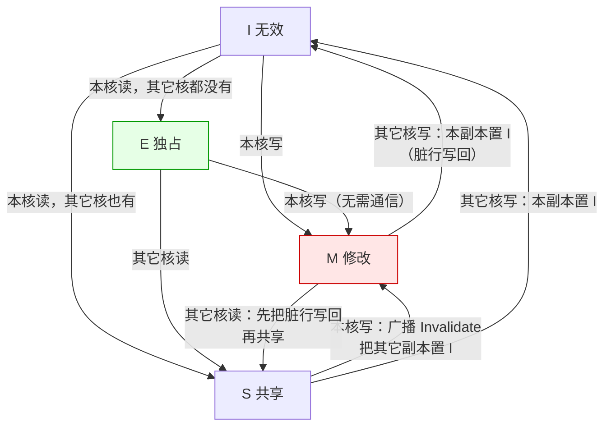
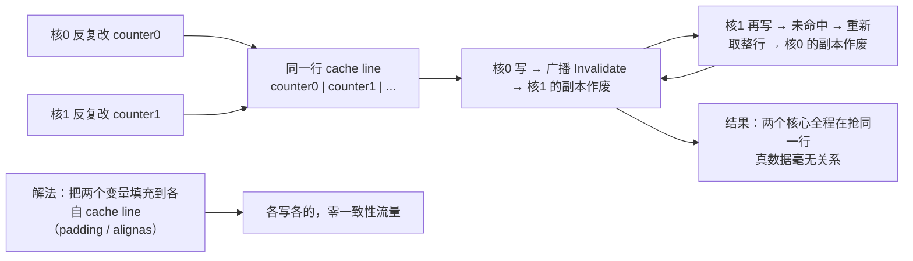

先看三个真实场面：

- 一段多线程代码，把两个线程各改一个计数器，逻辑上互不相干，实测却比单线程还慢——把两个变量之间塞几个没用到的字节进去，反而快了好几倍；
- `volatile` 明明只是为了禁止编译器优化，为什么在多核上还能保证可见性；
- 一个热点商品缓存，两个业务共用了同一个 key，一个业务高频刷新，另一个业务的命中率莫名其妙掉到底。

第三个场面看起来是「Redis 用错了」，第一个看起来是「CPU 微架构」，中间那个看起来是「Java 内存模型」。但这三件事是**同一个问题**：**同一份数据存在多份拷贝，写了一份之后，谁负责让其它拷贝知道？**

本文讲的这条原则就是回答这个问题的——它不叫「Redis 缓存一致性」，它的本名是 **cache coherence（缓存一致性）**，是几十年前多核处理器为了共享内存而发明的一整套协议。

## 一、它从哪来

要让多个核共享内存，缓存就必须解决一个矛盾：**缓存的意义是「让每个核都有一份副本，各自快速访问」，但副本一多，「谁的是最新的」就成了问题**。

这个问题在 1960 年代末就已经出现（**1967 年 Maurice Wilkes** 提出 cache 的概念时，就在论文里讨论了多处理器的缓存问题），但真正成为工程焦点是 **1980 年代初的多处理器时代**：

- **1983 年**，**James R. Goodman** 发表《Using Cache Memory to Reduce Processor-Memory Traffic》，提出 **write-once** 协议——第一次系统地用「总线监听（snooping）+ 让其它副本失效」来解决多核缓存的一致性；
- **1984 年**，**Mark Papamarcos 和 Janak Patel** 提出 **Illinois 协议**，把缓存行分成四个状态，这就是后来被广泛实现的 **MESI** 的雏形；
- 之后的几十年里，MESI 及它的各种变体（**MOESI**、**MESIF**，分别被 AMD 和 Intel 采用）成了几乎所有多核 CPU 的一致性方案。

四个状态的名字就是它们要表达的意思：

| 状态 | 含义 | 内存里的是不是最新 |
|------|------|--------------------|
| **M**（Modified，修改） | 本核改过，和内存不一致，只有本核有 | 否，内存是旧的 |
| **E**（Exclusive，独占） | 只有本核有，且和内存一致 | 是 |
| **S**（Shared，共享） | 多个核都有，都和内存一致 | 是 |
| **I**（Invalid，无效） | 本地副本作废，不能用 | — |

**注意这里有个非常关键的设计选择：MESI 走的是「写失效（write-invalidate）」，不是「写更新（write-update）」。** 一个核要写某行，做法是**广播一条 Invalidate，把别人的副本直接作废**，而不是把新值推给别人。这个选择决定了后面所有性能特征。

## 二、为什么需要它

因为**「缓存」和「共享」这两个词放在一起，就自动产生了不一致**。

先看没有一致性协议的后果：

- **读到脏数据**：核 A 改了自己缓存里的 `x`，核 B 的缓存里还是旧 `x`，B 读到的值是错的。**这不是「暂时旧一点」，是「永远错」**——因为 A 永远不会主动告诉 B。
- **写丢失**：两个核各自的缓存里都有 `cnt`，同时加一，各自写回内存——最后内存里的值是 1，而不是 2。**两次加一的结果，比一次加一还少。**
- **编译器与 CPU 的重排**：即使硬件做了一致性，编译器和 CPU 还可能把访存顺序重排，让「先写标志位再写数据」变成「先写数据再写标志位」——另一个核就可能看到「标志位已置位但数据还没写」的状态。

更根本的动机是**性能预算**：CPU 访问寄存器是 1 个周期，访问 L1 是几到十几个周期，访问内存是上百个周期。**如果每次读写都要锁总线、强制走内存，那么加缓存带来的收益会被一致性开销吃光。** 所以一致性协议要解决的不是「要不要一致」，而是**「怎样用尽可能少的通信，维持足够的一致」**——这才有了 MESI 的四态，把「独占可写」「只读共享」「已改待写回」这些情况分开处理。

**本质一句话：缓存一致性解决的是「同一份数据的多份拷贝，写发生后如何让其它拷贝失效或同步」——它不是缓存本身的属性，而是「多副本」这个结构必然要交的税。**

## 三、两张图看懂

先看 MESI 的状态流转。重点观察一条：**「写」的代价取决于当前状态，而不是写本身**——这是伪共享问题的根源。



再看「伪共享」为什么是「伪」的。两个核改的是**完全不同的变量**，逻辑上没有任何交互，但只要它们落在同一行 cache line（通常是 64 字节），就会互相踢副本：



两张图合起来说明：**一致性的单位不是「变量」，是「cache line」**。这一个粒度差异，就制造出了「伪共享」这个纯性能陷阱。

## 四、它有什么用

**1. 先看真共享：同一变量的跨核读写（本机模拟）**

先说清一件事：**本机没有 gcc，也没法在 Python/Node 里直接测 CPU 的 cache line 行为**（Python 有 GIL，Node 无法控制内存布局）。所以我写了一个 **MESI 状态机模拟器**，逐条执行协议规则并统计一致性流量。它模拟的是协议逻辑，不是硬件实测——**下面的数字是「协议会走多少步」的计数，不是纳秒级性能**。

```text
场景 A：两个核访问【同一个】变量（真共享）
    核0 R 行X         未命中 → 总线读，本核置 E
    核1 R 行X         未命中 → 总线读，本核置 S
    核0 W 行X         busRdX → 无效化 1 个副本，本核置 M  ★流量+1
    核1 R 行X         未命中 → 总线读（含脏行写回），本核置 S
    核1 W 行X         busRdX → 无效化 1 个副本，本核置 M  ★流量+1
    → 命中 0 / 未命中 3 / 总线事务 5 / 无效化 2
```

两次读先建立 E 和 S，一次写把对方打回 I，再读又要重新取（还要等脏行写回）。**这是「真共享」的代价：数据本来就有关，这个代价躲不掉**——你要么用锁把它串行化，要么用无锁 + 正确的内存序保证可见性。

**2. 再看伪共享：代码逻辑完全一样，只是变量地址不同（本机模拟）**

```text
场景 B：两个核各改【自己的】变量，但两者同处一行 cache line
    核0 W 行L         busRdX → 无效化 0 个副本，本核置 M  ★流量+1
    核1 W 行L         busRdX → 无效化 1 个副本，本核置 M  ★流量+1
    核0 W 行L         busRdX → 无效化 1 个副本，本核置 M  ★流量+1
    ...（此后每一次写都重复这条）
    → 命中 0 / 未命中 0 / 总线事务 12 / 无效化 11

场景 C：把两个计数器各自填充到独立 cache line
    核0 W 行L0        busRdX → 无效化 0 个副本，本核置 M  ★流量+1
    核1 W 行L1        busRdX → 无效化 0 个副本，本核置 M  ★流量+1
    核0 W 行L0        命中（已是 M），零流量
    ...（此后全部命中）
    → 命中 10 / 未命中 0 / 总线事务 2 / 无效化 0
```

对比结果：

```text
  伪共享（紧挨） : 总线事务 12 次，无效化 11 次
  填充隔离后     : 总线事务  2 次，无效化  0 次
  ★ 一致性流量相差 6 倍，变的只是两个变量的地址
```

**这就是那个著名陷阱的全貌**：两个线程干着毫不相干的事，却因为内存布局挨在一起，全程在抢同一行 cache line。这不是理论推演——`java.util.concurrent` 里大量用了 `@Contended` 注解（把字段填充到独立 cache line），`Disruptor` 框架给每个 `Sequence` 加了好几十字节的 padding，都是同一个目的。

**3. 放大到分布式缓存：名字换了，模式没换**

前面说过，「缓存一致性」在 CPU 语境下指核间一致性（MESI）。但在业务里说「缓存一致性」，往往指**缓存与数据库之间的一致性**——那是另一条线（先更新 DB 还是先删缓存、延迟双删），本站有专文讲过，这里不重复。真正值得放在一起看的，是**这两个尺度上的同构性**：

| CPU 侧（多核） | 分布式侧（多副本） | 对应关系 |
|----------------|-------------------|----------|
| cache line 失效广播 | 缓存失效通知（Pub/Sub 或删除消息） | 都是「让别人的副本作废」 |
| MESI 四态协议 | 先更新 DB 后删缓存 / 延迟双删 | 都是一套「写后怎么办」的策略 |
| write-invalidate | 更新 DB → 删缓存 → 下次读回填 | 写失效而非写更新 |
| write-update | 更新 DB → 同步刷缓存 | 写更新，代价是写放大 |
| false sharing 伪共享 | 多个业务挤在一个 key / 一个大 key | 无关数据共用一份副本 |
| 总线争用 / 总线风暴 | 热点 key 打到同一个分片 | 多副本结构的共同瓶颈 |

**★ 同一个约束：只要同一份数据存在多份拷贝，写发生后就必须有人让其它拷贝失效或同步。** 缓存一致性不是 CPU 的专利，它是「多副本」这个结构本身的税。

**4. 工程上怎么用这条原则**

```text
  问题                          对策                      代价
--------------------------------------------------------------------------------
  多核抢同一行（伪共享）          padding / @Contended      内存膨胀
  核间可见性                     volatile / 内存屏障 / atomic  编译器优化受限
  高竞争计数器                  每核一份 + 定期归并        读到的值是近似
  缓存与 DB 不一致               先更 DB 后删缓存 + 延迟双删  中间态窗口
  热点 key 打爆分片              本地缓存 / 分片 / 预热      复杂度上升
```

**共同思路只有一条：不要试图消灭「多副本」，而是设计「写之后如何失效」的机制，并把失效的代价控制在可接受范围内。**

## 五、反例与边界

- **「一致性」这个词严重超载。** 至少有三层含义：CPU 核间一致性（本文）、缓存与数据库一致性（业务语境，见 Seckill 系列）、分布式副本一致性（见 CAP）。**同一个词，三个完全不同的问题**——讨论前先对齐说的是哪一个，否则十有八九在鸡同鸭讲。
- **一致性协议不是「越强越好」。** 协议越强，通信越多，扩展性越差。这也是为什么业界没有「最强协议」，只有「在某个核数规模下够用的协议」；核数上去之后，MESI 的总线监听本身就成瓶颈，这直接催生了 NUMA 和非共享架构。
- **伪共享的**止损**要看实测。** padding 会让结构体变大、破坏原有局部性，滥用反而更慢。**正确的做法是先 profile**（看 CPU 的 HITM / cache-to-cache 指标，Linux 下用 `perf c2c`），确认真的是伪共享再改，而不是「听起来像伪共享就加 padding」。
- **`volatile` 不是万能的。** 它解决的是**可见性和重排**，不解决**原子性**。`volatile int` 做 `++` 依然是「读-改-写」三步，多个线程同时执行照样丢更新。**要原子性得用 `atomic` / `fetch_add`。**
- **写失效不是永远最优。** 如果某行会被频繁读写，或者有大量核共享只读副本，那么「失效 + 重新取」的成本可能高于「直接把新值推给持有者」（写更新）。**协议选型取决于访问模式，没有普适最优解**——这也是 MOESI、MESIF 存在的理由。
- **伪共享不是只在多线程里出现。** 单个线程访问跨 cache line 的数据结构（比如链表节点、哈希桶里的链表）也会有类似的「每次访问都多取一行」问题，只是没有跨核流量那么刺眼。**这时候它叫「缓存不友好」，本质是同一件事：访问模式和硬件粒度对不上。**

## 六、对比表与小结

| 状态 | 本地是否有副本 | 内存是否最新 | 本核可读 | 本核可写（是否要通信） |
|------|---------------|-------------|---------|----------------------|
| M 修改 | 有 | 否 | ✅ | ✅ 直接写 |
| E 独占 | 有 | 是 | ✅ | ✅ 直接写（无需通信） |
| S 共享 | 有 | 是 | ✅ | ⚠️ 需广播 Invalidate |
| I 无效 | 无 | — | ❌ 未命中 | ⚠️ 需总线取行 |

| 维度 | 真共享（同一变量） | 伪共享（同一行不同变量） |
|------|-------------------|-------------------------|
| 数据是否有关 | 有关 | **无关** |
| 一致性流量 | 必需 | **纯浪费** |
| 能否消除 | 不能（只能换机制） | 能（padding 到独立行） |
| 典型表现 | 锁竞争、原子操作热点 | 计数器、状态数组、线程局部标志 |
| 排查手段 | 看锁统计、争用指标 | `perf c2c` 看 HITM |

🐾 **小结**：缓存一致性最容易被误解的地方，是把它当成某个具体产品（Redis、MESI、CAP）的专属名词。它其实是一条**结构性的约束**：只要你为了性能而复制了数据，就必然要面对「写完之后其它副本怎么办」。CPU 用 MESI 回答它，分布式系统用失效通知和反熵回答它，业务系统用「先更 DB 后删缓存」回答它——**三次回答，同一个问题**。而它带来的最反直觉的工程后果，是「伪共享」：**两段逻辑上毫不相干的代码，会因为物理上靠得太近而互相拖慢**。所以下次给多线程程序调优时，除了问「有没有锁竞争」，也该问一句：「我这两个热点变量，是不是躺在同一行里？」

---

**相关阅读**：
- [局部性原理：缓存体系的地基](/posts/princ-locality/)
- [空间换时间：哈希、缓存与索引的共同母题](/posts/princ-space-time/)
- [CAP 定理：分布式的取舍三角](/posts/princ-cap/)
- [二八定律（Pareto）：热点总是集中](/posts/princ-pareto/)
