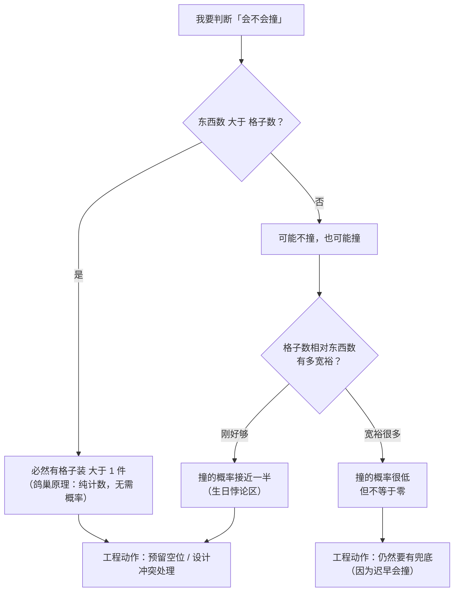
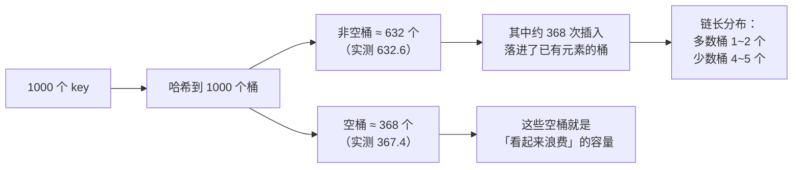

先看三个在工程里反复出现的场面：

- 用「随机生成的 8 位十六进制串」当订单号，跑了一段时间开始出现主键冲突——随机不是不重复；
- Java 的 `HashMap` 默认容量 16，理想情况能放 16 个，可它在放入第 13 个元素时就扩容了；
- 数据库给某个字段加了唯一索引，上线后偶发插入失败，排查半天发现是「业务上默认唯一的那个编号，其实并不唯一」。

这三件事背后是同一条规律：**只要你的「格子」比「东西」少，就必然有格子装两件东西**。它不依赖随机性、不依赖实现细节、也不需要概率——是纯粹的计数结论。这条规律就是鸽巢原理。

本文不从「抽屉原理的定义」讲起——那在离散数学课上讲过。这里讲的是它**作为工程上一条不可绕开的约束**：它怎么决定了哈希表的内存开销、怎么变成了 HashDoS 的攻击面、以及为什么「看起来随机」的系统照样会撞。

## 一、它从哪来

这条原理的正式提出者是 **Peter Gustav Lejeune Dirichlet（狄利克雷）**，时间是 **1834 年**。他在研究用有理数逼近无理数的问题时，需要一个「必然存在」的结论——不是「大概率存在」，而是「一定存在」。他在论文里把它命名为 **Schubfachprinzip**，直译就是「抽屉原理」：

> 如果把 n 件东西放进 m 个抽屉，且 n > m，那么至少有一个抽屉里放了不止一件东西。

在英语世界它也叫 **Dirichlet's box principle** 或 **pigeonhole principle**（pigeonhole 是鸽舍里那种一格一格的巢箱）。

需要说清楚两件事：

**第一，它是「存在性」结论，不是「构造性」结论。** 它告诉你「一定有一对撞了」，但不告诉你「是哪一对」。这在工程上很要命——你没法靠它去定位冲突，只能靠它知道冲突**必然发生**。

**第二，它是纯粹的计数事实，不需要任何概率假设。** 这点经常被误解：很多人以为「鸽巢」是概率版的东西，其实概率版是它的**推论**（生日悖论），而不是它本身。原版连「随机」两个字都不需要。

它后来长成了一个庞大的家族：**广义鸽巢原理**（n 件放 m 个抽屉 → 至少一个抽屉有 ⌈n/m⌉ 件）、**拉姆齐定理**（Ramsey）、**Erdős–Szekeres 定理**（任何足够长的序列必含长度 k 的单调子序列）。它们共享同一个骨架：**规模 > 容量 → 必然重复**。

## 二、为什么需要它

因为在系统里，**「容量」和「规模」是两个独立增长的量，而规模总是先撞上容量**。

没有这条规律，会踩三类坑：

**第一类：以为随机就等于不重复。** 用随机数做 ID、做分片键、做采样。随机只保证**单个值**的出现概率均匀，不保证**两两之间**不撞。一旦值域是有限的，撞就只是时间问题。

**第二类：把「理论容量」当成「可用容量」。** 一个 16 桶的哈希表，直觉是「能放 16 个」，实际是「放到 12 个就该扩容了」。差的那 4 个槽位就是鸽巢原理收的税——你必须留出空位，否则查找会退化。

**第三类：把冲突当成 bug 去修。** 哈希冲突、UUID 碰撞、布隆过滤器误判，这些**不是缺陷，是数学必然**。把精力花在「消灭冲突」上，等于把精力花在推翻计数法上；正确的做法是「承认冲突必然存在，然后设计代价可控的处理方式」。

**本质一句话：鸽巢原理讲的是「规模超过容量时，重复不是意外而是必然」——它把「会不会撞」这个问题，变成了一道只有加减乘除的算术题。**

## 三、两张图看懂

先看它的定位：它不同于「大概率会撞」的概率结论，也不同于「某次真的撞了」的观测，它站在一个很硬的位置上——**只要条件成立，结论就没得商量**。



再看它最常见的落点——哈希表。这里有一个非常反直觉的算术：**桶数和元素数相等时，不是「刚好用完」，而是「约三分之一空着、另一些排了队」**。



两张图合起来说明一件事：**桶数从来不是「刚好够用」，而是「必须大于元素数」**。空桶不是浪费，是留给冲突的缓冲。

## 四、它有什么用

**1. 先用最朴素的版本验证一遍（本机实跑）**

366 只鸽子放进 365 个抽屉，结果不需要任何假设：

```text
  抽屉总数            : 365
  鸽子总数            : 366
  被占用的抽屉数      : 232
  单个抽屉的最大数量  : 5
  结论                : 366 > 365，必然存在抽屉 >= 2 只 （实测 5 只）
```

注意这里的两个数字：**366 > 365 保证了「必然 ≥ 2」，但实测最大的那个抽屉装了 5 只**。这就是「存在性」结论和「实际分布」的差距——原理只保证下限，实际分布远比下限夸张。

**2. 生日悖论：鸽巢原理的概率推论（本机实跑）**

生日悖论是鸽巢原理最著名的推论。它的反直觉之处在于：比较的不是「谁和我同一天生日」，而是**所有两两组合**。

```text
  人数 n | 理论 P(碰撞) | 实测频率 | 位数
  -------|--------------|----------|------
      10 |      0.1169  |   0.1163 |
      20 |      0.4114  |   0.4079 |
      23 |      0.5073  |   0.5099 | ★ 已过半
      30 |      0.7063  |   0.7099 | ★ 已过半
      40 |      0.8912  |   0.8910 | ★ 已过半
      50 |      0.9704  |   0.9702 | ★ 已过半
      57 |      0.9901  |   0.9908 | ★ 已过半
      70 |      0.9992  |   0.9991 | ★ 已过半

  ★ n=23 时两两组合数 C(23,2) = 253，远大于 23
  ★ 每组重复 40000 次实验，实测频率与理论值吻合
```

**这就是「用 32 位随机 ID」的危险所在**：32 位有约 43 亿个取值，按生日悖论，**在生成约 7.7 万（√(2·2³²·ln2) ≈ 7.7×10⁴）个 ID 后，撞的概率就过半了**。而「一亿用户」听起来离 43 亿很远，实际差着好几个数量级的安全余量。

**3. 哈希表：桶数 = 元素数时，到底会发生什么（本机实跑）**

```text
  哈希桶数 = 1000，插入元素数 = 1000（负载因子正好 1.0）

  实测（2000 轮平均）非空桶数 = 632.6 / 1000
  实测（2000 轮平均）空桶数   = 367.4
  ★ 理论：空桶期望 = m·e^(-n/m) = 1000·e^(-1) ≈ 367.9

  同时，有约 368 次插入是「落进了已经有人占的桶」。
```

负载因子等于 1 时，**约 37% 的桶是空的**，同时**约 37% 的插入撞了车**。这两个数字加起来正好 100%——因为「撞车」的定义就是「本该占一个空桶，结果那个桶已经满了」。

所以哈希表的理想负载因子不是 1.0。下面是不同负载因子下的实测链长：

```text
  负载因子 | 平均链长 | 最长链长(2000 轮均值) | 相对 0.75 的查找成本
  ---------|----------|------------------------|----------------------
      0.50 |     0.50 |                    4.0 |                 0.86x
      0.75 |     0.75 |                    4.8 |                 1.00x
      1.00 |     1.00 |                    5.5 |                 1.14x
      1.50 |     1.50 |                    6.8 |                 1.43x
      2.00 |     2.00 |                    7.9 |                 1.71x
      3.00 |     3.00 |                   10.0 |                 2.29x
```

**Java 的 `HashMap` 默认负载因子 0.75，就是这张表里的一行。** 它不是数学定理，是「空间」和「链长」的折中：负载再高，链长线性增长，`O(1)` 退化成 `O(n)`；负载过低，内存白花。

**4. 冲突不只是性能问题，也是安全问题（本机实跑）**

如果哈希函数只取低位（比如 `(k * 31) % 64`），攻击者可以构造出**全部落进同一个桶**的 key：

```text
  场景：哈希函数只取低位（m = 64 桶），攻击者提交 64 个精心构造的 key
  非空桶数 = 1（总共 64 个桶）
  0 号桶链长 = 64
```

64 个 key 全挤进一个桶，**单次查找从 `O(1)` 退化成 `O(n)`，每次请求的 CPU 开销被放大 64 倍**。这就是 **HashDoS** 的原理——2011 年多个语言运行时（PHP、Java、Python、Ruby、Node）都为此打过补丁，主流对策是**在哈希函数里掺入随机种子**（Java 的 `hashSeed`、Python 的 `PYTHONHASHSEED`），让攻击者无法提前构造出同桶的 key。

这是鸽巢原理一个很典型的工程后果：**既然冲突必然存在，那就要保证「冲突的分布不由外部输入决定」**。

## 五、反例与边界

- **它只管「有重复」，不管「重复几次」。** 366 只鸽子放进 365 个抽屉，原理只保证「至少有一个抽屉 ≥ 2」，实测可能是 5。想要更强的结论得用**广义鸽巢原理**：n 件放 m 个抽屉，必有抽屉 ≥ ⌈n/m⌉ 件。
- **它不告诉你「哪一对撞了」。** 这是存在性证明的通病。工程上想定位冲突，只能靠记录 + 比对，鸽巢原理在这里帮不上忙。
- **它假设「格子是固定的」。** 一旦格子能动态扩张（哈希表扩容、分片增加节点），冲突就可以被稀释——但扩容本身有成本，而且**扩容只是把「必然撞」推迟到更大的规模**，没有取消它。
- **拿它硬套会闹笑话。** 经典的「50 个人里必有两个人头发数相同」成立，因为人的头发数 < 15 万 ≪ 50 亿人；但「50 个人里必有两个人身高相同」就不成立，因为身高是连续量（在给定精度下才成立）。**「格子数有限」是前提，值域连续时这条原理要么不适用、要么得先量化精度。**
- **它和「随机」是正交的。** 随机化能让**单次**碰撞概率可控，但消不掉**必然性**。所以正确的工程姿势是双管齐下：用随机化哈希抵御定向攻击，用冲突处理（链地址、开放寻址、扩容）兜住必然发生的那次碰撞。
- **它解释了「唯一索引」为什么不是银弹。** 数据库唯一索引能防住重复，但代价是插入时要查一次、冲突时要报错。**这正是「幂等性」里反复出现的那条思路**：把「不可能重复」换成「如果重复了怎么办」——因为按鸽巢原理，重复是迟早的事，只是这次撞在了业务键上，而不是哈希桶上。

## 六、对比表与小结

| 你想回答的问题 | 鸽巢原理能答吗 | 该用什么 |
|----------------|----------------|----------|
| 会不会有重复？ | ✅ 规模 > 容量时，必然 | 鸽巢原理（纯计数） |
| 重复的概率多大？ | ❌ 不涉及概率 | 生日悖论 / 碰撞概率公式 |
| 重复会重复几次？ | ⚠️ 只给下界 ⌈n/m⌉ | 广义鸽巢原理 |
| 是哪几个撞了？ | ❌ 存在性，不给实例 | 实际记录 + 比对 |
| 怎么减少碰撞影响？ | ⚠️ 只告诉你「必须处理」 | 扩容 / 随机种子 / 冲突链表 |

| 场景 | 「格子」是什么 | 「东西」是什么 | 必然发生的重复 | 工程对策 |
|------|---------------|---------------|---------------|---------|
| 哈希表 | 桶 | 元素 | 桶内链 | 负载因子 + 扩容 |
| 随机 ID | 值域大小 | 已生成 ID 数 | 主键冲突 | 值域做大 / 检测重试 |
| 布隆过滤器 | 位数组 | 插入元素 | 误判（假阳性） | 控制误判率 |
| 分片 | 分片数 | 数据条目 | 分片倾斜 | 一致性哈希 + 虚拟节点 |
| 唯一索引 | 索引键 | 业务记录 | 唯一性冲突 | 幂等写入 |

🐾 **小结**：鸽巢原理被当成「抽屉里放鸽子」的初级常识太久了，以至于它在工程里的分量被低估。它不是概率、不是经验、不能商量——**它是「规模 > 容量 ⇒ 必然重复」这条计数事实**。哈希表的负载因子、生日悖论的安全余量、HashDoS 的随机种子、唯一索引的冲突处理，全都是它在不同尺度上的投影。真正要改的不是「消灭冲突」，而是心态：**别再问「会不会撞」，改问「撞了之后我的系统会怎样」——因为按这条原理，只要规模继续涨，答案一定是「会撞」。**

---

**相关阅读**：
- [空间换时间：哈希、缓存与索引的共同母题](/posts/princ-space-time/)
- [大 O 复杂度：增长率的语言，不只是面试题](/posts/princ-big-o/)
- [幂等性：让重试变得安全](/posts/princ-idempotency/)
- [二八定律（Pareto）：热点总是集中](/posts/princ-pareto/)
