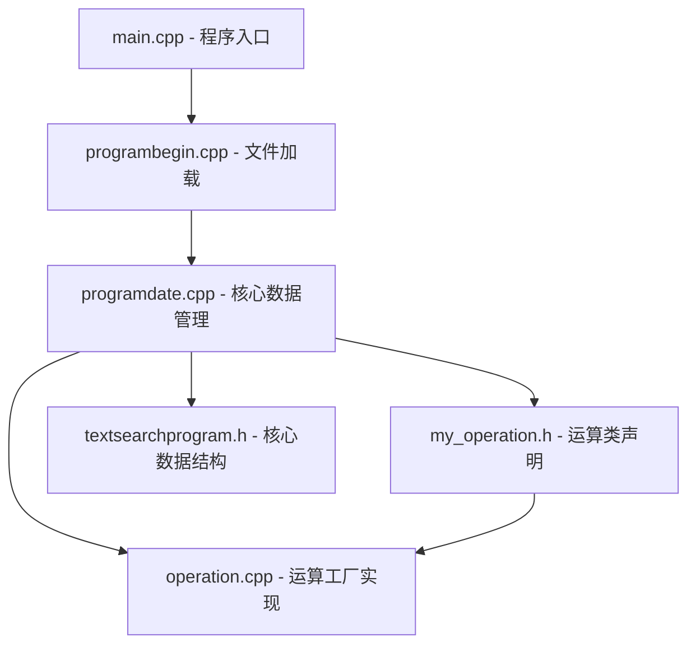
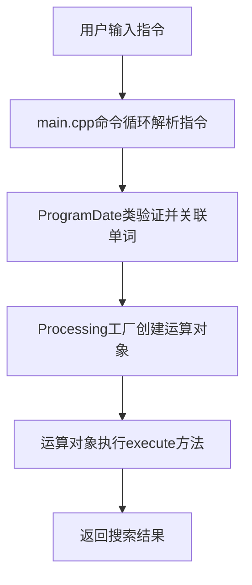

---

title: 文件词频代码解析
tags:
  - 单词查询
  - Practical-System-Development
categories: [Languages, C-Cpp]
abbrlink: a665bf6f
date: 2025-02-16

---
## 一、项目总览：结构与核心目标

### 1.1 项目定位

该程序是一款轻量级文本分析工具，支持加载文本文件、单词搜索及布尔逻辑运算，核心目标是**快速定位单词在文本中的出现位置**，并通过逻辑组合满足复杂搜索需求（如 “查找同时包含hello和world的行”）。在实际应用场景中，无论是处理学术论文、代码库检索，还是进行日志文件分析，该工具都能通过高效的搜索逻辑，快速定位关键信息，极大提升文本处理效率。

### 1.2 文件结构

```
word_frequency_analysis/
├── 22.txt/text.txt       # 测试文本文件
├── CMakeLists.txt        # CMake构建配置（依赖C++11及以上）
├── main.cpp              # 程序入口（命令循环与交互）
├── my_operation.h        # 运算类声明（Operation基类）
├── operation.cpp         # 运算工厂实现（Processing类）
├── programbegin.cpp      # 文件加载与预处理（清洗单词、统计行号）
├── programdate.cpp       # 核心数据管理（单例+命令解析+逻辑运算）
└── textsearchprogram.h   # 核心数据结构（WordDate类）
```


为了更直观地展示各文件间的协作关系，可参考以下流程图：



在整个项目架构中，main.cpp 作为程序入口，首先调用 programbegin.cpp 完成文件的加载与预处理工作，接着将处理后的数据传递给 programdate.cpp 进行核心数据管理。而 my_operation.h 和 operation.cpp 则负责运算类的声明与具体实现，textsearchprogram.h 定义的核心数据结构贯穿整个数据处理流程。

## 二、核心数据结构：WordDate 与数据封装

程序的 “数据基石” 是 textsearchprogram.h 中定义的 WordDate 类，其职责是**封装单个单词的统计信息**，确保数据操作的安全性与一致性。

### 2.1 类实现与设计思路

 ```
class WordDate {
private:
    int count = 0;               // 单词出现总次数
    set<int> linenums;           // 出现行号集合（自动去重+有序）
    friend class ProgramDate;    // 友元授权：允许数据管理器直接访问
public:
    WordDate() {};
    WordDate(int _count, set<int> num) : count(_count), linenums(num) {}
    // 更新单词出现信息（新增行号时自动维护count）
    void Update(const int & linenum) {
        ++count;
        linenums.emplace(linenum);  // set::emplace避免重复插入
    }
    void clear() {  // 重置数据（用于重新加载文件）
        linenums.clear();
        count = 0;
    }
    // 对外提供只读访问（避免直接修改私有成员）
    int getCount() const { return count; }
    set<int> getLinenums() const { return linenums; }
};
 ```

### 2.2 设计亮点

- **容器选择**：用 set 存储行号，而非 vector，既避免重复行号（如同一行多次出现同一单词），又能通过有序特性优化后续逻辑运算（如双指针求交集）。在逻辑运算过程中，例如 “与” 运算，由于 set 的有序性，使用双指针算法可以在 \(O(n+m)\) 的时间复杂度内完成两个单词行号集合的交集计算，相较于无序容器，大大提升了运算效率。

- **信息隐藏**：私有成员仅通过 Update/clear 方法修改，外部只能通过 get 方法读取，防止非法数据篡改。这种设计方式严格遵循了面向对象编程的封装原则，保证了数据的完整性和一致性。例如，若外部代码想要修改单词的出现次数，必须通过 Update 方法，而该方法会同时维护行号集合，确保数据的关联性不会被破坏。

- **友元控制**：仅授权核心数据管理器 ProgramDate 访问私有成员，平衡 “封装性” 与 “操作便利性”。ProgramDate 类在进行数据加载、统计等核心操作时，需要直接访问 WordDate 类的私有成员以提高操作效率，友元机制在不破坏封装性的前提下，满足了这一需求。

## 三、架构设计：设计模式的协同应用

程序结合**单例模式**与**工厂模式**，解决 “数据一致性” 与 “功能扩展性” 问题。

### 3.1 单例模式：ProgramDate 数据管理器

ProgramDate 是全局唯一的数据中枢，负责文本加载、命令解析、单词搜索及结果存储，通过单例模式确保**所有操作共享同一数据池**（避免多实例导致的文件重复加载、数据不一致）。在多线程环境下，虽然当前基础实现未加锁，但后续可通过双重检查锁定（Double-Checked Locking）或使用 std::call_once 等机制实现线程安全的单例模式，保证在高并发场景下数据的一致性和正确性。

#### 实现代码（programdate.cpp）

```
class ProgramDate {
private:
    static ProgramDate* instance;  // 静态单例实例
    vector<string> _filecontent;   // 加载的文本内容（按行存储）
    map<string, WordDate> _wordmap;// 单词-统计信息映射表（核心数据池）
    // 私有构造：禁止外部直接实例化
    ProgramDate() {};
public:
    // 全局唯一获取实例的接口（线程安全需额外加锁，此处为基础实现）
    static ProgramDate* getInstance() {
        if (instance == nullptr) {
            instance = new ProgramDate();
        }
        atexit([](){ delete instance; });  // 程序退出时自动释放
        return instance;
    }
    // 核心方法：搜索单词、逻辑运算、命令解析等...
};
ProgramDate* ProgramDate::instance = nullptr;  // 静态成员初始化
```

### 3.2 工厂模式：Processing 运算工厂

为支持 “与 / 或 / 非” 三种逻辑运算，程序采用**工厂模式**动态创建运算对象，避免新增运算时修改现有代码（符合 “开放 - 封闭” 原则）。当需要新增一种逻辑运算，如 “异或” 运算时，只需创建一个新的运算子类继承自 Operation 基类，并在 Processing 工厂类的 createOperation 方法中添加相应的创建逻辑即可，无需修改已有的运算类和其他核心代码。

#### 实现流程（operation.cpp）

**定义运算基类（策略接口）**：

```
class Operation {
public:
    virtual ~Operation() {}  // 虚析构：确保子类资源正确释放
    // 二元运算接口（非运算需特殊处理，此处为基础设计）
    virtual WordDate execute(const WordDate& a, const WordDate& b) = 0;
};
```

**实现具体运算子类（策略实现）**：

```
// 与运算：求两个单词行号的交集
class AndOperation : public Operation {
public:
    WordDate execute(const WordDate& a, const WordDate& b) override {
        set<int> res;
        auto it1 = a.getLinenums().begin(), it2 = b.getLinenums().begin();
        // 双指针求交集：时间复杂度 O(n+m)
        while (it1 != a.getLinenums().end() && it2 != b.getLinenums().end()) {
            if (*it1 == *it2) {
                res.insert(*it1);
                ++it1; ++it2;
            } else if (*it1 < *it2) {
                ++it1;
            } else {
                ++it2;
            }
        }
        return WordDate(res.size(), res);
    }
};
// 或运算（并集）、非运算（补集）实现类似，此处省略...
```

**工厂类创建运算对象**：

```
class Processing {
public:
    // 根据运算符动态创建对应运算对象
    Operation* createOperation(const char& op) {
        switch (op) {
        case '&': return new AndOperation();
        case '|': return new OrOperation();
        case '~': return new NotOperation();
        default: return new SearchOperation();  // 默认：单单词搜索
        }
    }
};
```

## 四、命令执行流程详解

当用户在命令行输入搜索指令后，程序将按以下步骤完成搜索任务。首先，main.cpp 中的命令循环模块接收用户输入，对指令进行初步解析，提取出待搜索的单词和逻辑运算符。接着，将解析后的指令传递给 ProgramDate 类的命令解析方法，该方法会进一步验证指令的合法性，并将单词与之前加载到 _wordmap 中的 WordDate 对象关联起来。

随后，Processing 运算工厂根据指令中的运算符，创建对应的运算对象。例如，若指令中包含 & 运算符，则创建 AndOperation 对象。最后，调用运算对象的 execute 方法，基于 WordDate 类提供的单词统计信息，执行相应的逻辑运算，得出最终的搜索结果。搜索结果将以行号列表的形式返回给用户，同时程序会记录本次搜索操作，以便后续进行搜索历史查询等功能扩展。


