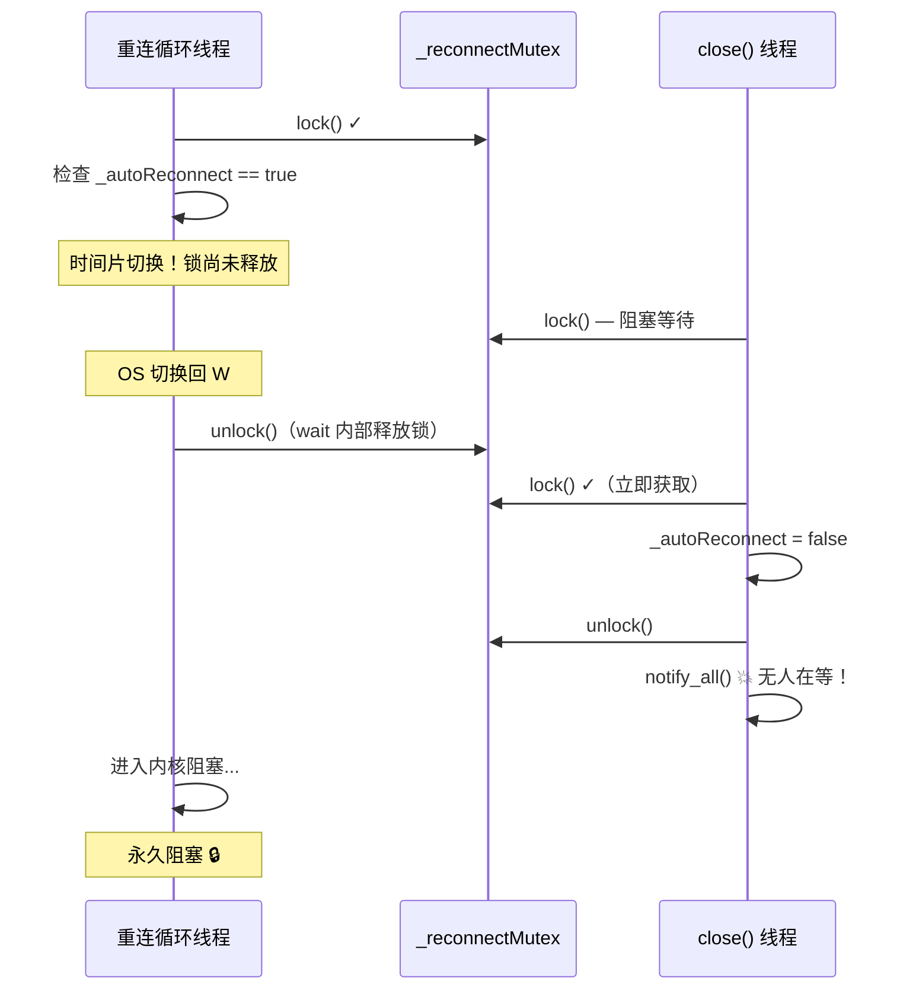

## 一、一行「看似无用」的空代码

先来看一段真实项目中的代码——它出现在一个嵌入式 CAN 总线通信模块的断线重连逻辑里：

```cpp
void CANTransport::close() {
    _autoReconnect.store(false);
    {
        std::lock_guard<std::mutex> lk(_reconnectMutex);
    }
    _reconnectCond.notify_all();
}
```

初看这段代码，那个孤零零的花括号块让人困惑：`lk` 刚构造完就被析构了，花括号里面什么也没干，这不就是一段**空操作**吗？直接把锁删掉，写成下面这样不是更简洁？

```cpp
// 很多人会这样"优化"——但这埋下了定时炸弹
_autoReconnect.store(false);
_reconnectCond.notify_all();
```

这两行代码的区别，正是 C++ 多线程编程中最隐蔽的陷阱之一——**Lost Wakeup（丢失唤醒）**。今天我们就来把它的原理讲透。

## 二、条件变量的工作模型

在分析问题之前，先回顾一下 `std::condition_variable` 的核心机制。

### 2.1 基本用法

条件变量解决的是这样一个场景：一个线程需要等待某个**条件**成立才能继续执行。最典型的写法如下：

```cpp
std::mutex mtx;
std::condition_variable cv;
bool ready = false;

// 等待线程
void consumer() {
    std::unique_lock<std::mutex> lk(mtx);
    cv.wait(lk, [] { return ready; });  // 等待 ready 变成 true
    // ready 为 true，继续执行
}

// 通知线程
void producer() {
    {
        std::lock_guard<std::mutex> lk(mtx);
        ready = true;
    }
    cv.notify_one();  // 唤醒等待线程
}
```

### 2.2 wait() 的原子三部曲

`cv.wait(lk, predicate)` 的执行过程可以拆成三个**原子步骤**——这里的"原子"不是指 CPU 原子指令，而是指这三个步骤在持有互斥锁的前提下作为一个不可分割的整体来执行：

```
┌────────────────────────────────────────────────┐
│  1. 检查谓词 predicate()                        │
│     ├─ 返回 true  → 直接返回（不阻塞）            │
│     └─ 返回 false → 进入第 2 步                  │
│                                                 │
│  2. 释放互斥锁 lk                                │
│                                                 │
│  3. 阻塞当前线程，等待 notify                      │
│     └─ 被唤醒后 → 重新获取锁 → 回到第 1 步         │
└────────────────────────────────────────────────┘
```

**关键点**：在步骤 2（释放锁）和步骤 3（进入阻塞）之间，存在一个**时间窗口**——锁已经释放，但线程还没有真正进入等待状态。Lost Wakeup 就发生在这个窗口里。

### 2.3 虚假唤醒

标准明确允许 `wait()` 在**没有收到 notify 的情况下返回**，即**虚假唤醒（Spurious Wakeup）**。这就是为什么我们必须用带谓词的 `wait` 重载版本，或者手动写 `while` 循环：

```cpp
// 错误：伪唤醒会导致逻辑错误
cv.wait(lk);

// 正确：带谓词，自动处理伪唤醒
cv.wait(lk, [] { return condition; });

// 等价的手动写法
while (!condition) {
    cv.wait(lk);
}
```

## 三、Lost Wakeup 竞态条件深度剖析

### 3.1 时序重建

让我们回到开篇的场景。假设重连循环线程正在 `wait()` 中等待，而 `close()` 线程试图关闭它。下表展示了竞态发生的完整时序：

| 时间点 | 重连循环线程（waiter） | close() 线程（notifier） |
|:------:|:----------------------|:-------------------------|
| T1 | 获取锁，检查谓词 `_autoReconnect == true` | — |
| T2 | **时间片用尽，被 OS 切换出去** | — |
| T3 | **（尚未释放锁，尚未进入阻塞）** | 获取锁，设置 `_autoReconnect = false` |
| T4 | — | 释放锁，调用 `notify_all()` |
| T5 | **notify_all() 无效果——等待线程尚未阻塞** | — |
| T6 | OS 切回该线程，释放锁，进入阻塞 | — |
| T7 | **永久阻塞——没有任何人再发通知** | — |

问题的本质是：**通知发生在等待线程真正进入阻塞状态之前**。notify 不是"排队"的——如果发出的时候没有线程在等，它就白白丢失了。

### 3.2 用 Mermaid 时序图理解竞态



### 3.3 为什么锁是关键

注意 T2 时刻的细节：等待线程已经检查完谓词（结果为 true，条件满足，按说应该继续执行），但因为**时间片切换**，它还没来得及在 `wait()` 内部释放锁并进入阻塞。此时它仍然持有 `_reconnectMutex`。

如果 `close()` 线程在修改 `_autoReconnect` 之前**也要获取同一把锁**，它就会在 T2 时刻阻塞在锁上，直到等待线程完成 `wait()` 的全部三步——从而天然地避免了竞态。

但问题恰恰在于：`_autoReconnect` 是一个 `std::atomic<bool>`，对它的写入不需要持锁。因此 `close()` 线程可以绕过互斥锁直接修改它——这就打破了同步屏障。

## 四、解决方案：空锁块作为同步屏障

### 4.1 代码对比

```cpp
// ❌ 危险做法：可能在等待线程进入阻塞前发出通知
_autoReconnect.store(false);
_reconnectCond.notify_all();

// ✅ 正确做法：通过锁建立 happened-before 关系
_autoReconnect.store(false);
{
    std::lock_guard<std::mutex> lk(_reconnectMutex);
}  // lk 析构，释放锁——这是一个完整的同步点
_reconnectCond.notify_all();
```

### 4.2 原理：锁释放作为内存屏障

这个空锁块的作用可以从两个层面理解：

**层面一：互斥（Locking Discipline）**

当等待线程在 `wait()` 内部持有 `_reconnectMutex` 时，`close()` 线程对同一把锁的 `lock()` 操作会阻塞，直到等待线程释放锁并进入阻塞状态。空锁块的 `lock()` → `unlock()` 序列强迫 `close()` 线程"等一等"，确保等待线程已经安稳地进入了 `wait()`。

**层面二：内存模型（Happens-Before）**

C++ 内存模型规定：互斥锁的 unlock 操作 **happens-before** 同一互斥锁的下一次 lock 操作。这意味着：

```
_close() 线程：              重连循环线程：
write _autoReconnect         ─┐
unlock(_reconnectMutex) ─────┼→ happens-before
                               │
                              ├→ lock(_reconnectMutex)  ← wait() 内部重获锁
                              └→ read _autoReconnect    ← 保证看到 close() 的写入
```

当等待线程被 `notify_all()` 唤醒后，`wait()` 内部会重新获取 `_reconnectMutex`。由于 `close()` 线程在 notify 之前释放了同一把锁，根据 happens-before 传递性，等待线程**一定能看到** `_autoReconnect` 被设置为 `false` 的写入。

### 4.3 完整代码示例

下面是一个可直接编译运行的完整示例，展示了正确的同步模式：

```cpp
#include <atomic>
#include <chrono>
#include <condition_variable>
#include <iostream>
#include <mutex>
#include <thread>

class ReconnectManager {
public:
    ReconnectManager() : _autoReconnect(true) {}

    // 重连循环（等待线程）
    void reconnectLoop() {
        std::unique_lock<std::mutex> lk(_reconnectMutex);
        while (_autoReconnect.load()) {
            std::cout << "[loop]  等待重连触发..." << std::endl;
            _reconnectCond.wait(lk);
            if (_autoReconnect.load()) {
                std::cout << "[loop]  执行重连..." << std::endl;
                std::this_thread::sleep_for(std::chrono::milliseconds(200));
            }
        }
        std::cout << "[loop]  收到关闭信号，退出循环。" << std::endl;
    }

    // 关闭（通知线程）
    void close() {
        std::cout << "[close] 发送关闭信号..." << std::endl;
        _autoReconnect.store(false);
        {
            std::lock_guard<std::mutex> lk(_reconnectMutex);
        }  // 关键的同步屏障
        _reconnectCond.notify_all();
        std::cout << "[close] 通知已发送。" << std::endl;
    }

private:
    std::atomic<bool> _autoReconnect;
    std::mutex _reconnectMutex;
    std::condition_variable _reconnectCond;
};

int main() {
    ReconnectManager mgr;

    std::thread loopThread(&ReconnectManager::reconnectLoop, &mgr);
    std::this_thread::sleep_for(std::chrono::milliseconds(100));

    mgr.close();
    loopThread.join();

    std::cout << "[main]  线程安全退出。" << std::endl;
    return 0;
}
```

**输出示例**：

```
[loop]  等待重连触发...
[close] 发送关闭信号...
[close] 通知已发送。
[loop]  收到关闭信号，退出循环。
[main]  线程安全退出。
```

### 4.4 如何复现这个 Bug？

Lost Wakeup 是典型的**概率性竞态**，复现它需要制造特定的时序条件。以下是一种思路：

```cpp
// 压力测试：大量并发 close + wait 循环
void stressTest() {
    for (int trial = 0; trial < 10000; ++trial) {
        ReconnectManager mgr;
        std::thread t(&ReconnectManager::reconnectLoop, &mgr);
        // 在极短的时间内执行 close，增大竞态窗口
        std::this_thread::sleep_for(std::chrono::microseconds(10));
        mgr.close();
        // 设置超时检测：如果 2 秒内线程没退出，说明可能发生了 Lost Wakeup
        auto future = std::async(std::launch::async, [&] {
            t.join();
            return true;
        });
        if (future.wait_for(std::chrono::seconds(2)) == std::future_status::timeout) {
            std::cout << "⚠ 可能触发 Lost Wakeup，trial #" << trial << std::endl;
            std::terminate();  // 实际项目中可以记录日志
        }
    }
    std::cout << "压力测试完成，未检测到异常。" << std::endl;
}
```

> **注意**：即使在压力测试中没有复现，也不代表 Bug 不存在。Lost Wakeup 的发生概率取决于 CPU 调度、负载、核心数量等多种因素。在单核或低负载环境下，可能连续运行数月都不会触发；一旦上了多核生产环境，可能几天就会出现一次**顽固的"假死"**。

## 五、条件变量使用最佳实践

### 5.1 四则铁律

| 编号 | 规则 | 原因 | 违反后果 |
|:----:|:-----|:-----|:---------|
| ① | **始终在循环中检查谓词** | 防御虚假唤醒和竞态 | 随机逻辑错误 |
| ② | **修改谓词后，notify 前持锁** | 建立 happens-before 同步关系 | Lost Wakeup |
| ③ | **用 `notify_all` 处理广播，用 `notify_one` 处理单消费者** | 避免惊群效应或漏通知 | 不必要的上下文切换或等待延迟 |
| ④ | **析构前确保所有等待线程已退出** | 避免访问已销毁的条件变量 | Undefined Behavior（通常是 segfault） |

### 5.2 规则 ① 的展开说明

很多人误以为谓词检查只是用来防范虚假唤醒的，但实际上它承担了更多职责。`while (!predicate()) cv.wait(lk)` 中的 `while` 循环充当了三重防线：

```
被 notify 唤醒 → 检查谓词
                 ├─ true  → 退出等待（正常唤醒）
                 └─ false → 继续等待
                              ├─ 可能是虚假唤醒
                              ├─ 可能是被 notify 了但条件已被其他线程"抢先消费"
                              └─ 可能是一开始就根本没收到 notify（本应在通知前到来的信号）
```

如果改成 `if (!predicate()) cv.wait(lk)`，以上任一情况都会导致线程在条件不满足时继续执行。

### 5.3 `notify_one` vs `notify_all` 的选择

```cpp
// 场景一：单生产者/单消费者 → notify_one
// 只有一个线程会响应条件变化
std::condition_variable cv;
cv.notify_one();  // 只唤醒一个，避免不必要的线程切换

// 场景二：广播通知 → notify_all
// 所有等待线程都需要重新评估条件
// 例如：析构时通知所有线程退出
_autoReconnect.store(false);
{
    std::lock_guard<std::mutex> lk(_reconnectMutex);
}
_reconnectCond.notify_all();  // 确保所有等待线程都能被唤醒
```

### 5.4 析构安全

一个容易忽略的问题是：如果等待线程还在 `wait()` 中，主线程已经开始析构条件变量了怎么办？标准做法是**在析构前设置停止标志并 notify_all**：

```cpp
class Service {
public:
    ~Service() {
        _stop.store(true);
        {
            std::lock_guard<std::mutex> lk(_mtx);
        }
        _cv.notify_all();
        if (_worker.joinable()) {
            _worker.join();  // 等待线程退出
        }
    }

private:
    std::atomic<bool> _stop{false};
    std::mutex _mtx;
    std::condition_variable _cv;
    std::thread _worker;
};
```

### 5.5 常见错误模式汇总

| 错误模式 | 代码示例 | 正确写法 |
|:---------|:---------|:---------|
| notify 前未持锁 | `flag = true; cv.notify_one();` | `flag = true; { lock(mtx); } cv.notify_one();` |
| 用 if 而非 while | `if (!pred) cv.wait(lk);` | `while (!pred) cv.wait(lk);` |
| 忘记 notify | 仅修改条件变量关联的 flag | 修改 flag + notify（或 `notify_all`） |
| 析构前未等待线程退出 | `~Foo() { /* 什么都不做 */ }` | `~Foo() { stop = true; { lock; } cv.notify_all(); t.join(); }` |

## 六、总结

回到开篇那行"无用"的空代码：

```cpp
{
    std::lock_guard<std::mutex> lk(_reconnectMutex);
}
```

它不是什么多余的装饰，而是一道**精心设计的同步栅栏**。当你在代码审查时看到这样的写法，请不要顺手删掉它——否则你可能会收获一个在生产环境里不定期"卡死"的系统。

**核心要点**：

1. **Lost Wakeup** 是条件变量使用中最容易忽略的竞态条件——通知在等待线程进入阻塞之前发出，导致线程永久休眠。
2. **空锁块不是无用代码**——通过锁的 happens-before 语义，它在 notifier 和 waiter 之间建立了一条同步链，确保修改对等待线程可见。
3. **遵守四则铁律**：while 循环检查谓词 → 修改谓词后持锁再 notify → 根据场景选择 notify_one/notify_all → 析构前确保所有等待线程安全退出。

多线程编程的魅力（或者说可怕之处）在于：**正确的代码和 Bug 之间的距离，往往只是一把锁的持有与否**。
