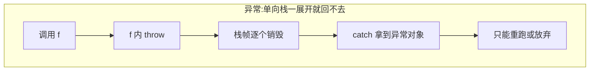
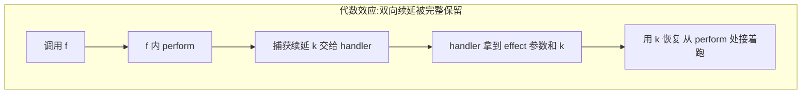
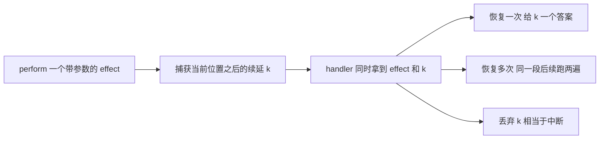
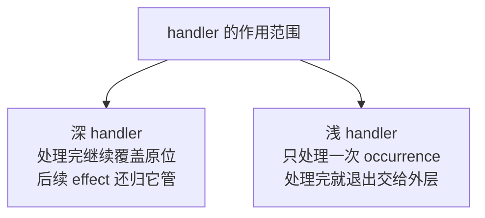
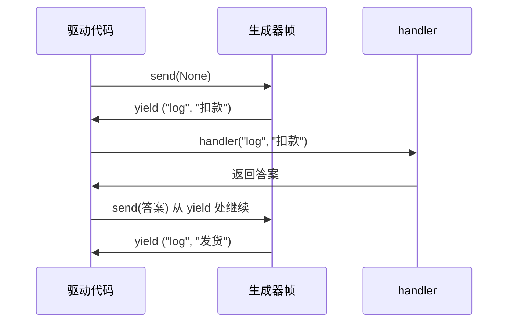
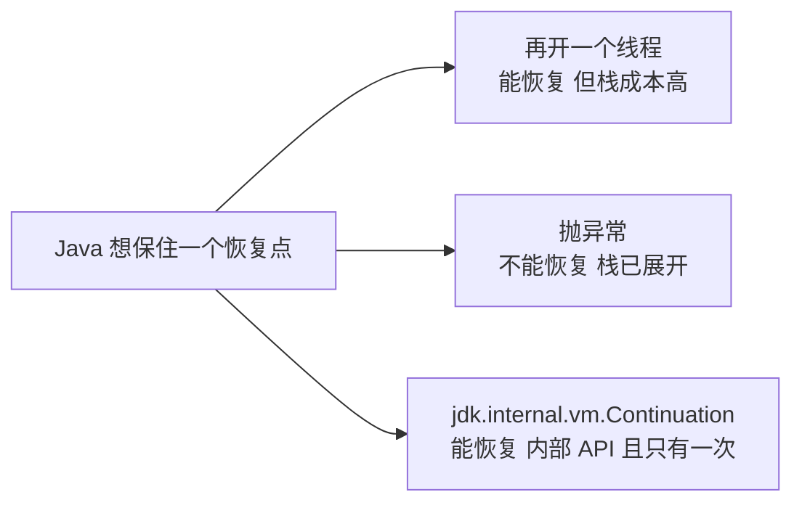

## 一、从一个异常办不到的需求说起

做过 CLI 工具或者协议解析的人都遇到过这种需求：

> 我走到第 3 步发现要问一下环境（"这个文件存在吗"/"用户选哪个"），拿到答案之后**还要从第 3 步继续往下走**。

`throw` 办不到。异常是单向的，`throw` 出去的瞬间，当前函数的栈帧就被展开销毁了，`catch` 手里只剩下一个异常对象，第 3 步的局部变量、循环位置、执行到哪一行——全没了。你只能从头再跑一遍，或者把状态手工拆出来存进一个上下文对象里。

这就是**代数效应（algebraic effects）** 想解决的问题：把"中断"和"恢复"拆开，中断的人可以把当前位置之后的整段计算（**续延，continuation**）打包交出去，处理的人决定怎么用它——接着跑、跑两次、或者干脆扔掉。




三个术语，一次说清：

- **effect（效应）**：一个带类型的操作签名，比如 `Read : unit -> string`、`Log : string -> unit`。业务代码在需要时"执行"它。
- **perform（触发）**：业务侧调用 effect 的动作。执行到这一句，当前计算被挂起，从这句往后剩下的部分被捕获成一个续延。
- **handler（处理器）**：拦截 effect 的那一层，手里同时拿到 effect 的参数和续延 `k`。它有三个选择：`resume` 一次（提供答案，继续跑）、`resume` 多次（同一段后续跑两遍，用来实现非确定性/回溯）、或者不 resume（丢弃续延，等价于中断）。



"**代数**"这个词不是修辞。effect 就是代数签名里的操作符号，handler 就是给这些操作符号指定语义的解释器——同一组操作签名配上不同的解释器，就是不同的代数结构。这一点在第四节会变得非常具体：同一段业务代码，换一个 handler，语义完全变了，业务代码一个字都不用改。

术语史简单交代：代数效应由 Plotkin 和 Power 在 2000 年代初提出，handler 模型由 Plotkin 和 Pretnar 在 2009 年前后补全。真把它做进能用的语言是 2022 年的 **OCaml 5.0**——目前唯一一个把 effect handlers 做进主流、带 GC、静态类型语言运行时的实现。此外还有 Koka、Eff、Unison、Effekt 这些从设计之初就以 effect 为核心的语言，以及 Frank、Links 这些学术实现。

## 二、判定标准：什么才算真支持

评价一门语言"有没有代数效应"，别听宣传，看这四条：

| 硬指标 | 说明 | 为什么必须 |
| --- | --- | --- |
| 续延可捕获 | 能把"当前位置之后"打包成一个一等对象 | 没有这个，只能算"可恢复异常" |
| 续延可恢复 | handler 能把值送回挂起点，从那里继续 | 这是和 `throw` 的分水岭 |
| 可多次恢复 | 同一份续延能跑两遍以上 | 非确定性、回溯、概率采样全靠它 |
| effect 有类型 | 谁能触发什么、谁必须处理，编译期能查 | 否则就是换了皮的字符串 tag |

前三条是"能力"，第四条是"安全"。多数语言能勉强做到前两条（协程、生成器都行），第三条才是真正的分水岭——**multi-shot（多次恢复）** 要求运行时能复制或者分叉一个栈，代价立刻上一个数量级。

顺带一个术语：handler 分**深（deep）**和**浅（shallow）**两种。深 handler 处理完一次 effect 之后仍然留在原地，后续的 effect 依然归它管；浅 handler 只接一次就退出，把控制权交还给外层。



另外还有个工程上的坑：multi-shot 和资源管理天然冲突。续延被恢复两遍，意味着"续延内部的资源获取代码"也会跑两遍，那你第一遍拿到的文件句柄、锁、事务怎么办？OCaml 5 就是权衡之后**故意只给 one-shot**——一次恢复，用完作废，换来的是不需要处理"资源被复活"这类噩梦。Eff、Unison 给了 multi-shot，代价是自己扛。这个取舍后面三节会反复出现。

## 三、C++：只有半个机制

先说结论：**C++ 两样都没有**——没有 effect 类型系统，也没有一等续延。但它有一个非常接近的东西：协程。

### 3.1 异常为什么不能当 effect 用

C++ 的异常和 Java、Python 一样是单向的，栈一旦开始展开就不可逆。`catch` 里拿到的只是异常对象，别指望"从 throw 的那一行继续"。

### 3.2 协程：编译器替你保存了续延，但不让你看见

C++20 的协程（P0912，Coroutines TS 转正）做了一件很实在的事：把一个含 `co_await`/`co_yield` 的函数编译成"状态机 + 堆上的帧"。每次挂起，帧留着；下次 `resume()`，从挂起点后面继续。

**这在语义上就是 one-shot 的分隔续延。** 但它有两个限制：

1. 续延被藏在 `coroutine_handle` 里，是编译器的实现细节，不是语言给的一等值。你想要 effect 的类型，得自己在 `promise_type` 里手工搭。
2. 帧不能复制。没有"把同一份续延跑两遍"这回事——和 OCaml 的 one-shot 立场一样。

标准库层面倒是有个很有意思的证据，说明委员会清楚 one-shot 和 multi-shot 的区别：即将进入 C++26 的 `std::execution`（P2300，senders/receivers，2024 年 6 月圣路易斯会议上正式并入 C++26 工作草案）里，适配器文档明确按 **single-shot 与 multi-shot sender** 分类，还给了一个 `split` 适配器，专门把只能消费一次的 sender 变成可以多次订阅的。标准库承认这个维度存在，但给的是"订阅多次"这种库层面的做法，不是语言层面的续延复制。

### 3.3 手搓一个 effect 层：代价是四十行样板

想在 C++ 里用上手搓的 effect，路子是这样的——让 `co_await` 表达"我要一个 effect 的结果"，请求通过 promise 交给驱动代码，答案再塞回 promise：

```cpp
// 骨架：本机没装 C++ 编译器，这段没有编译验证，只用来展示结构
// 编译参数参考：g++ -std=c++20 -fcoroutines
#include <coroutine>
#include <string>
#include <variant>
#include <iostream>

struct Request { std::string op, arg; };            // 提出去的 effect

struct Task {
    struct promise_type {
        Request pending{};                          // 往外递的请求
        std::string answer{};                       // handler 塞回来的答案
        std::suspend_always initial_suspend() noexcept { return {}; }
        std::suspend_always final_suspend() noexcept { return {}; }
        Task get_return_object() {
            return Task{std::coroutine_handle<promise_type>::from_promise(*this)};
        }
        void return_void() {}
        void unhandled_exception() { std::terminate(); }
    };
    std::coroutine_handle<promise_type> h;
};

struct Perform {                                    // co_await 的对象
    Request req;
    std::coroutine_handle<Task::promise_type> h;
    bool await_ready() const noexcept { return false; }
    void await_suspend(std::coroutine_handle<Task::promise_type> handle) noexcept {
        h = handle;
        h.promise().pending = req;                  // 挂起，把请求交出去
    }
    std::string await_resume() const { return h.promise().answer; }  // 恢复时取答案
};

Perform log(std::string msg) { return Perform{{"log", std::move(msg)}, {}}; }

Task checkout() {                                   // 业务代码：只描述要什么 effect
    auto a = co_await log("下单");
    auto b = co_await log("扣款");
    auto c = co_await log("发货");
    co_return;
}

int main() {                                        // 驱动代码：扮演 handler
    Task t = checkout();
    while (true) {
        t.h.resume();
        if (t.h.done()) break;
        auto& p = t.h.promise();
        std::cout << "  handler 收到: " << p.pending.op << " / " << p.pending.arg << "\n";
        p.answer = "已记录:" + p.pending.arg;        // handler 的决策
    }
}
```

（为了控制篇幅，上面省掉了 `Task` 的析构、移动语义和 `h.destroy()`，那部分和 effect 无关。）

看这段代码的分布：业务函数 `checkout()` 里干干净净三行，完全不知道日志最终去哪儿；`main()` 才是决策者。这就是代数效应的写法，只是——**四十行样板换来一个 effect**。C++ 的天赋点不在这儿。

## 四、Python：生成器就是现成的 one-shot 分隔续延

Python 没打算做代数效应，但它有个副作用巨大的副产品：**生成器**。

- PEP 255（Python 2.2，2001）：`yield`，函数可以挂起。
- PEP 342（Python 2.5）：`send`/`throw`/`close`，挂起点可以接收值——生成器正式变成协程。
- PEP 380（Python 3.3）：`yield from`，把 `send`/`throw` 直接转发给子生成器，可以嵌套。
- PEP 492（Python 3.5）：`async`/`await`。

关键在于：**每次 `yield` 处挂起的那个生成器帧，形式上就是一个捕获在 `yield` 点的 one-shot 分隔续延。** 有了这个，写一个 effect handler 的运行时只用十行。

```python
def business():
    total = 0
    for x in (1, 2, 3):
        total += x
        yield ("log", "加了 %d，当前 %d" % (x, total))
    yield ("log", "结束，总计 %d" % total)

def run_with(gen, handler):
    """驱动：把业务代码挂起的 effect 交给 handler，把答案送回去"""
    sent = None
    while True:
        try:
            op, arg = gen.send(sent)     # 从上次挂起点继续，送去 handler 的答案
        except StopIteration:
            return
        sent = handler(op, arg)          # handler 决定这条 effect 怎么办
```

驱动循环就这点东西：`gen.send()` 跑到下一个 `yield`，把 `(tag, 参数)` 交给 handler，再把 handler 的返回值 `send` 回去。挂起、恢复、传值三件事全在这四行里。



### 4.1 同一段业务，三种 handler

现在换 handler，业务代码一个字不改：

```python
def drop(op, arg):
    return None

def show(op, arg):
    print("     [日志]", arg)
    return None

collected = []
def collect(op, arg):
    collected.append(arg)
    return None

print("[P1] handler = drop 丢弃")
run_with(business(), drop)
print("     -> 什么都没输出")
print("[P1] handler = show 打到控制台")
run_with(business(), show)
print("[P1] handler = collect 收集")
run_with(business(), collect)
print("     -> 收到 %d 条: %s" % (len(collected), collected))
```

真实运行输出：

```text
[P1] handler = drop 丢弃
     -> 什么都没输出
[P1] handler = show 打到控制台
     [日志] 加了 1，当前 1
     [日志] 加了 2，当前 3
     [日志] 加了 3，当前 6
     [日志] 结束，总计 6
[P1] handler = collect 收集
     -> 收到 4 条: ['加了 1，当前 1', '加了 2，当前 3', '加了 3，当前 6', '结束，总计 6']
```

这段输出就是代数效应的广告词：**业务代码只声明"我要发一条日志"，发到哪儿、发不发，是 handler 的事。** 换成"丢进 Kafka"或者"只在 debug 模式打"，`business()` 不用动。

### 4.2 换 handler = 换语义：state effect

再看一个"handler 决定语义"更狠的例子。业务代码要做的是"读取计数器、加一、再读、再加十"，但它不碰任何存储——存储是 handler 的事：

```python
def counter_program():
    n = yield ("get", None)
    yield ("set", n + 1)
    n = yield ("get", None)
    yield ("set", n + 10)
    return (yield ("get", None))

def run_state(gen, get, put):
    sent = None
    while True:
        try:
            op, arg = gen.send(sent)
        except StopIteration as stop:
            return stop.value          # 业务代码 return 的值从 StopIteration 里取
        sent = get() if op == "get" else put(arg)
```

三个 handler，三种语义，真实输出：

```python
store = {"n": 100}
r = run_state(counter_program(), lambda: store["n"], lambda v: store.__setitem__("n", v))
print("[P2] 内存 handler -> 返回值 %d, store = %s" % (r, store))

trace, store2 = [], {"n": 0}
def tr_get():
    trace.append("get -> %d" % store2["n"])
    return store2["n"]
def tr_put(v):
    trace.append("set %d" % v)
    store2["n"] = v
r2 = run_state(counter_program(), tr_get, tr_put)
print("[P2] 带追踪 handler -> 返回值 %d" % r2)
print("     trace = %s" % trace)

try:
    run_state(counter_program(), lambda: 42,
              lambda v: (_ for _ in ()).throw(RuntimeError("这个 handler 不允许写状态")))
except RuntimeError as e:
    print("[P2] 只读 handler -> 抛错: %s" % e)
```

```text
[P2] 内存 handler -> 返回值 111, store = {'n': 111}
[P2] 带追踪 handler -> 返回值 11
     trace = ['get -> 0', 'set 1', 'get -> 1', 'set 11', 'get -> 11']
[P2] 只读 handler -> 抛错: 这个 handler 不允许写状态
```

内存 handler 从 100 加到 111；带追踪 handler 从 0 开始，顺手记下每一步；只读 handler 直接在 `set` 上抛错，把"这段代码需要写权限"变成一句运行期报错。**同一份 `counter_program()`，三种完全不同的语义。** 这就是"代数"两个字的实际含义。

### 4.3 硬伤：multi-shot 只能靠重跑凑

到这儿都挺好，直到你想要的是一次运行拿到**所有分支**。

OCaml 5 的做法是 `continue k` 两次，同一份续延跑两遍。Python 做不到——生成器对象里只有一份帧，没法复制。于是社区的标准凑法是"**重跑 + 路径向量**"：把业务函数从头再跑一遍，用一条路径记录"每一层选择选第几个"，跑完把路径最后一位加一，直到所有组合枚举完。

```python
def picks():
    a = yield ("choose", [1, 2, 3])
    b = yield ("choose", [10, 20])
    return a + b

def run_all(factory):
    results, path, runs = [], [], 0
    while True:
        runs += 1
        gen, sent, depth, widths, value = factory(), None, 0, [], None
        try:
            while True:
                op, arg = gen.send(sent)
                if op == "choose":
                    idx = path[depth] if depth < len(path) else 0
                    widths.append(len(arg))
                    depth += 1
                    sent = arg[idx]          # 按路径给出这一层的"选择"
        except StopIteration as stop:
            value = stop.value
        results.append(value)
        # 回溯：把路径当成一个混合进制数，加一进位
        while len(path) < len(widths):
            path.append(0)
        k = len(path) - 1
        while k >= 0 and path[k] + 1 >= widths[k]:
            path.pop()
            k -= 1
        if k < 0:
            break
        path[k] += 1
    return results, runs
```

```python
res, runs = run_all(picks)
print("[P3] 六种组合: %s" % res)
print("[P3] 业务函数被完整重跑了 %d 次（不是一次跑出六个结果）" % runs)
```

```text
[P3] 六种组合: [11, 21, 12, 22, 13, 23]
[P3] 业务函数被完整重跑了 6 次（不是一次跑出六个结果）
```

六个结果出来了,但代价藏在第二行:**业务函数被完整执行了六遍。** 这在"只是算个数"的场景里没感觉,一旦业务代码里有副作用,灾难就开始了。加个计数器立刻现形:

```python
RERUN = []
def picks_sideeffect():
    RERUN.append(len(RERUN) + 1)
    a = yield ("choose", [1, 2, 3])
    b = yield ("choose", [10, 20])
    return a + b

res2, runs2 = run_all(picks_sideeffect)
print("[P3] 带副作用的版本: 结果 %s" % res2)
print("[P3] 副作用执行记录 RERUN = %s  <- 重跑把副作用一并重放了" % RERUN)
```

```text
[P3] 带副作用的版本: 结果 [11, 21, 12, 22, 13, 23]
[P3] 副作用执行记录 RERUN = [1, 2, 3, 4, 5, 6]  <- 重跑把副作用一并重放了
```

`RERUN` 里**六条记录**。真 multi-shot 下,续延恢复两遍时只会重复"续延之后"那段计算;重跑方案则把"进入续延之前"的部分也一起重放了——你不能在这里面扣款、不能打日志、不能改数据库。**这是仿真,不是等价。** 顺便印证了第二节那句话:multi-shot 一旦和副作用、资源管理碰面,就是硬矛盾。

### 4.4 那 Python 里到底能不能做真 multi-shot

能，但得借外力。Python 官方论坛 2026 年 6 月还有一个帖子在问"Python 里代数效应做到哪一步了"，提问者的原话是生成器和 context manager 只能近似"one-shot 的浅 handler"，他更想知道有没有更完整的实现。回复里被提到的是 PyPI 上 `simple-eff`、`eff` 这么几个小库，以及一个叫 `aleff` 的项目——它标榜 deep/shallow、有状态、可组合，并且**支持 multi-shot**。

我把它拉下来跑了一遍（`pip install aleff`，0.5.0 版，底下依赖 greenlet）：

```python
from aleff import create_handler, effect

feature_enabled = effect("feature_enabled")

def checkout_total():
    shipping = 0 if feature_enabled("free_shipping") else 500
    return 3_000 + shipping

explore_both = create_handler(feature_enabled)

@explore_both.on(feature_enabled)
def _(resume, flag):
    # 同一个续延 resume 两次 —— 真 multi-shot
    return {"off": resume(False), "on": resume(True)}

print("multi-shot 结果:", explore_both(checkout_total))
```

```text
multi-shot 结果: {'off': 3500, 'on': 3000}
```

**一次调用，同一个续延被恢复了两次**，走了两条分支（关掉免邮时运费 500，总价 3500；打开时 3000）。这才叫 multi-shot。代价看它的依赖就明白了：它要 greenlet 去搬栈，是个 C 扩展。

aleff 的文档里还有个细节很能说明问题：它有个 `wind` 上下文管理器，专门处理"续延被恢复第二次时资源怎么办"——重新调一遍 `before()`，把新资源塞进一个堆上的 `Ref` 让所有分支共享。**第二节说的 multi-shot 与资源管理的冲突，在真实实现里就是这么打补丁的。**

### 4.5 别忘了 one-shot 的边界

最后钉一颗钉子。生成器是一条线，不是一棵树：

```python
def counter():
    print("     body: A")
    yield 1
    print("     body: B")
    yield 2
    print("     body: C")

it = counter()
print("[P4] next ->", next(it))
print("[P4] next ->", next(it))
try:
    next(it)
except StopIteration:
    print("[P4] 第三次 next -> StopIteration")
print("[P4] 没有「回到 B 再走一次」这种东西：对象里只有一份帧，走完就没了")
```

```text
     body: A
[P4] next -> 1
     body: B
[P4] next -> 2
     body: C
[P4] 第三次 next -> StopIteration
[P4] 没有「回到 B 再走一次」这种东西：对象里只有一份帧，走完就没了
```

## 五、Java：三语言里唯一缺席的那位

Java 这边最简单，也最干脆：**没有，也没有要做的意思。**

### 5.1 异常？不行（真跑）

Java 异常和 C++ 一样单向。这个 demo 在 JDK 26 上编译运行过：

```java
public class NoResume {
    static int resumePoint = -1;

    static void parse() {
        for (int i = 1; i <= 3; i++) {
            if (i == 3) {
                resumePoint = 3;
                throw new RuntimeException("第 3 步出错");
            }
            System.out.println("  parse 正常走完第 " + i + " 步");
        }
    }

    public static void main(String[] args) {
        try {
            parse();
        } catch (RuntimeException e) {
            System.out.println("catch 到: " + e.getMessage());
            System.out.println("抛错时 resumePoint = " + resumePoint);
            System.out.println("想「从第 3 步继续」——做不到，parse 的栈帧已经展开销毁");
        }
        System.out.println("parse 的循环不会再有第 4 次迭代");
    }
}
```

```text
  parse 正常走完第 1 步
  parse 正常走完第 2 步
catch 到: 第 3 步出错
抛错时 resumePoint = 3
想「从第 3 步继续」——做不到，parse 的栈帧已经展开销毁
parse 的循环不会再有第 4 次迭代
```

`resumePoint = 3` 说明确实走到了第 3 步，但 `catch` 之后只剩一句"做不到"。这就是异常：**它是报告，不是断续。**

### 5.2 线程？能断续，代价是栈

想要"从中间继续"，Java 程序员的老办法是**再开一个线程**。线程本质上就是一份完整的续延，还能挂起和恢复（`wait`/`notify`）——只不过一份线程栈默认就是 1 MB 级别的开销，用它做"保存一个恢复点"属于拿卡车运快递。

Loom 项目把这件事的成本压下来了：虚拟线程把栈搬到堆上，一份续延可以便宜得多。但那是**并发**用途，语言层面依然没给你"捕获当前续延"的写法。

### 5.3 真正的那个东西藏在内部 API 里（真跑）

有个事实很多人不知道：**JDK 里确实有一个分隔续延的实现**，就在 `jdk.internal.vm.Continuation`——Loom 用它实现虚拟线程。JDK 26 上真跑了：

```java
// 编译运行都需要：--add-exports java.base/jdk.internal.vm=ALL-UNNAMED
import jdk.internal.vm.Continuation;
import jdk.internal.vm.ContinuationScope;

public class ContDemo {
    public static void main(String[] args) {
        ContinuationScope scope = new ContinuationScope("demo");
        Continuation cont = new Continuation(scope, () -> {
            System.out.println("  续延内: 第 1 段");
            Continuation.yield(scope);
            System.out.println("  续延内: 第 2 段");
            Continuation.yield(scope);
            System.out.println("  续延内: 第 3 段收尾");
        });
        System.out.println("run 之前 isDone = " + cont.isDone());
        cont.run();
        System.out.println("第一次 run 后 isDone = " + cont.isDone());
        cont.run();
        System.out.println("第二次 run 后 isDone = " + cont.isDone());
        cont.run();
        System.out.println("第三次 run 后 isDone = " + cont.isDone());
        try {
            cont.run();
        } catch (Throwable t) {
            System.out.println("再 run 一次 -> " + t.getClass().getName() + ": " + t.getMessage());
        }
    }
}
```

```text
run 之前 isDone = false
  续延内: 第 1 段
第一次 run 后 isDone = false
  续延内: 第 2 段
第二次 run 后 isDone = false
  续延内: 第 3 段收尾
第三次 run 后 isDone = true
再 run 一次 -> java.lang.IllegalStateException: Continuation terminated
```

`Continuation.yield(scope)` 就是"捕获续延并交出去"，`run()` 就是恢复。三个 `yield` 把一段 lambda 切成三段，每次 `run()` 推进一段 —— **这是货真价实的分隔续延**。跑完之后再 `run()` 直接 `IllegalStateException: Continuation terminated`，一次性的，用完作废，仍然是 one-shot。

拿它做 effect handler 也行。下面这个是 JDK 26 上真跑通的"手搓 log effect"，结构和 C++ 那版骨架、Python 那版驱动几乎一模一样：

```java
import jdk.internal.vm.Continuation;
import jdk.internal.vm.ContinuationScope;

public class LogEffect {
    static final ContinuationScope SCOPE = new ContinuationScope("log-effect");
    static String pending = null;   // 往外递的请求（perform 的参数）
    static String answer  = null;   // handler 塞回来的答案（resume 的值）
    static int    handled = 0;

    static String performLog(String msg) {   // 这个函数就是 effect 的入口
        pending = msg;
        Continuation.yield(SCOPE);           // 挂起，把控制权交给 handler
        String a = answer;
        answer = null;
        return a;                            // 恢复后拿到 handler 给的答案
    }

    public static void main(String[] args) {
        StringBuilder collected = new StringBuilder();
        Continuation body = new Continuation(SCOPE, () -> {
            performLog("下单");
            performLog("扣款");
            performLog("发货");
            System.out.println("  body 跑完了，被 handler 拦下 " + handled + " 次");
        });

        while (!body.isDone()) {
            body.run();
            if (pending != null) {
                handled++;
                if (collected.length() > 0) collected.append(" | ");
                collected.append(pending);
                answer = "已记录:" + pending;   // handler 的决策
                pending = null;
            }
        }
        System.out.println("handler 收集到: " + collected);
    }
}
```

```text
  body 跑完了，被 handler 拦下 3 次
handler 收集到: 下单 | 扣款 | 发货
```

跑通了，但请看它的样子：请求和答案得挂在两个 `static` 字段上传递。**这就是没有 effect 类型的真实代价**——C++ 好歹能用 `promise_type` 装类型，Python 至少能用元组约定，Java 只能靠全局可变状态硬传。而且 `jdk.internal.vm` 是内部 API，编译要加 `--add-exports`，JDK 随时可以改它。想靠这个写业务代码，属于在雷区里盖房子。

### 5.4 2026 年的 Java 路线图里有它吗

没有。翻一下今年 Oracle 团队公布的计划，在推进的是：Valhalla 的值类型（JEP 401，瞄着 JDK 28）、Amber 的常量模式和模式赋值（JEP 468 派生的 record 创建）、Loom 的结构化并发（JEP 505，接近定稿）、Leyden 的 AOT 编译、Panama 的 Vector API（JEP 529）、Babylon 的 code reflection。

**一个代数效应都没有。** 这不是黑 Java，而是语言演进的优先级问题：Java 的续延能力已经通过虚拟线程以"给并发用"的形式交付了，而 effect system 那套类型学（Koka 的 row-typed effects）和 Java 现有的名义子类型系统合不到一块去。



## 六、横向对比

把三家的能力摆在一张表上：

| 维度 | C++ | Python | Java |
| --- | --- | --- | --- |
| 语言级 effect 声明 | 无 | 无（`yield` 的 tag 靠约定） | 无 |
| 捕获分隔续延的原生机制 | 协程帧（编译器生成，藏在 `coroutine_handle` 里） | 生成器帧（`yield` 处，一等对象） | 无公开 API；内部 `Continuation` |
| 续延恢复次数 | 一次 | 一次 | 一次（内部 API） |
| multi-shot | 否 | 否（`aleff` 借 greenlet 可做） | 否 |
| handler 能拿到续延并决定怎么用 | 部分（要自己写调度器，续延不暴露） | 是（`send`/`throw`） | 是（`Continuation.yield`，非公开） |
| 异常能否充当 effect | 否 | 否 | 否 |
| 写 effect 的业务代码像什么 | `co_await log("x")` | `yield ("log", "x")` | `performLog("x")` + 静态字段兜值 |
| 落地时的工程近似 | C++26 `std::execution`（senders/receivers，有 one-shot/multi-shot 之分） | `async`/`await` + `contextmanager`；`aleff` 等实验库 | Loom 虚拟线程 + 结构化并发 |
| 官方有没有在做 | 没有 | 没有（2026 年官方论坛还在讨论有没有可能） | 没有（2026 路线图里没这项） |
| 谁真在做 | OCaml 5 / Koka / Eff / Unison / Effekt | —— | —— |

## 🐾 小结

| 一句话 | 内容 |
| --- | --- |
| 代数效应要什么 | 带类型的 effect + 能捕获续延 + handler 能恢复（一次或多次） |
| 和异常的分水岭 | 异常是单向报告，effect 是双向断续 |
| 最难的那一条 | multi-shot：要复制栈，还和资源管理天然冲突（OCaml 5 干脆只给 one-shot） |
| C++ 的位置 | 有 one-shot 续延（协程），没有 effect 类型，40 行样板换一个 effect |
| Python 的位置 | 生成器免费送 one-shot 续延，十行写出 handler；multi-shot 只能重跑凑，真做要借 `aleff` 这类 C 扩展 |
| Java 的位置 | 全面缺席；唯一能碰到的续延在 `jdk.internal.vm` 里，内部 API、一次性，还得靠 static 字段传值 |
| 判据 | 别信宣传，就问三件事：续延能不能捕获、能不能恢复、能不能恢复多次 |

**这三个语言的对照，本质上是三种取舍：C++ 把续延交给编译器、只给你一个编译器造出来的帧；Python 把续延当作迭代器协议的副产品免费送出来；Java 把续延留给运行时、只服务于并发，语言层面装作没有这回事。** 真正把代数效应当一等公民做的，目前还只有 OCaml 5 和 Koka 那一小撮。

前一篇三语言对比聊的是[命名空间](/posts/multi-lang-namespace/)——那个话题三家各有各的做法，语法不同问题同构。这一篇正好相反：**同一个问题，三家交出了三种不同深度的答案，而最完整的那份答卷不在它们手上。**
