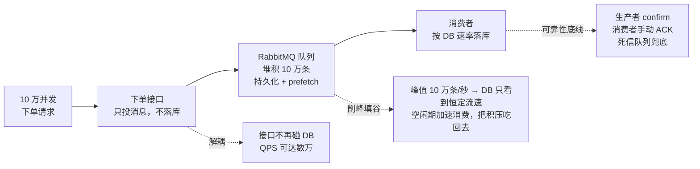
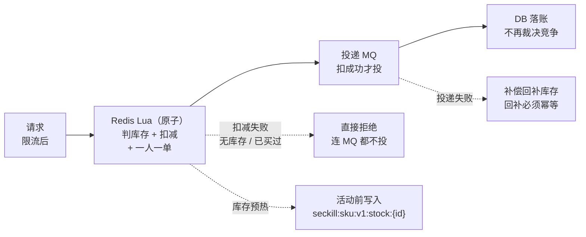
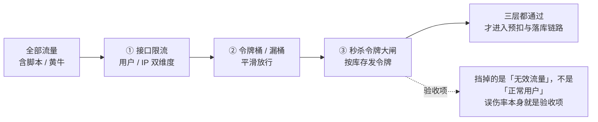

系列写到第五章「读性能优化」时，项目在 `v0.2.0` 收官了：代码定格在「直打数据库 + Redis 读缓存」这一档，第六至八章（MQ 削峰 / Lua 原子预扣 / 防刷限流）不再落地实现。

但设计不该烂尾。这一篇把剩下三章**一次性讲完**——不贴落地代码，只讲"如果继续做，会怎么做、为什么这么做、预计能拿到什么、会踩哪些坑"。

> **本篇性质说明**：本篇**没有配套落地代码**（仓库止于 `v0.2.0`，见 `docs/PLAN.md` ADR-10）。文中所有架构、接口、Key 均沿用前五章既有约定，属**预计方案**；出现的 QPS 数字均为**预期目标**，不是实测值。判断依据只有一条：**它们能不能把已经证明过的方法论继续用下去**。

## 一、先交代：为什么停在第五章

| 理由 | 说明 |
| --- | --- |
| 验收指标的性质变了 | 项目的核心命题是"QPS 跃迁来自架构决策，而不是换框架或堆中间件"。前五章已经把这件事证明完整：440 QPS → 万级，全部来自**读缓存**这一层架构改动 |
| 取舍密度会被稀释 | 前五章每章都有真实两难（超卖怎么防、Redis 同步客户端为什么不能用、缓存失效删 `item` 还是 `all`、四项增强为什么默认关）。到了 MQ / Lua 阶段，多数决策会退化成"按中间件文档来" |
| 收尾质量 > 功能数量 | 这个仓库要作为"可复习标本 + 拿得出手的开源库"交付。把已完成部分打磨到每篇都能对照真实代码与实测数字，价值高于多两个从没压测过的半成品阶段 |

**代价也说清楚**：架构演进止步"单体 + 缓存"，"单体 → 微服务"这条线不完整。所以才有这篇——**留档设计，而不是留档代码**。

## 二、第六章预计实现：MQ 削峰填谷

### 2.1 它要解决的真问题

第五篇加了读缓存，**读**路径压下去了；但**写**路径没有任何变化：每个下单请求依旧占一条 DB 连接、持 `seckill_sku` 行锁直到事务提交。100 并发下临界区约 22ms，行锁把写吞吐锁死在几百到几千 QPS。

瓶颈不在"数据库慢"，而在**请求的瞬时速率直接等于数据库的落库速率**。削峰填谷要做的，就是把这两件事解耦。

### 2.2 预计架构

### 2.3 预计实现要点

1. **接口形态**：`POST /api/seckill` 校验参数后**只投递消息**，立即返回 `{"code":0,"msg":"QUEUED","data":{"requestId":"..."}}`。响应从"下单结果"变成"受理回执"——这是异步化的必要代价。
2. **消息体与幂等**：`{requestId, userId, skuId, ts}`。`requestId` 用于消费端去重；最终兜底仍是 `seckill_order` 的 `uk_user_sku` 唯一键（前五章那套幂等照旧有效）。
3. **削峰原理**：队列把"瞬时并发"变成"待办清单"。数据库面对的始终是消费者按自己节奏发出的请求，这就是"削峰"；空闲时消费者可以多并发把积压吃回去，这就是"填谷"。
4. **可靠性三件套**：生产者 `confirm` 确保消息真进了 broker；消费者**手动 ACK**（落库成功才 ACK，失败进死信）；死信队列 + 定时补偿处理反复失败的消息。
5. **结果查询**：新增 `GET /api/seckill/result/{requestId}` 返回 `PENDING / SUCCESS / SOLD_OUT / DUPLICATE`。前五章的 SSE / WebSocket 能力（Drogon 原生支持）可用于主动推送。

### 2.4 预计会踩的坑

| 坑 | 现象 | 预计解法 |
| --- | --- | --- |
| 消息丢失 | 接口返回"已受理"但订单永不落库 | 生产端 confirm + 本地消息表/重投；消费端先落库后 ACK |
| 重复消费 | 同一 `requestId` 落两次库 | 消费端幂等（`requestId` 去重 + `uk_user_sku` 兜底） |
| 消费者串行 | 队列很长但落库速率上不去 | 多消费者线程 / 协程 + `prefetch` 调参 |
| 接口"假成功" | 用户看到受理但实际失败 | 结果查询要能如实返回失败原因，而不是永远 PENDING |

**预计验收**：下单接口 QPS 数万级；DB 落库速率稳定可控；**0 超卖、0 重复下单**（硬指标不放松）。

## 三、第七章预计实现：Redis Lua 原子预扣

### 3.1 为什么 MQ 之后还有瓶颈

MQ 削峰解决的是"请求速率 ≠ 落库速率"，但**没解决行锁本身**：消费者再多，只要它们抢的是同一行 `seckill_sku`，落库仍然是串行的。要再上一个量级，必须让"抢"这件事离开数据库——DB 退化成"最终落账"，不再承担竞争裁决。

### 3.2 预计实现要点

1. **库存预热**：活动开始前把 `seckill_sku.stock` 写入 Redis `seckill:sku:v1:stock:{id}`（这个 key 在前五章的 `CacheKeys.h` 里已经预留，当时标注"阶段四 7.2 预留，当前不读写"）。
2. **Lua 一次裁决三件事**：读库存 → `> 0` 则扣减 → 同时判"这个 user 是否已买过"。三件事必须在**同一个 Lua 脚本里原子完成**，否则并发下会各自读到旧值。
3. **一人一单下沉到 Redis**：用 `SET` 记录 `user:sku` 已购，Lua 里原子 `SADD` 判重；DB 的 `uk_user_sku` 仍是最终一致性的兜底，但不再是第一道防线。
4. **售罄标记**：库存扣到 0 时写一个标记 key，后续请求**在入口快速失败**，不必再进 Lua 全流程——把"抢不到"的请求成本压到一次 GET。
5. **回补的幂等**：MQ 投递失败要把 Lua 已扣的库存加回去。回补必须可重入（记录补偿凭证），否则重试会把库存加多，直接导致超卖。

### 3.3 预计会踩的坑

| 坑 | 后果 |
| --- | --- |
| Redis 与 MySQL 最终不一致 | 预扣成功但落库失败 → 少卖；需对账与补偿 |
| 回补不幂等 | 库存越补越多 → **超卖**（最危险） |
| Lua 脚本过长 | Redis 单线程被阻塞，整个缓存层抖动 |
| 预热与开抢竞态 | 活动已开始但库存还没写完 → 误判售罄 |

**预计验收**：QPS 从万级跃到数万~十万级；DB 压力从"每单一次写"降为"批量落账"；**0 超卖、0 重复**。

## 四、第八章预计实现：防刷、限流与秒杀资格校验

前两章解决"系统扛不住"，这一章解决"**流量该不该进来**"。三层防线，全部挡在预扣链路之前：

### 4.1 预计实现要点

1. **接口限流（固定窗口 / 滑动窗口）**：Redis Lua 原子计数，按**用户 + IP 双维度**限频。固定窗口实现最简单但有临界突刺（窗口边界可放行两倍流量）；滑动窗口用 `ZSET` 记时间戳，精度更高但内存更贵——**这是本章第一个真实取舍**。
2. **令牌桶 / 漏桶**：把"平均速率"与"突发容量"分开控制。自实现后做成路由层中间件，与业务解耦。令牌桶允许突发（桶里存了多少就能一次性放多少），漏桶强制匀速——秒杀场景通常选令牌桶。
3. **秒杀令牌大闸**：活动开始前按**库存量**发放略多于库存的令牌（多发的余量用于对冲"抢到不付款"），下单必须携带有效令牌。
4. **一次性令牌**：令牌校验通过即删除（`DEL` 原子），同一 token 无法重复提交——这比"在业务里判重复"更早、更便宜。

### 4.2 预计会踩的坑

| 坑 | 后果 |
| --- | --- |
| 令牌超发 | 请求数超过库存 → 少卖或（若无兜底）超卖 |
| 令牌覆盖 | 并发下发时后写覆盖前值 → 有的人拿到无效令牌 |
| 限流误伤 | 阈值太紧，正常用户被挡；太松则形同虚设 |
| 固定窗口突刺 | 窗口交界处瞬时放行 ≈ 2× 阈值 |
| 并发扣大闸 | 大闸余额扣成负数 → 超发令牌 |

**预计验收**：无效/重复流量在进入预扣前被挡下；正常用户可用；大闸发放量与库存关系可对账。

## 五、三章的共性：为什么"取舍密度"确实更低

这不是给偷懒找理由，是实打实的差别。对比一下每章的决策类型：

| 章 | 典型决策 | 决策类型 |
| --- | --- | --- |
| 二（表设计） | 幂等靠唯一键还是应用层判重 | **自主设计**，有真实代价取舍 |
| 三（登录） | 同步 Redis 客户端在 IO 线程里为什么不能用 | **踩坑驱动的架构约束** |
| 四（下单） | 乐观锁 / 悲观锁 / SQL 条件判断 | **多方案权衡**，各有适用面 |
| 五（缓存） | 失效删 `item` 还是 `all`；四项增强为什么默认关 | **新鲜度 ↔ 命中率** 的定量交换 |
| 六（MQ） | 用 RabbitMQ 还是 Kafka | 多为**范式选择**（都成熟，按生态选） |
| 七（Lua 预扣） | 脚本里先判库存还是先判一人一单 | **实现细节**，正确答案基本唯一 |
| 八（限流） | 固定窗口还是滑动窗口 | **算法既定**，按精度/内存选 |

前四章的决策**没有标准答案**，答案取决于你的业务约束；后三章的决策**有标准答案**，更多是"按成熟范式正确实现"。这正是收官的核心理由：**这个项目想练的是前者**。

## 六、如果续做：路线与验收标准

| 阶段 | 手段 | 预期 QPS | 验收硬指标 | 压测方法 |
| --- | --- | --- | --- | --- |
| 三（六章） | MQ 削峰填谷 | 数万 | QPS↑一个量级 · 0 超卖 · 0 重复 | 下单接口压测（吞吐）+ 结果查询对账 |
| 四上（七章） | Lua 原子预扣 | 数万~十万 | 同上 + Redis 与 DB 对账一致 | 压测后比对 Redis 余量 / DB 余量 / 订单数 |
| 四下（八章） | 限流 + 令牌大闸 | 同上 | 同上 + 大闸发放量与库存可对账 | 混合流量（正常 + 脚本）验证误伤率 |

> **硬指标全程不变**：QPS 提升一个量级、不超卖、不重复下单。这三条是前五章一路守下来的底线，续做时一条都不能放松。

## 七、对比表：已实测 vs 预计

| 维度 | 前五章（已交付） | 后三章（本篇预计） |
| --- | --- | --- |
| 状态 | ✅ 代码落地 + 实测 | ⏸ 规划与设计（无代码） |
| 核心手段 | 原子 SQL / 应用层闸门 / 读缓存 | MQ 削峰 / Lua 预扣 / 限流令牌 |
| 瓶颈认知 | 行锁串行化（读侧已解，写侧未解） | 逐层把裁决从 DB 移出 |
| 数据来源 | 官方 JMeter 实测（440 / 万级） | **预期目标，未实测** |
| 决策密度 | 高（无标准答案的取舍） | 低（按成熟范式实现） |

## 功能抉择（本篇核心权衡）

**① 为什么"不写"也是一种技术决策？**
技术项目最容易犯的错是"因为路线图上画了，所以必须做完"。但路线图是手段，不是目的。这个项目的目的是练"有真实代价的架构取舍"；后三章的取舍密度明显更低，继续做只是把"引入中间件 + 写胶水"重复三遍。**承认范围边界，比假装什么都能做完更专业。**

**② 如果只能续做一章，从哪开始？**
**第六章（MQ）**。理由：它针对的是前五章**唯一没被解决的真瓶颈**——写路径的行锁串行化。读缓存的收益已经吃干净了，不解决写路径，QPS 就卡在万级。第七章的 Lua 预扣本质是"把裁决从 DB 挪到 Redis"，属于在第六章基础上的进一步优化；第八章是流量治理，优先级在两者之后。

**③ 为什么这篇要如实标注"未实测"？**
因为技术写作最贵的东西是**可信度**。前五章的每个数字都有压测脚本和 HTML 报告可复核；后三章没有代码，就绝不能把"预期"写成"实测"。**预期目标与实测数字必须用不同措辞隔离**——这本身就是本系列从第一章延续到收官的态度。

## 小结

- 系列**交付范围止于第五章**（阶段二，`v0.2.0` 收官）；第六至八章以本篇「规划与预计实现」收口，**无落地代码**。
- **第六章（MQ 削峰）**：下单接口只投消息不落库，消费者按 DB 承受速率落库；预计接口 QPS 数万，可靠性靠 confirm + 手动 ACK + 死信 + 幂等。
- **第七章（Lua 预扣）**：库存预热到 Redis，Lua 原子完成"判库存 + 扣减 + 一人一单"；DB 退化为最终落账；预计 QPS 再上一层，回补幂等是防超卖的关键。
- **第八章（防刷限流）**：接口限流（用户 + IP）+ 令牌桶 + 秒杀令牌大闸三层前置；挡无效流量而非正常用户。
- **收官判据**：前五章证明了"QPS 跃迁来自架构决策"；后三章的决策有标准答案、取舍密度更低——**把已完成的部分做扎实，比堆两个没压测过的半成品阶段更有价值**。🐾
