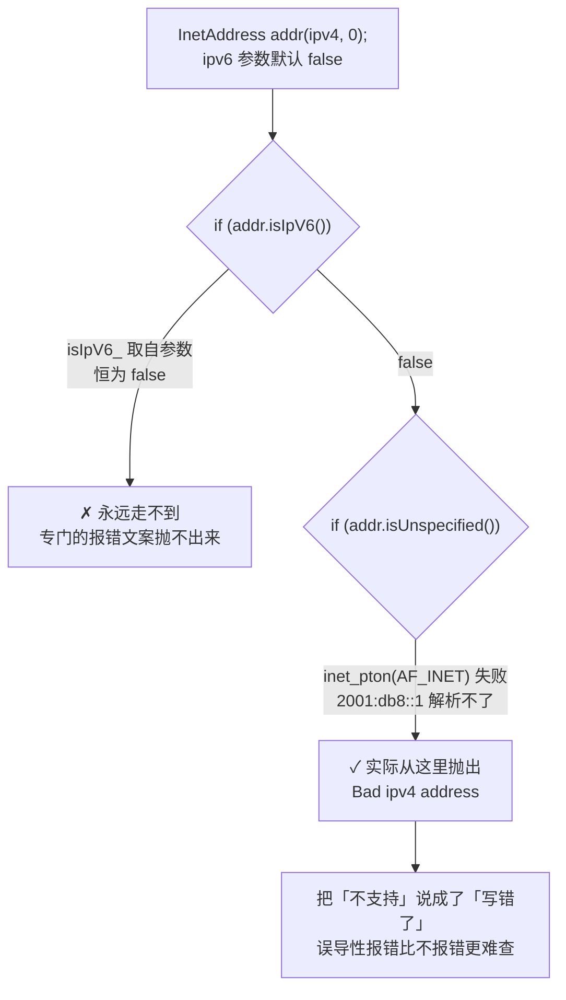
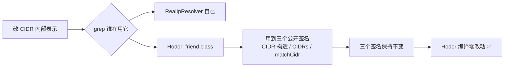
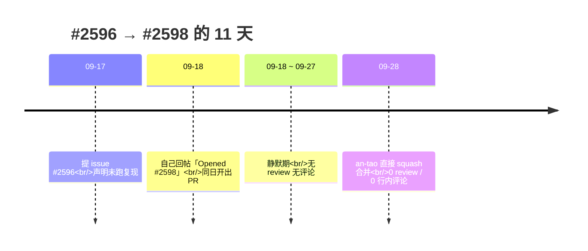

昨天下午，`drogonframework/drogon` 的 `master` 分支多了一行提交：

```text
fix(plugin): support ipv6 in RealIpResolver (#2598)
43b2e07ff4b874b1d5001eb9dda7cacf82440ec7
2026-09-28T15:07:32Z，by an-tao
```

11 天前我还只是个用 Drogon 写秒杀项目的使用者，[那篇 XFF 勘误](/posts/seckcpp0311/)写的是我自己取错请求头的事。这篇把后面这段补上：**一次真实的上游贡献，从头到尾。**

先把结论摆在最前面，因为它是这篇唯一有分量的部分：

> **「读源码读出来的 bug」和「能进上游的 patch」之间，差的不是代码能力，是取证纪律。**
>
> 我读了源码、推出了两条缺陷、写了个 issue——然后在 issue 里明说了「我没有跑复现，请把具体报错字符串当作推导结果而非观测结果」。这句话看着像示弱，实际是**唯一能让自己不翻车的写法**。最后 3 个文件、255 增 / 36 删，被合并。

## 一、这个 PR 到底改了什么

先把账摆清楚，后面所有复盘都建立在这张表上：

| 项 | 值 |
| --- | --- |
| PR | [drogonframework/drogon#2598](https://github.com/drogonframework/drogon/pull/2598) |
| 标题 | `fix(plugin): support ipv6 in RealIpResolver` |
| 关联 issue | [#2596](https://github.com/drogonframework/drogon/issues/2596)（`Closes #2596`） |
| 分支 | `Hespethorn:fix/realipresolver-ipv6` → `drogonframework:master` |
| 体量 | 3 files changed, **+255 / −36** |
| 提交数 | 3 commits，合并方式为 squash |
| 开出 | 2026-09-18 02:44 UTC |
| 合并 | 2026-09-28 15:07 UTC（北京时间 23:07），by **an-tao**（项目作者） |
| Review | **0 条** —— 没有 review、没有行内评论、没有 reviewer 指派 |

三个文件：

| 文件 | 改动 | 内容 |
| --- | --- | --- |
| `lib/inc/drogon/plugins/RealIpResolver.h` | +19 / −5 | `CIDR` 结构体换存储表示；头注释从「只支持 ipv4」改成「both ipv4 and ipv6」 |
| `lib/src/RealIpResolver.cc` | +109 / −30 | `CIDR` 构造、`matchCidr`、新增 `comparePrefix`、重写 `parseAddress` |
| `lib/tests/RealIpResolverTest.cc` | +127 / −1 | 测试用例 5 → 14，断言 56 条 |

最后一行是这个 PR 能被合掉的关键。**改动量最大的文件是测试**——比源码改动还多。等会儿说为什么。

## 二、起点是一条评论，不是一次调研

11 天前那篇[信任边界的长文](/posts/net-xff-trust-boundary/)是回应一条读者评论的：那位读者主张「直接在 proxy 上 strip 掉非可信 header，把复杂性丢给 proxy」。

我写完那篇，顺手把结论里「Drogon 有官方插件能干这事」的插件源码读了一遍。读完发现，**它只支持 IPv4。**

这不是我特意去找的 bug。是写文章时为了说清「边界 strip 和后端解析是同一个算法」，把源码当证据引用，顺手读到的。


**这条链的起点是「为了写清楚而读源码」，不是「为了提 issue 而读源码」。** 后者容易带着目的去找证据，前者不。这个区别后来救了我——因为在 issue 里我不得不承认「我没跑复现」，这是带着目的找证据时最说不出口的一句话。

## 三、缺陷本体：两条静默失效

插件做的是那个两步解析：先验直连方是否可信代理，再从右往左扫 XFF 取第一个不可信地址。问题出在「只认 IPv4」上，而且分两条路。

### 缺陷一：`trust_ips` 里填 IPv6，报的是「地址格式错误」

原实现：

```cpp
trantor::InetAddress addr(ipv4, 0);          // 第三个参数 ipv6 默认为 false
if (addr.isIpV6())
{
    throw std::runtime_error("Ipv6 is not supported by RealIpResolver.");
}
if (addr.isUnspecified())
{
    throw std::runtime_error("Bad ipv4 address: " + ipv4);
}
```

看着挺周全：专门的 IPv6 分支、专门的报错文案。但**那个分支永远进不去**。因为 trantor 的字符串构造函数不自动判断地址族——`isIpV6_` 直接取自参数：

```cpp
// trantor/net/InetAddress.cc
InetAddress::InetAddress(const std::string &ip, uint16_t port, bool ipv6)
    : isIpV6_(ipv6)   // ← 来自参数，不是来自字符串
{
    if (::inet_pton(AF_INET, ip.c_str(), &addr_.sin_addr) <= 0)
    {
        return;       // isUnspecified_ 保持 true
    }
    isUnspecified_ = false;
}
```

参数默认 `ipv6 = false` → `isIpV6()` 恒为 `false` → 拿 `"2001:db8::1"` 去跑 `inet_pton(AF_INET, ...)` 失败 → 返回 `isUnspecified() == true`。

于是填 `"trust_ips": ["2001:db8::1"]` 的人，收到的是：

```text
Bad ipv4 address: 2001:db8::1
```

**这句话在说「你的地址格式不对」。而这是个完全合法的 IPv6 地址。** 用户会去反复检查配置里的拼写，而正确答案是「这个插件压根不支持 v6」——一句已经写好了、却因为一个默认参数永远抛不出来的话。



### 缺陷二：XFF 里的 IPv6 被静默丢弃

`parseAddress()` 用 `find(':')` 拆 host 和 port：

```cpp
auto pos = addr.find(':');              // "2001:db8::1" → pos == 4
port = std::stoi(addr.substr(pos + 1)); // stoi("db8::1") 抛异常 → port = 0
return trantor::InetAddress(addr.substr(0, pos), port);   // InetAddress("2001", 0)
```

`"2001"` 过不了 `inet_pton(AF_INET, ...)`，`isUnspecified()` 为真。然后在遍历循环里：

```cpp
while (!(ip = parser.getNext()).empty())
{
    trantor::InetAddress addr = parseAddress(ip);
    if (addr.isUnspecified() || matchCidr(addr, trustCIDRs_))
    {
        continue;   // ← IPv6 条目在这里被丢掉
    }
    req->attributes()->insert(attributeKey_, addr);
    return;
}
req->attributes()->insert(attributeKey_, peerAddr);   // 全丢完了 → 回退
```

每一条 IPv6 都落到最后那行，插件存下的是 **TCP 对端地址**，也就是反代自己的地址。

这条的后果形状，和「`trust_ips` 填窄」**一模一样**：反代后面**所有 IPv6 客户端收缩成同一个 key**。任何建在 `GetRealAddr()` 上的按 IP 限流——注册频控、登录锁定——会把整个 IPv6 人群当成一个客户端。

而日志里一切正常。

```mermaid
flowchart TD
    A[XFF: 2001:dba::1, 2001:db8::99] --> B[parseAddress 逐个解析]
    B --> C{find(':') 拆 host/port}
    C -->|IPv4 1.2.3.4| D[解析成功]
    C -->|IPv6 2001:dba::1| E[stoi 抛异常<br/>→ InetAddress 2001,0]
    E --> F[isUnspecified = true]
    F --> G[continue 跳过]
    G --> H[整链扫完无命中]
    H --> I[回退 peerAddr = 反代地址]
    D --> J[返回真实客户端 ✅]
    I --> K[所有 IPv6 客户端<br/>collapse 成同一个 key ❌]
```

### 还有第三处，是推导出来的

`matchCidr()` 也是纯 IPv4——`addr.ipNetEndian()` 返回 32 位 `in_addr_t`。所以就算解析修好了，v6 对端也**永远匹配不上任何可信 CIDR**。这一处在 issue 里列了，因为它决定了修法的形状：不能只修 `parseAddress`。

## 四、issue 里最要紧的一句话

issue 正文末尾我写了这么一段：

> Everything above comes from reading `lib/src/RealIpResolver.cc` and `trantor/net/InetAddress.{h,cc}`. **I have not run a reproduction, so please treat the exact error strings as derived rather than observed.** Happy to attach a failing test if that would help.

现在回头看，这段话是这个 PR 能成的前提。理由很实在：

- **本机没有能编译 Drogon 的环境**，硬造一个「复现输出」就是编。而开源维护者最反感的就是编。
- 我确实**在写的时候也没打算跑**：脏数据、测试、描述全都能从代码推出来，但推导结果的风险是——**它是一个模型，模型可能错，而错的地方你恰恰知道得最少。**
- 所以主动把边界划出来，把「我确定的部分」（代码路径、参数默认值、算子语义）和「我推的部分」（具体报错字符串）分开。**维护者拿到的是一个可分级的证据包，而不是一堆混在一起、真假难辨的断言。**

反过来说：如果我在 issue 里用笃定的语气写「实测报错为 Bad ipv4 address」，然后 an-tao 一跑发现文案对不上，那这条 issue 的公信力会连同后面整个 PR 一起崩掉。**在没法跑的地方主动降级措辞，不是谦虚，是止损。**

## 五、修法的核心：一个结构体换掉两个字段

原实现把 CIDR 存成「32 位地址 + 32 位掩码」：

```cpp
struct CIDR
{
    in_addr_t addr_{0};
    in_addr_t mask_{32};
};
```

这个表示**从类型上就排除了 v6**。改法是换存储：

```cpp
struct CIDR
{
    explicit CIDR(const std::string &ipOrCidr);

    /**
     * @brief The network address in network byte order.
     *
     * 4 bytes for an ipv4 CIDR, 16 bytes for an ipv6 one. The length also
     * identifies the address family, so an ipv4 address can never match an
     * ipv6 CIDR (and vice versa) - comparing byte strings of different
     * lengths fails early.
     */
    std::string network_;

    /**
     * @brief Number of significant leading bits of network_: 0-32 for ipv4
     * and 0-128 for ipv6.
     */
    uint16_t prefixLen_{32};
};
```

这里有个设计上值得说一下的点，注释里也写了：**字节串长度本身就是地址族标识**。4 字节 vs 16 字节，长度不同直接返回 false，**不需要任何 `if (isIpV6)` 分支**。地址族这个维度，用「数据结构」表达比用「代码分支」表达更省事、也更难写错。

比对逻辑从「掩码与」换成「前缀字节比较」：

```cpp
static bool comparePrefix(const std::string &addr,
                          const std::string &network,
                          uint16_t prefixLen)
{
    if (addr.size() != network.size())
    {
        return false;   // 不同地址族，永不匹配
    }
    const auto fullBytes = static_cast<size_t>(prefixLen / 8);
    const auto remainingBits = static_cast<uint8_t>(prefixLen % 8);
    if (fullBytes > 0 && std::memcmp(addr.data(), network.data(), fullBytes) != 0)
    {
        return false;
    }
    if (remainingBits == 0)
    {
        return true;
    }
    const auto mask = static_cast<uint8_t>(0xff << (8 - remainingBits));
    return (static_cast<uint8_t>(addr[fullBytes]) & mask) ==
           (static_cast<uint8_t>(network[fullBytes]) & mask);
}
```

`remainingBits` 那几行是必须的。前缀长度不一定是 8 的倍数（`/33`、`/12`），最后一个字节得按位掩一下。**这一处漏了，测试用例 12 和 13 就会挂**——后面讲。

`parseAddress` 重写成按形态分派：

| XFF 条目 | 结果 | 判定依据 |
| --- | --- | --- |
| `1.2.3.4` | ipv4，无端口 | 没有冒号 |
| `1.2.3.4:5678` | ipv4 + 端口 | **恰好一个冒号** |
| `[2001:db8::1]:5678` | 带括号 ipv6 + 端口 | 以 `[` 开头，`]:` 之后是端口 |
| `[2001:db8::1]` | 带括号 ipv6，无端口 | 以 `[` 开头，无 `]:` |
| `2001:db8::1` | 裸 ipv6，无端口 | **多个冒号、无括号** |

「恰好一个冒号 → 必是 `ipv4:port`」这条判据我觉得很干净：**一个合法的 IPv6 地址至少有两个冒号**。所以 `firstColon == rfind(':')` 这个条件本身就完成了消歧，不用去猜、不用去试解析。

解析失败一律返回 unspecified 地址，而调用方的循环本来就会 `continue` 跳过——**畸形输入的既有行为没变**。这种「新逻辑不改变旧边界行为」的处理，是让 diff 能被快速信任的关键。

`XForwardedForParser` 一行没动。它只按空格和逗号切分，v6 地址天然完整通过。**改得少的地方，通常正是原设计对的地方。**

## 六、255 行里那 127 行测试

测试从 5 个用例扩到 14 个，断言 56 条。最有价值的两条是**验证方向相反**的：

```cpp
// 12. 前缀长度不是 8 的倍数：2001:dbd::/33 保留了第 33 位
//     （第 5 字节的最高位）。2001:dbd::9 该位为 0 → 在可信块内 → 回退对端地址。
//     （如果忽略了那个不完整的字节，这里会返回 2001:dbd::9。）
{ ... req->addHeader("x-forwarded-for", "2001:dbd::9");
  CHECK(resp->body() == "127.0.0.1"); }

// 13. 2001:dbd:8000::5 第 33 位为 1 → 落在 2001:dbd::/33 之外 → 必须报它。
//     （如果忽略了那个不完整的字节，这里会匹配上、返回对端地址。）
{ ... req->addHeader("x-forwarded-for", "2001:dbd:8000::5");
  CHECK(resp->body() == "2001:dbd:8000::5"); }
```

**这两条是一对。** 只写 12 号，一个把末尾字节整个忽略的实现也能过；只写 13 号同理。两条一起，才把「第 33 位」这一个 bit 钉死——不管实现往哪个方向错，必挂一条。

这是我从这次贡献里学到的最实在的一招：**边界类的改动，测试要成对写，一个「该在内」一个「该在外」，夹住那条边界。** 单侧的测试只能证明你对，双侧的测试能证明别人错。

其他用例覆盖：裸 v6、`[v6]:port`、`[v6]`、v6 落在可信 CIDR 内被跳过、全链可信回退对端、v4/v6 混合、ipv4-mapped v6（`::ffff:4.4.4.4`）。既有 5 条 v4 用例一条没改。

## 七、最难写的是那句「向后兼容」

向后兼容这一节，我最后给的是这个说法：

> The ipv4 path is **bit-identical** to the previous implementation for every prefix from **1 to 32**, so no existing `trust_ips` configuration changes behaviour.
>
> Verified by translating both the old masked comparison and the new byte-prefix comparison into a script and comparing them per prefix over large random samples: **zero disagreements for prefixes 1-32**.

这句话分三层，每层都有对应动作：

1. **声明「bit-identical」**——不是「行为大致相同」，是逐位相同。这是能被人拿去验证的强断言。
2. **说明验证方式**——把新旧两套比较逻辑各翻成一份脚本，逐前缀跑随机样本对比。因为**本机没有 Drogon 编译环境**，跑不了真实测试，那就退一步验证「算法等价性」。这不等于跑过单测，但它能证明一件具体的事。
3. **给出结论**——prefixes 1-32 零分歧。

顺带还发现一处顺手修掉的：旧实现靠 `0xffffffffu << 32` 表示零前缀，**这在 C++ 里是未定义行为**（移位量等于宽度）。新实现把零前缀显式处理了，不再依赖它。这条在 issue 里没提，是改的时候撞见的——**上游贡献的常见副产品：你要动的那块代码，总会顺手暴露旁边的问题。**

还有一条兼容性约束写在 PR 描述里：

> `friend class Hodor` uses `CIDR(const std::string &)`, the `CIDRs` type and `RealIpResolver::matchCidr`. All three public signatures are unchanged, so `Hodor` compiles without modification.

`Hodor` 是另一个内部插件，`friend` 关系让它直接用了这三个东西。**改结构体不能只想着插件自己**——先 grep 谁在用，再决定签名动不动。三个签名保住不变，`Hodor` 零改动。



## 八、PR 描述的组织方式

3000 多字的描述，结构是这样的：

```text
Closes #2596.
<问题摘要：两种静默失效>

### What changed
  1. CIDR 换存储（贴结构体 + 解释长度即地址族）
  2. matchCidr 换成 comparePrefix（贴代码）
  3. parseAddress 处理五种形态（贴表格）
  4. XForwardedForParser 无需改动（说明为什么）

### Backward compatibility
  bit-identical + 验证方法 + 零分歧结论
  + 顺手修的 UB

### Tests
  5 → 14 用例，56 断言，逐条列覆盖点

### Notes
  feature gap 而非 regression；引用 #1321
  Hodor 的签名约束
```

几个刻意的选择：

- **把「需要维护者决策」的部分留在 issue 里**，没塞进 PR。issue 结尾我问了两条：「这个方向可接受吗，我可以准备 PR」以及「还是你更希望换个走法，比如彻底不用 `in_addr_t` 改用 `InetAddress`？」——**给维护者留选择权，而不是把已经做好的方案砸过去。** 后来 an-tao 直接合了，说明这个方向他是认的。
- **强调这是 feature gap 不是 regression**：`#1321`（2022-07 合并）以来这块代码没变过，v1.9.10 和 master 在这块完全一致。这个定性很重要——它决定了维护者是用「你新引入的 bug」还是「一直存在的缺口」的视角读你的 PR。
- **主动说明「没有重复劳动」**：查过没有别的 issue/PR 覆盖这个插件。避免维护者花时间去合重复的东西。

## 九、时间线：11 天，0 条 review



几个诚实的观察：

- **issue 和 PR 是同一天连着的。** 09-17 提 issue，09-18 就开 PR——中间没有等回复。我在 issue 里问了「方向可接受吗」，但没等答案就把 patch 写完了。这不算失礼（patch 本身就是对问题最清楚的说明），但**严格说违背了自己在 issue 里说的话**。如果那次方向被否，255 行就白写了。要不要等回复，是个真实的取舍：等，节奏慢但省力；不等，快但可能白干。
- **0 条 review 不等于没人看。** 合并者是项目作者 an-tao 本人，squash 合并会保留 PR 号（`(#2598)`）。没有 review 记录，只说明他选择了直接合而不是走 review 流程——**在小体量、边界清晰的补丁上，这是常见的处理方式，不代表跳过了审查。**
- **从开出到合并 10 天。** 对一个个人主导的开源项目，这个响应速度没什么可抱怨的。

## 十、对比表与小结

| 我做了什么 | 效果 | 如果反着做会怎样 |
| --- | --- | --- |
| issue 里主动声明「未跑复现，报错字符串是推导」 | 证据可分级，维护者知道该验什么 | 文案对不上，整条 issue 公信力崩掉 |
| 说清是 feature gap 而非 regression | 定性准确，不被当成新引入的坑 | 被要求先证明「以前是好的」 |
| 把方向选择权留给维护者 | an-tao 认可方向，直接合 | 方案被否，255 行白写 |
| 测试 5 → 14，含一对反向用例 | 第 33 位那个 bit 被钉死 | 单侧测试，实现错向仍能过 |
| 声明 v4 路径 bit-identical + 给验证方法 | 零配置回归风险，可被复核 | 「应该没影响」这种没法验的话 |
| grep `Hodor` 保住三个公开签名 | 上游零改动编译 | 顺手破坏另一个插件 |
| 顺手修 `<< 32` 的 UB | 顺带清掉一处隐患 | 留着，下次再踩 |

小结：

- **这次贡献的起点是「为了把文章写清楚去读源码」，不是「为了提 issue 去找代码」。** 后者容易带着结论找证据，前者不会——而且顺手读到的东西，往往比你专门去找的更真。
- **本机没有编译环境，就不要编造复现输出。** 在 issue 里明确标出「哪部分是从代码推的、哪部分是实测的」，比写一个漂亮的假输出有价值得多。**推导是允许的，把推导说成观测不行。**
- **「不支持」和「写错了」是两回事。** 一个默认参数 `ipv6 = false`，让一句写好的 `Ipv6 is not supported` 永远抛不出来，用户拿到的是「地址格式错误」。**误导性报错比不报错更难查，因为它把人引向错误的方向。**
- **地址族用数据结构表达，别用 if 分支。** 4 字节 vs 16 字节，长度不同直接 false，比在每个函数里判 `isIpV6()` 干净得多。
- **边界改动，测试要成对写。** 一个「该在内」一个「该在外」，两条夹住那条边界。单侧只是自我确认。
- **换个表示法要保留公开签名。** 先 grep `friend` 和外部调用，再决定动不动接口——`Hodor` 就是这么保住的。
- **向后兼容的话要能被人验。**「bit-identical for prefixes 1-32」+「怎么验的」+「零分歧」，三段式。说不出口的兼容性，等于没有。
- 最后一条跟开源无关：**这次真正起作用的能力，是能把「我确定的」和「我推的」分开说。** 代码是其次——`parseAddress` 那五个分支谁都能写。🐾

## 相关阅读

- [3.11 X-Forwarded-For 取首段的陷阱：一次真实的注册频控绕过](/posts/seckcpp0311/)
- [信任边界放哪一层：XFF 的「边界 strip」与后端兜底之辩](/posts/net-xff-trust-boundary/)
- [3.10 注册安全加固：同 IP 注册频控 + 反代真实客户端 IP 解析](/posts/seckcpp0310/)

> ## 配套源码
>
> 触发这次贡献的项目：**[Hespethorn/seckill-cpp](https://github.com/Hespethorn/seckill-cpp)**
>
> 上游 PR：**[drogonframework/drogon#2598](https://github.com/drogonframework/drogon/pull/2598)**（已合并）
> 上游 issue：**[drogonframework/drogon#2596](https://github.com/drogonframework/drogon/issues/2596)**（已关闭）
